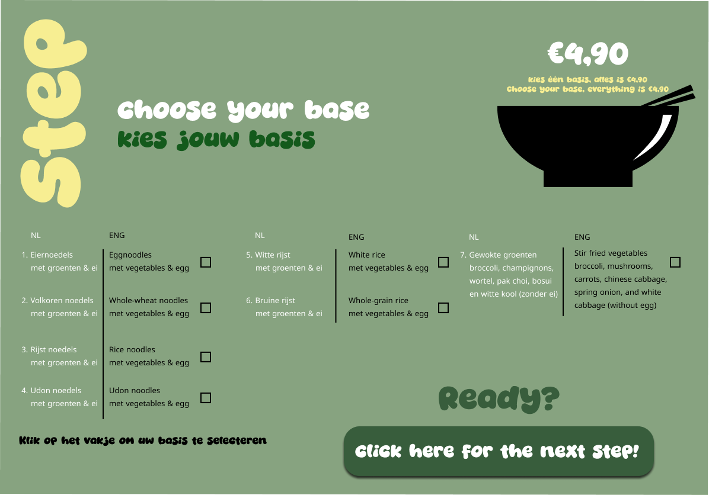
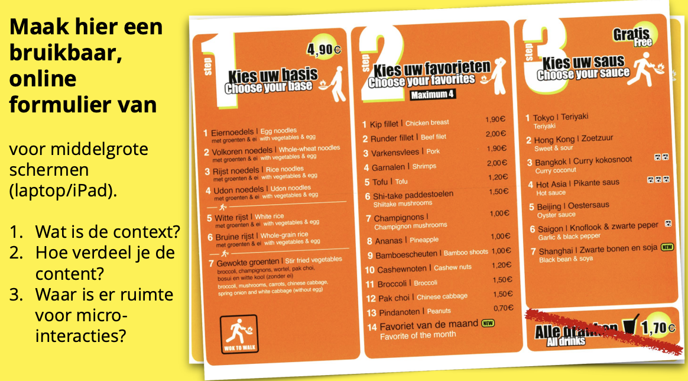
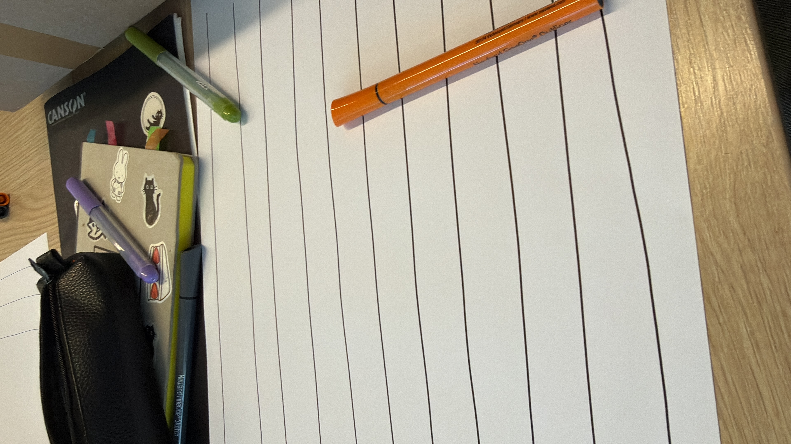
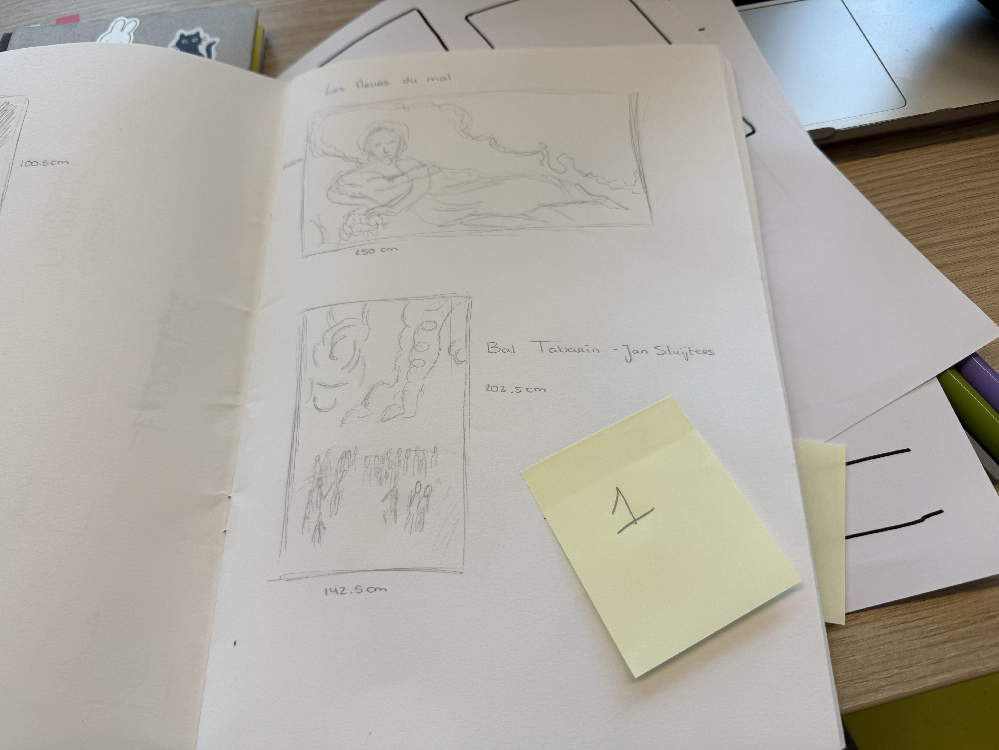
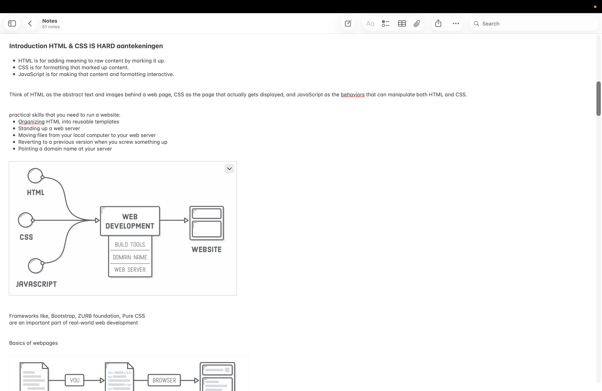
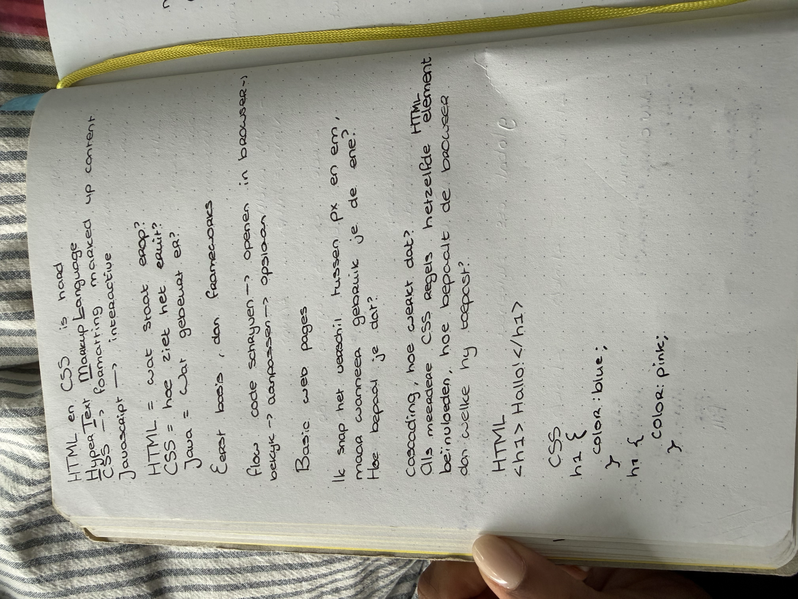
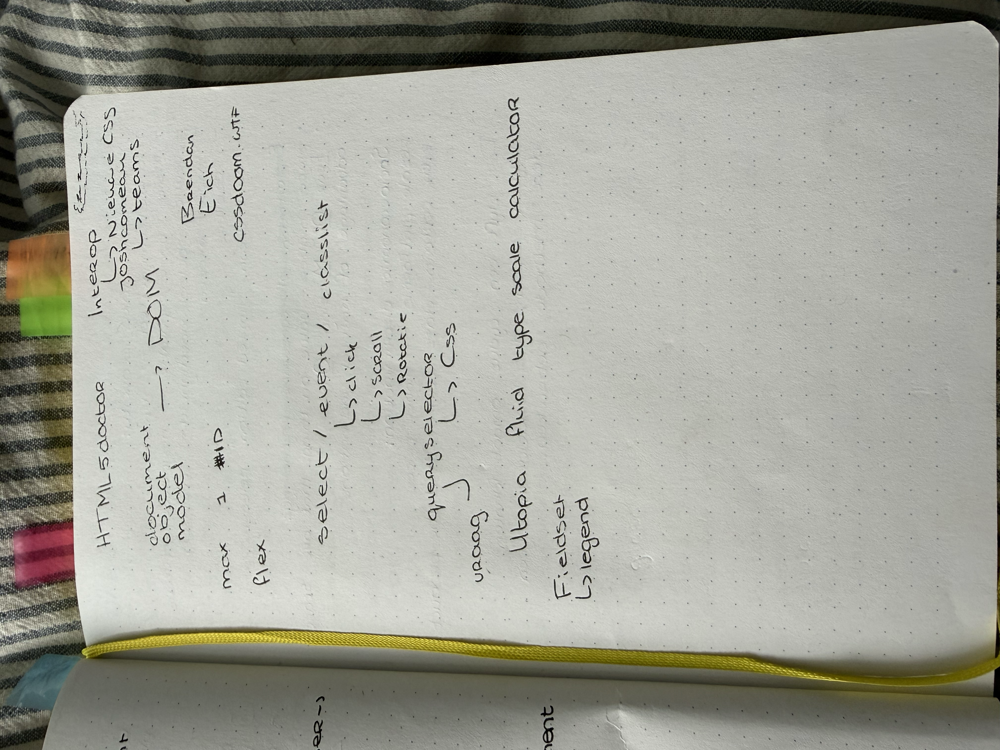

# Model

Het staat model voor digitale tuintjes welke bij 'Het web is voor iedereen' door studenten worden gemaakt.

## Learning Log

### 31 aug - Kickoff

Een fork van de model repository gemaakt en gepubliceerd via mijn eigen Github omgeving.

#### 1. Leg uit wat een source hosting platform is en voor welke jij gekozen hebt.

Een source hosting platform is een online plek waar je de bestanden en code van een website kunt opslaan en beheren. Ik heb gekozen voor GitHub. Hier heb ik mijn eigen repository gemaakt door de model repository te forken.

#### 2. Vertel welke domeinnaam jij gekozen hebt en hoe je die hebt gekoppeld aan jouw pagina.

Ik heb gekozen voor het domein tharanika.nl. Ik heb mijn domein gekoppeld aan mijn GitHub Pages door de DNS-instellingen van mijn domein aan te passen en een CNAME-bestand in mijn repository te gebruiken.

#### 3. Beschrijf hoe je aanpassingen aan jouw pagina kunt maken en hoe je er voor zorgt dat die op het web gepubliceerd worden.

Ik kan mijn website aanpassen door de bestanden, bijvoorbeeld index.html, in VSCodium te veranderen. Daarna sla ik mijn wijzigingen op en maak ik een commit. GitHub Pages zorgt er daarna voor dat de aangepaste versie van mijn website online wordt gepubliceerd.

### 2 september 2026

Vandaag hebben we gewerkt aan micro-interacties en multimodal design.
We hebben een Wok to Walk-menu formulier aangepast naar een digitaal ontwerp voor een laptop of tablet. Dit heb ik Figma gemaakt.

#### Dit is het originele formulier:

#### schetsencursus

We hebben tijdens schetsen cursus gehad over lijnen trekken en vierkanten maken zonder liniaal, na dit oefenen hebben we verschillen bekeken tussen hi-fi en low fi wireframes en die getekend van een app met microanimaties.
Ik had apple music gekozen

#### De wireframe die ik heb gemaakt

### 3 september 2026

voorbereiding voor de cursus HTML & CSS Basics (Justus) en Praktische CSS (Vasilis)

Voor deze les heb ik de onderdelen Introduction, Basic Web Pages en Hello CSS van HTML & CSS is hard gelezen. Ook heb ik de CSS Diner gedaan om meer te oefenen met CSS-selectors. Dit vond ik eerlijk gezegd best lastig, maar ik kwam uiteindelijk tot level 15. Ik wil hier nog verder mee oefenen totdat ik de selectors beter begrijp.

Daarnaast heb ik het artikel Structuring content with HTML op MDN doorgenomen. Tijdens het doorklikken viel mij op dat SEO niet alleen bij bijvoorbeeld YouTube een rol speelt, maar ook bij websites. Ik wist niet dat de structuur en betekenis van HTML hierbij kunnen meespelen.

De vragen die ik voor de les had waren:

- Wanneer gebruik je in CSS px en wanneer em?
- Hoe bepaalt de cascade welke CSS-regel voorrang krijgt wanneer meerdere regels op hetzelfde HTML-element van toepassing zijn?

#### deel van de aantekeningen die ik had gemaakt en CSS diner

### CSS diner game

#### lelijke website verbeteren

#### 4 september 2026

Vandaag hebben de in de cursus van Justus het gehad over de basis van HTML en CSS, aangezien de laatste keer dat we het hier over hadden al een jaar geleden was waar we weinig uitleg kregen.
We hebben besproken waar HTML en CSS voor staan, wat de belangrijkste onderdelen zijn en waar je op moet letten wanneer je ermee werkt.
Iets echt nieuws wat ik nog niet wist was dat je tegenwoordig Java niet perse meer nodig hebt om een website echt interactief te maken omdat je met CSS heel veel kan doen, dus ik ben benieuwd hoe mijn website er over een paar weken uit zal zien.

Bij Vasilis hebben we mijn eerder gemaakte “lelijke” HTML-pagina gebruikt om opnieuw naar de basis van HTML en CSS te kijken. We hebben de code stap voor stap opgebouwd en steeds zelf overgetypt, zodat duidelijker werd wat ieder onderdeel doet.

Ik vind HTML en vooral CSS nog steeds best ingewikkeld. Daarom wil ik de komende tijd blijven oefenen door de code zoveel mogelijk zelf uit te schrijven in plaats van alles te kopiëren en plakken. Op die manier wil ik niet alleen de code beter leren begrijpen, maar ook de volgorde, haakjes, aanhalingstekens en andere tekens steeds beter leren herkennen en onthouden.
