# Model

Het staat model voor digitale tuintjes welke bij 'Het web is voor iedereen' door studenten worden gemaakt.

#### bronnen voor mijn website, die ik heb gebruikt.

- W3Schools - Gebruikt voor uitleg en voorbeelden bij HTML en CSS.
- MDN Web Docs - gebruikt voor uitleg en documentie over HTML en CSS.
- HTML5 Doctor - vinden van codes voor mijn HTML en CSS
- CSS-Tricks - gebruikt voor uitleg en voorbeelden rondom CSS.
- ChatGPT - gebruikt als hulpmiddel om mijn code te controleren, fouten te begrijpen en het bedenken van oplossingen.

#### Voor inspiratie

- Pinterest - visuele inspiratie voor de vormgeving, kleding en beelden op mijn website

#### Gebruikte afbeeldingen

- Pinterest - afbeelding gebruikt op de website; oorspronkelijke maker/auteur was bij het vinden van de afbeelding niet duidelijk vermeld.
- andere afbeeldingen - fotos van mijzelf of die ik zelf heb gemaakt.

## Learning Log

### 31 aug - Kickoff

Een fork van de model repository gemaakt en gepubliceerd via mijn eigen Github omgeving.

#### 1. Leg uit wat een source hosting platform is en voor welke jij gekozen hebt.

Een source hosting platform is een online plek waar je de bestanden en code van een website kunt opslaan en beheren. Ik heb gekozen voor GitHub. Hier heb ik mijn eigen repository gemaakt door de model repository te forken.

#### 2. Vertel welke domeinnaam jij gekozen hebt en hoe je die hebt gekoppeld aan jouw pagina.

Ik heb gekozen voor het domein tharanika.nl. Ik heb mijn domein gekoppeld aan mijn GitHub Pages door de DNS-instellingen van mijn domein aan te passen en een CNAME-bestand in mijn repository te gebruiken.

#### 3. Beschrijf hoe je aanpassingen aan jouw pagina kunt maken en hoe je er voor zorgt dat die op het web gepubliceerd worden.

Ik kan mijn website aanpassen door de bestanden, bijvoorbeeld index.html, in VSCodium te veranderen. Daarna sla ik mijn wijzigingen op en maak ik een commit. GitHub Pages zorgt er daarna voor dat de aangepaste versie van mijn website online wordt gepubliceerd.

### 2 september 2026

Vandaag hebben we gewerkt aan micro-interacties en multimodal design.
We hebben een Wok to Walk-menu formulier aangepast naar een digitaal ontwerp voor een laptop of tablet. Dit heb ik Figma gemaakt.

#### Dit is het originele formulier:

#### schetsencursus

We hebben tijdens schetsen cursus gehad over lijnen trekken en vierkanten maken zonder liniaal, na dit oefenen hebben we verschillen bekeken tussen hi-fi en low fi wireframes en die getekend van een app met microanimaties.
Ik had apple music gekozen

#### De wireframe die ik heb gemaakt

### 3 september 2026

voorbereiding voor de cursus HTML & CSS Basics (Justus) en Praktische CSS (Vasilis)

Voor deze les heb ik de onderdelen Introduction, Basic Web Pages en Hello CSS van HTML & CSS is hard gelezen. Ook heb ik de CSS Diner gedaan om meer te oefenen met CSS-selectors. Dit vond ik eerlijk gezegd best lastig, maar ik kwam uiteindelijk tot level 15. Ik wil hier nog verder mee oefenen totdat ik de selectors beter begrijp.

Daarnaast heb ik het artikel Structuring content with HTML op MDN doorgenomen. Tijdens het doorklikken viel mij op dat SEO niet alleen bij bijvoorbeeld YouTube een rol speelt, maar ook bij websites. Ik wist niet dat de structuur en betekenis van HTML hierbij kunnen meespelen.

De vragen die ik voor de les had waren:

- Wanneer gebruik je in CSS px en wanneer em?
- Hoe bepaalt de cascade welke CSS-regel voorrang krijgt wanneer meerdere regels op hetzelfde HTML-element van toepassing zijn?

#### deel van de aantekeningen die ik had gemaakt en CSS diner

### CSS diner game

#### lelijke website verbeteren

#### 4 september 2026

Vandaag hebben de in de cursus van Justus het gehad over de basis van HTML en CSS, aangezien de laatste keer dat we het hier over hadden al een jaar geleden was waar we weinig uitleg kregen.
We hebben besproken waar HTML en CSS voor staan, wat de belangrijkste onderdelen zijn en waar je op moet letten wanneer je ermee werkt.
Iets echt nieuws wat ik nog niet wist was dat je tegenwoordig Java niet perse meer nodig hebt om een website echt interactief te maken omdat je met CSS heel veel kan doen, dus ik ben benieuwd hoe mijn website er over een paar weken uit zal zien.

Bij Vasilis hebben we mijn eerder gemaakte “lelijke” HTML-pagina gebruikt om opnieuw naar de basis van HTML en CSS te kijken. We hebben de code stap voor stap opgebouwd en steeds zelf overgetypt, zodat duidelijker werd wat ieder onderdeel doet.

Ik vind HTML en vooral CSS nog steeds best ingewikkeld. Daarom wil ik de komende tijd blijven oefenen door de code zoveel mogelijk zelf uit te schrijven in plaats van alles te kopiëren en plakken. Op die manier wil ik niet alleen de code beter leren begrijpen, maar ook de volgorde, haakjes, aanhalingstekens en andere tekens steeds beter leren herkennen en onthouden.

#### 7 september 2026

##### Les van Maandag

we hebben in de les artikels gelezen en geanalyseerd over wat een digital garden inhoudt, wat het betekent, maar ook wat jij zelf denkt dat erin hoort.

We hebben ook websites vergeleken met elkaar, en gerangschikt hoe "webby" het is.
of het alle vakjes aanvinkt.

- **Vanuit de inventarisatie: Wat zou je zelf willen maken? Heb je dingen gezien die je nog niet kan, maar wel interessant vindt in de websites die je bekeken hebt?**
  Ik wil eigenlijk een website die best wel diep in een bepaald onderwerp gaat, maar die ook naar meerdere kanten kijkt. Ik wil hem ook best prikkelend hebben, veel afbeeldingen, plaatjes maar ook micro animaties en ook dat hij interactief is.

- **Welke webby dingen heb je gezien die je ook wil gebruiken?**
  ik wil ook veel afbeeldingen hebben die animaties geven of dat als je er op drukt dat er een reactie komt, mooie kleurcombinaties maar vooral iets wat persoonlijk is en echt bij mij past.

- **Welke eigen content zou je over het onderwerp kunnen schrijven? Wat is de toon, ​de context, het doel, wat zijn onderwerpen, wat is ‘het’ wat jou raakt!​**
  Ik weet nog niet precies wat ik wil, maar ik wil een richting van kleding die uit culturen komt, en hoe dat mensen met elkaar verbind. Verdieping over hoe bijvoorbeeld bepaalde stijlen van over de hele wereld in een trend komen in bijvoorbeeld westerse landen, maar ook hoe je een bepaalde connectie kan voelen met jouw afkomst door de kleding die jij bij jou draagt.

- **Maak je gebruik van content van een ander? Hoe denk je dat te doen? En mag dat eigenlijk wel? Hoe kan je die content zo aanpassen dat het echt een eigen verhaal wordt? Dat het echt jouw content wordt, op jouw eigen garden?**
  Ik wil de content van anderen gebruiken om mijn eigen content te verbreden en te versterken, dus het wel mijn eigen te maken. Ik denk als ik bronvermeldingen gebruik en niet zeg dat het van mij is dan vind ik dat het wel zou kunnen maar wil veel zelf vinden en uitzoeken.

- **Op welke manier is de content te ervaren, denk verder dan alleen in tekst en beeld (beleeft, voelt, ziet, hoort enz.)**
  Ik denk dat bij mijn onderwerp heb je veel dingen die je kan ervaren, bijvoorbeeld je gevoel van nostalgie of herkenning maar ook dingen voor het eerst zien wat je nog niet kende.
  Ik denk dat muziek kan ook goed een gevoel creëren wat bij dat beeld past.

#### checkout

Check-out

Vandaag heb ik geleerd wat een Digital Garden is en hoe deze verschilt van een reguliere website. Een Digital Garden is persoonlijker en kan blijven groeien en veranderen, in plaats van dat alles meteen af en perfect hoeft te zijn.

Ook heb ik gekeken naar wat een website webby maakt. Voor mij zijn duidelijke navigatie en buttons, passende typografie, een goed kleurthema en voldoende contrast belangrijk. Ik wil deze principes meenemen in mijn eigen Digital Garden en vooral veel aandacht besteden aan de visuele uitstraling en interactie.

#### 8 september 2026

Voor het huiswerk heb ik mijn presentatie gemaakt en voorbereid,
Het koste best veel werk, en heb er ook heel lang over gedaan Terwijl het resultaat best simpel is, maar ik snap nu wel beter hoe afbeeldingen werken met positions and width left and right.

Ik heb daarna de deepdive gedaan van light&dark theme
Ingewikkeld maar ik snap het wel, dus ik denk als ik het vaker doe dat het dan steeds logischer wordt.

#### 9 september 2026

**Visual Research & visuele identiteit**

Tijdens de online les van vandaag hebben we gekeken hoe je een visuele identiteit aan je Digital Garden kunt geven. Door onder andere kleur, typografie, logo, visuals en achtergrond krijgt je Garden een eigen karakter en uitstraling.

Daarna zijn we gestart met Visual Research. Vanuit de zin “Ik voel mij verbonden” heb ik gezocht naar beelden die passen bij mijn onderwerp. Woorden als warm, trots, thuis, herkenning, eigen en divers passen hierbij. Ik heb gekeken naar verschillende culturen, mijn familie, kledingtrends, patronen en sieraden en hieruit visuele kenmerken gehaald zoals herhaling, overlapping en organische vormen.

Met de Crazy 8 heb ik vervolgens verschillende ideeën geschetst. Ik wil vooral het idee van inzoomen op details verder onderzoeken, bijvoorbeeld om patronen en sieraden uit kleding uit te lichten. Ook het samenbrengen van verschillende beelden tot één geheel past goed bij het idee van verbondenheid.

Daarnaast heb ik vandaag mijn presentatie met Tamar gegeven en hebben we elkaar vragen en feedback gegeven over onze onderwerpen.

de opdracht in miro [miro-opdrachten](https://miro.com/app/board/uXjVHpsKqYY=/?share_link_id=626870178987)

#### checkout vragen

**Leg uit waar het Visual Research in 3 stappen naartoe werkt**
Het Visual Research gaat van mijn onderwerp en sfeerwoord naar visuele kenmerken en uiteindelijk naar concrete ontwerpideeën. Door eerst beelden te verzamelen, daarna te kijken naar patronen en vormen en vervolgens te schetsen, kom ik tot een visuele richting voor mijn Digital Garden.

**Vertel in 2 zinnen waar jouw Garden over gaat, en met welke content je dat gaat doen (beeld, tekst, sound, animatie enz).**
Mijn Garden gaat over de relatie tussen kleding en cultuur en hoe kleding kan zorgen voor een gevoel van verbondenheid met een cultuur, familie en geschiedenis. Ik wil dit vertellen met eigen foto’s, afbeeldingen, tekst en interactieve/visuele elementen zoals animaties en micro-interacties.

**Vertel kort welk idee van de Crazy 8 je het liefst zou willen uitvoeren/ verder zou willen onderzoeken.**
Ik wil het idee van inzoomen op beelden verder onderzoeken. Ik vind het interessant om details van kleding, zoals patronen en sieraden, interactief uit te lichten.

**Vragen tijdens mijn presentatie;**

**Wat is voor jou de essentie van wat je hebt gepresenteerd qua onderwerp en geschreven/beeldende content?**

- Kleding is meer dan mode, het is een manier om creativiteit en verbondenheid uit te drukken.

 
**Welke woorden uit de kwaliteitenlijst kunnen passen bij je onderwerp?**

- Persoonlijk, traditioneel, modern en visueel.

 
**Heeft 'de ander' een aanvulling op je onderwerp?**

- Hoe sociale media trends impact hebben op hoe culturele kleding nu wordt gedragen en verkocht.

 
**Wat is het karakter/ de uitstraling/ het gevoel dat bij het onderwerp past? (bijv. stoer, hip, vrolijk, dynamisch, eenvoudig, enz.)**

- Kleurrijk, expressief en persoonlijk.

 
**Welke inspiratie kun je uit je 25 afbeeldingen halen. Stijl, een gevoel, vorm, enz.**

- Het is heel kleurrijk, verschillende culturen hebben vaak een eigen stijl in de kleding (patronen, kleuren,vormen). De culturele kleding kan ook trots gevoel opwekken.

#### 10 september 2026

**randvoorwaarden schermschetsen**

- Singel column is standaard voor moviel
- Schets realistische verhoudingen van tekst en beeld en schets met je gehele content, en de gehele flow met interacties
- +-35 tekens per regel en 16px/1em font-size

##### Mobile-first schermschetsen

Voor mijn vijf mobile-first schermschetsen heb ik ideeën uit mijn Crazy 8 en Visual Research verder uitgewerkt. Ik heb over verschillende manieren nagedacht waarop de gebruiker door mijn Digital Garden over kleding en cultuur kan navigeren.

Bij de schetsen heb ik onder andere gekeken naar:

- kleding als centraal uitgangspunt;
- verschillende culturen en kledingstijlen;
- inzoomen op details zoals patronen en sieraden;
- interactieve cirkels/hotspots;
- informatie die verschijnt wanneer je op een onderdeel klikt.

Ik heb bewust vijf verschillende richtingen geschetst om uiteindelijk te kunnen vergelijken en kijken welke toch het beste is.

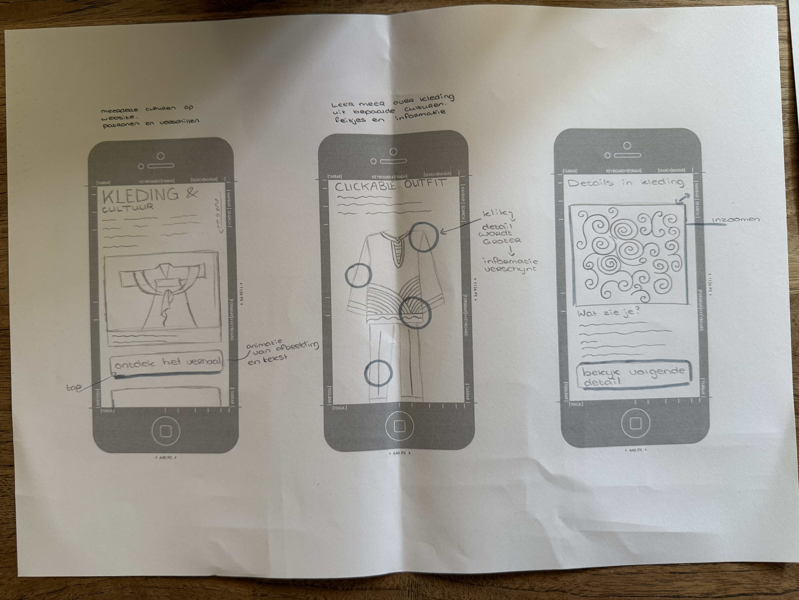
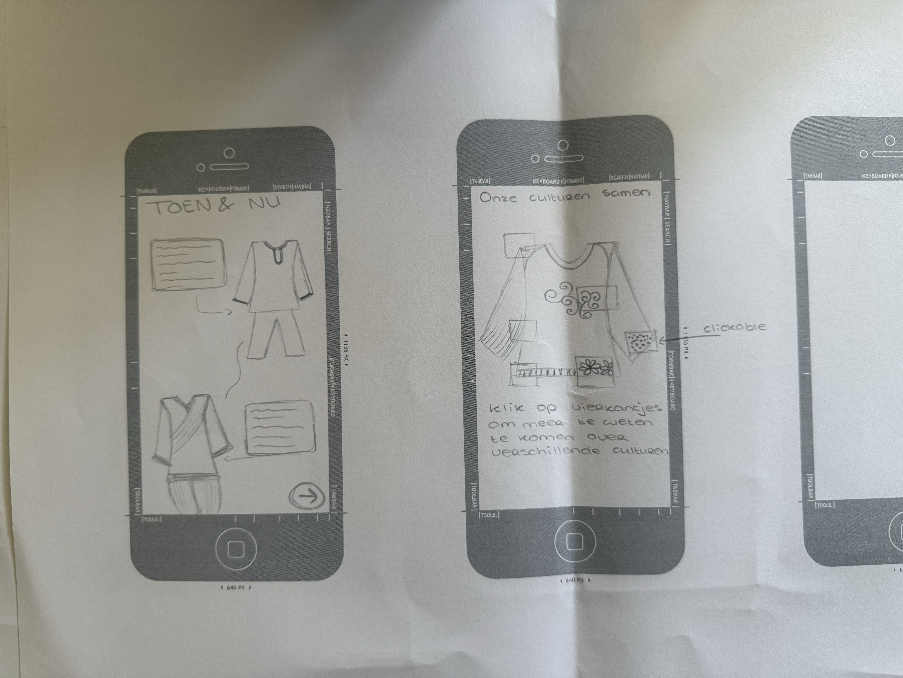

#### Digital garden en HTML structuur

Vandaag ben ik begonnen met het aanpassen van de HTML-structuur van mijn Digital Garden. Ik heb de bestaande template aangepast en ben alvast begonnen met het toevoegen van mijn eigen onderwerp, teksten en structuur. Ook wil ik de kleuren, achtergrond en typografie steeds meer laten aansluiten bij mijn eigen stijl.

Tijdens het uitwerken merkte ik dat ik eerst beter moet bepalen wat ik precies in mijn Digital Garden wil vertellen. Ik wil niet alleen onderzoek doen naar traditionele kleding en verschillende culturen, maar ook een persoonlijk onderdeel toevoegen.

Kleding heeft voor mij namelijk een sterke verbinding met cultuur, familie en identiteit. Doordat ik niet bij mijn gezin woon en een ouder ben verloren, heb ik soms het gevoel gehad dat er een stukje verbinding ontbrak. Het zoeken naar mijn culturele achtergrond en het dragen van kleding uit mijn cultuur is voor mij daardoor ook een manier geworden om die verbinding te voelen en te behouden.

Ik wil deze persoonlijke ervaring uiteindelijk naast mijn onderzoek plaatsen. Zo wordt mijn Digital Garden niet alleen een verzameling informatie over culturen en kleding, maar ook een plek waarin ik onderzoek hoe kleding voor iemand persoonlijk betekenis en een gevoel van verbondenheid kan krijgen.

**deepdive over kleuren en gradients**

ik heb de hele deepdive gedaan en vond het best interessant, ik wist al ongeveer van vorig jaar hoe hex codes werkte maar nu was het meer info en ook duidelijker dus ik kon de opdrachten ook doen, alleen bij de vlaggen kon ik de moeilijkste niet daarvoor moest ik wel AI gebruiken omdat mijn code steeds niet werkte.
gradients en animations snap ik nu ook, wel nog ingewikkeld maar als ik oefen komt het wel goed, laatste animation werkte niet helaas.

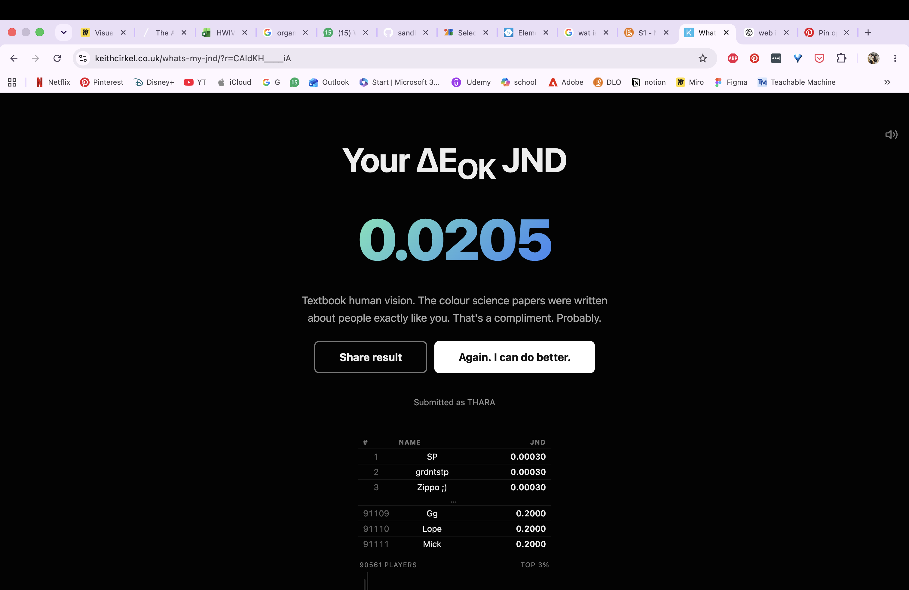
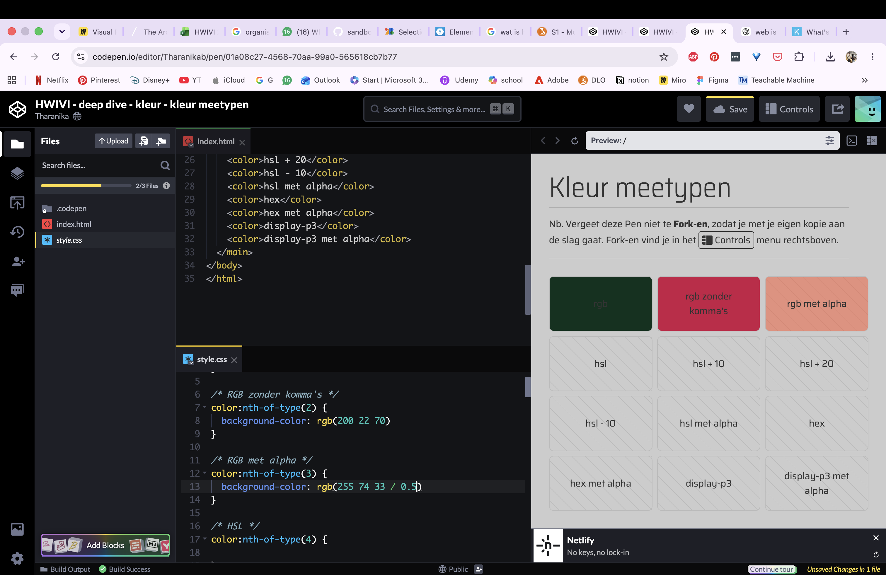

#### 11 september 2026

**feedback van Barbara**

- idee is goed uitgewerkt en ik heb een duidelijk idee van wat ik wil vertellen.
- ik heb veel frames getekend dus dat is goed zodat ik mijn ideeën kan vergelijken met elkaar
- probeer te kijken hoe je de kleuren kan laten terug komen van de fotos die je hebt verzameld dus bijvoorbeeld warme tinten
- de abstracte vormen van de typografie poster erin terug laten komen in je design bijvoorbeeld transitions met organische vormen.

Van mijn uitgetekende ideeën spreekt het idee waarbij een kledingstuk centraal staat en je meer informatie over verschillende details kunt ontdekken mij het meest aan. Mijn oorspronkelijke idee was om op een detail in te zoomen en vervolgens extra informatie te tonen.

Ik had samen met een leerling van tweedejaar gekeken naar een simpelere oplossing voor het idee dat ik had omdat mijn idee van het inzoomen op een kledingstuk en daar info bij zetten eigenlijk te moeilijk en misschien nu nog te complex is met de html en css wat ik nu kan, maar hij had wel laten zien hoe ik het op een andere manier kan doen dus dat wil ik uitproberen en misschien kan mijn idee dan toch werken.

Ik heb ook de deepdive gevolgd over grids, en hier heb ik alle opdrachten tijdens de deepdive kunnen doen.
Het was wel ingewikkeld de oefeningen maar ik snap het wel.
Ik heb wel nog moeite met code typen uit mijn hoofd, want ik snap de code vaak wel maar als ik dus zelf moet typen wat het moet zijn en de volgorde dan lukt het vaak niet. Ik hoop dat met oefenen dit probleem weggaat.

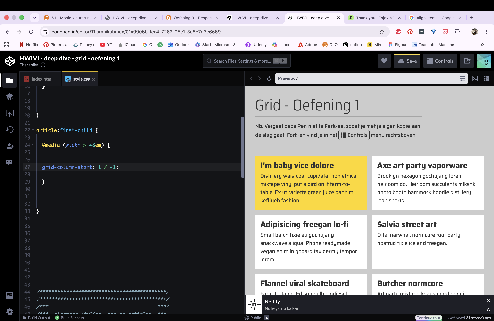

#### 12 september 2026 - huiswerk

#### 14 september 2026

**checkout vragen**

- Leg uit wanneer een website 'lelijk' wordt en geef voorbeelden wat je kan doen om deze 'lelijke' onderdelen te fixen?
  wanneer je html structuur niet werkt en je geen css hebt die bijvoorbeeld grid geeft of dat je afbeelding zich aanpast aan je desktop.
  door dus wel grids te hebben en max width toe te voegen maakt het een mindere lelijke website.

- Vertel welke volgende stap je neemt om je website responsive te maken.
  Ik denk dat mijn volgende stap is zorgen dat mijn headers en tekst mooi onder elkaar staan en ik ga verder aan mijn afbeeldingen

- Kun je het ontwerp en de bouw van je eigen Garden (zo uit je hoofd) onderbouwen in Webby vocabulair?
  Op dit moment kan ik nog niet zeggen dat hij volledig webby is maar hij heeft dus wel al dat hij redelijk fluïde is dus hij past zich aan aan het scherm zoals desktop of mobiel en light en dark mode.

Ik ben nu bezig met het dynamisch en interactief te maken dus hover states erin zetten.
Toegankelijk heb ik het al door dus contrast en hierarchie.

En ik wil het meer expressief maken want het idee wat ik heb is best uitdagend maar ik denk dat het gaat werken.

#### 15 september 2026

Visual design & design consistency
Ik heb de vijf principes van visual design van NN/g gelezen: scale, visual hierarchy, balance, contrast en Gestalt. Deze principes helpen om een ontwerp duidelijker en gebruiksvriendelijker te maken en kunnen ook invloed hebben op emotie en merkperceptie.

Daarnaast heb ik gelezen over design consistency. Consistentie zorgt ervoor dat een interface voorspelbaarder wordt, waardoor usability verbetert, de learning curve korter wordt en gebruikers minder fouten maken. Ik heb geleerd over visual, functional, internal en external consistency. Bij mijn eigen Digital Garden zie ik dit bijvoorbeeld terug in mijn vaste typografie, kleuren, layout en manier waarop links en onderdelen worden vormgegeven.

Ik heb de deepdive over grids gedaan, en doordat ik die grids 101 al had gedaan was het best makkelijk om te begrijpen en kon het ook toepassen in de oefeningen dus ik wil dat nu in mijn eigen website proberen.

"area-one area-two"
"area-three area-four"

┌───────────┬───────────┐
│area-one │ area-two │
├───────────┼───────────┤
│ area-three│ area-four │
└───────────┴───────────┘

Ik ben ook verder gegaan aan het verder maken van mijn website, ik heb extra tekst toegevoegd en de navigatie menu aangepast door hem nu boven mijn header neer te zetten en inplaatsvan verticaal onder elkaar dat ze horizontaal naast elkaar staan dat vond ik mooier.

Ik heb ook gekeken of ik mijn grids kon aanpassen dus naar areas maar ik denk dat dat niet handig is omdat hoe ik het nu heb is dat hij automatisch het in twee kolommen zet en ik nog geen specifieke positionering heb wat je bij areas juist gebruikt.

#### 16 september 2026

- Noem 3 Gestaltprincipes op en laat de ander uitleggen wat ze betekenen en doen.

Nabijheid - dus de afstand kan zorgen voor groepen zodat je weet wat bij elkaar hoort

closure - je hersenen maken het beeld af, door het zelf in te vullen dit kan of goed werken of juist het verkeerde beeld geven

Asymmetrie - tegenovergestelde van symmetrie waardoor je ongelijkheden krijgt in je design.

- Een grid biedt ruimte om te spelen (vrijheid), maar tegelijkertijd ook eenheid en structuur (vastigheid). Wat wordt hiermee bedoeld?

Je hebt veel mogelijkheden met hoe je de grids gebruikt met rows of columns of areas maar het geeft structuur omdat het alles uitlijnt dus het ziet er netter uit.

- Welk principe neem je mee in een laatste iteratie van je ontwerp?

Nabijheid want zo kan je goed zien welke groepen bij elkaar horen en dat mis ik nu nog een beetje in mijn website.

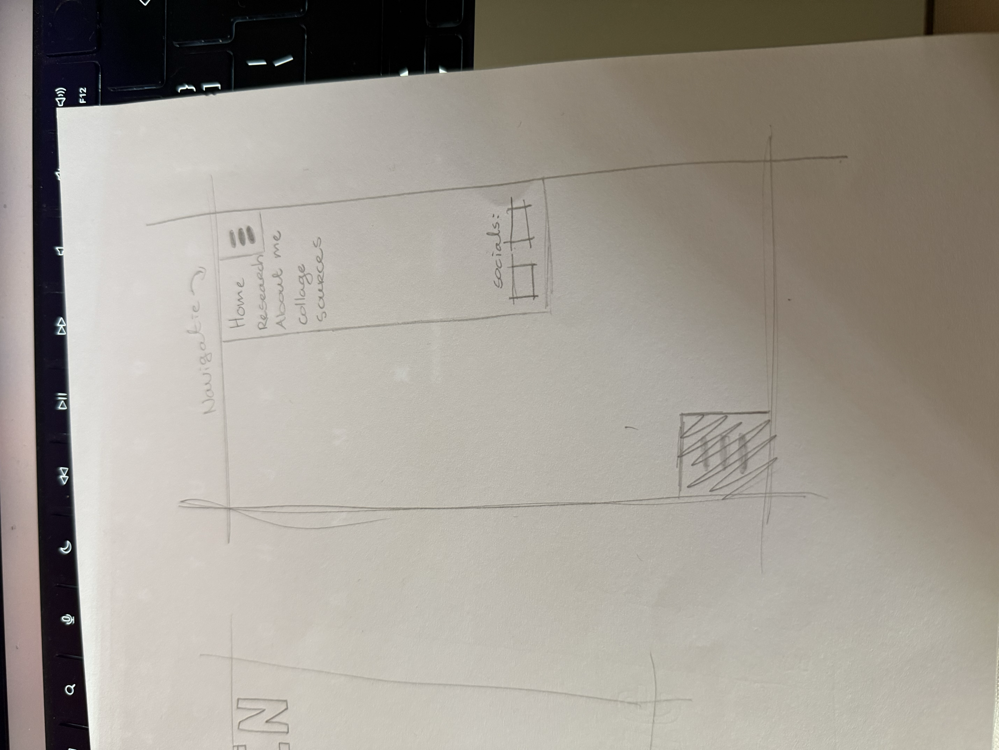
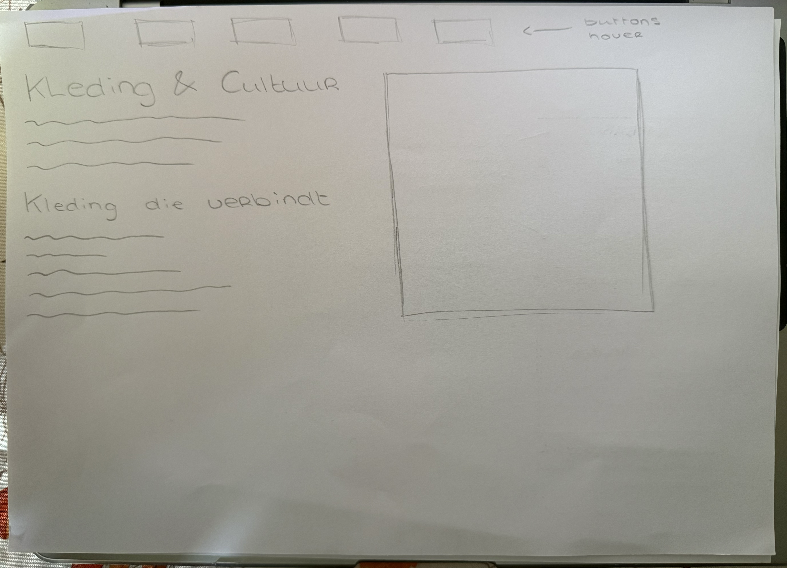
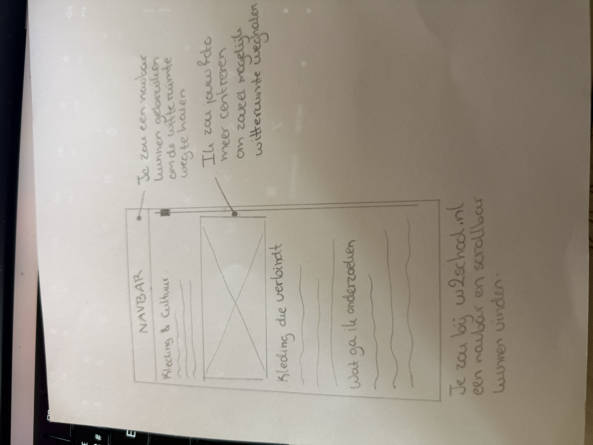

#### 17 september 2026

Ik heb na de schetsen die ik gisteren in de les heb gemaakt en die ik vandaag verder heb uitgedacht mijn navigatie responsive gemaakt.
Dus op de desktop zijn mijn navigatielinks nu buttons die werken met een hover. en heb hierbij dus gedaan dat als je op mobiel opent er een hamburger menu icoon verschijnt. Dit ik heb ik wel anders gedaan dan dat bij HTML5 Doctor werd aangegeven want dat was button code maar dat moest met JavaScript en aangezien dat voor mij nog te ingewikkeld is en ik mij wil focussen op CSS heb ik aan ChatGPT gevraagd of er andere mogelijkheden zijn en dat was werken met summary en details. En dit heb ik vorig jaar ook gedaan dus hiervan had ik zelf de code.

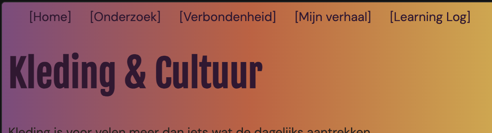

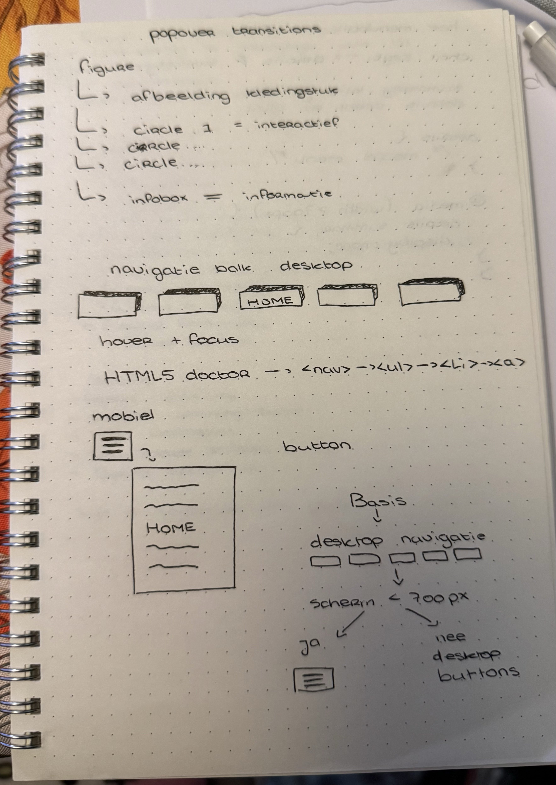
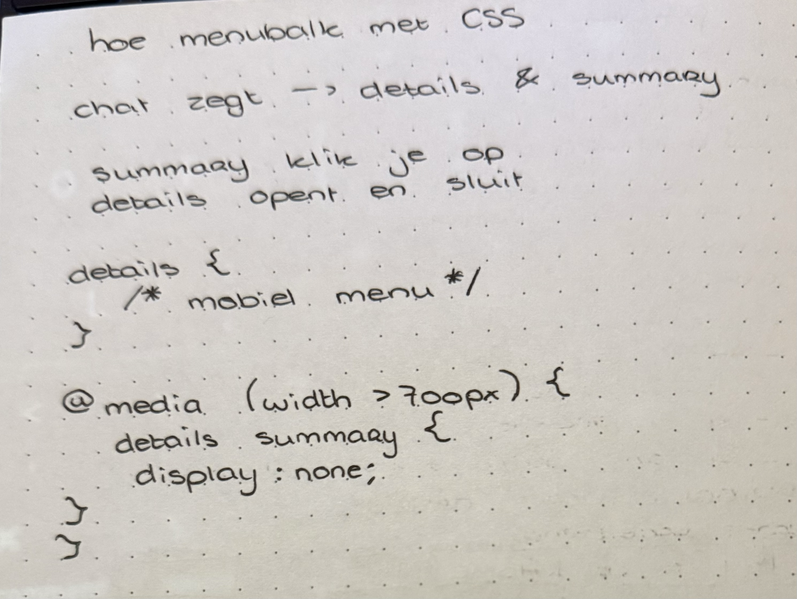

dus bijvoorbeeld
@media (width >700px) {
details: summary {
display: none;
}
}

#### 18 september 2026

**checkout reflectie**

Ik wilde vooral leren hoe ik HTML en CSS kan gebruiken om een Digital Garden te maken, door de Deep Dives en maken van mijn eigen website begrijp ik veel beter wat code inhoudt en hoe de structuur van een website werkt, bijvoorbeeld de opbouw met body, main en footer.
De Deep Dive over Grid 101 en Grid areas vond ik vooral het beste omdat ik hiervoor nooit goed snapte wat grids deden. Nu heb ik het ook kunnen verwerken in mijn eigen website. Ik heb ook bijvoorbeeld over gradients geleerd en snap nu hoe dat in CSS moet. Vergeleken met vorig jaar in het eerste blok vind ik HTML en CSS nu een stuk duidelijker. Het is nogsteeds moeilijk maar ik begin de logica te snappen.
Ik merk wel dat ik vaak veel ideeën heb die nu technisch nog te moeilijk zijn en daardoor nog niet haalbaar maar het geeft mij wel veel ruimte om nieuwe dingen te

In het begin wist ik nog niet goed wat een Digital Garden was. Door de voorbeelden die ik had gezien dacht ik eerst dat het vooral een soort portfolio of digitaal dagboek was. Ik vond dat minder bij mij passen omdat ik niet veel eerder gemaakt werk had gemaakt werk dat ik als portfolio wilde laten zien.
Één van de docenten had uitgelegd dat het een onderwerp kan zijn waar je je veel over in kan verdiepen of iets persoonlijks of juist iets wat je heel leuk vind, dus ik kwam uit bij mijn interesse in cultuur en kleding, waardoor het idee voor mijn Digital Garden over kleding en cultuur ontstond. Om dit idee verder te onderzoeken heb ik afbeeldingen uit mijn eigen galerij bekeken, Pinterest gebruikt en vrienden met verschillende culturele achtergronden gevraagd naar hun ervaringen. Daarnaast heb ik veel geschetst, wireframes gemaakt en Crazy Eights gebruikt om verschillende richtingen te onderzoeken. Mijn oorspronkelijke interactieve idee was een kledingstuk waarop je kon inzoomen. Tijdens feedback met Barbara en een van de studentassistenten bleek dat dit technisch waarschijnlijk te ingewikkeld zou zijn. Hij stelde voor om met pop-overs te werken, waardoor uiteindelijk het idee voor de interactieve hotspots ontstond. Mijn concept is uiteindelijk iets persoonlijker geworden en richt zich nu sterker op mijn eigen culturele achtergrond, terwijl ik oorspronkelijk verschillende culturen en hun overeenkomsten en verschillen wilde vergelijken.
Tijdens het uitwerken heb ik veel onderdelen van mijn website zelf gebouwd. Ik heb de kennis uit de Deep Dives en bronnen zoals MDN en HTML5 Doctor toegepast. Zo heb ik een light- en dark mode gemaakt, een navigatie met een hamburgermenu, Grid en Grid Areas gebruikt en interactieve hotspots met pop-overs toegevoegd. Vooral de navigatie was technisch lastig. Ik wilde eerst met buttons werken, maar daarvoor zou ik JavaScript nodig hebben, wat ik nog niet beheers en waar de focus dit blok ook niet op ligt, Daarom heb ik naar een andere oplossing gezocht en uiteindelijk met summary gewerkt.
Ook de hotspots waren lastig om goed te krijgen. De interactie werkt, maar de cirkels staan nog niet op iedere schermgrootte precies op de juiste plek. Tijdens het bouwen merkte ik hierdoor dat een idee technisch anders kan uitpakken dan ik vooraf verwacht. Het onderdeel waar ik het meest tevreden over ben, is de visuele stijl. Vooral de gradients zijn geworden zoals ik ze voor ogen had en sluiten goed aan bij mijn eerdere collage en moodboard.
Tijdens het proces heb ik verschillende keren feedback gebruikt om mijn ontwerp te verbeteren. Van Barbara kreeg ik bijvoorbeeld de feedback om mijn moodboard, collage, foto's, typografie en het abstracte karakter van mijn onderzoek meer terug te laten komen in mijn website. Vooral de kleuren en vloeiende, organische bewegingen konden sterker terugkomen. Daarom heb ik mijn eerste simpele kleurgebruik aangepast en gradients toegevoegd, waardoor de website beter aansluit bij mijn eerdere visuele onderzoek. Ook heb ik samen met klasgenoten gekeken naar mijn light- en dark mode. Zij gaven feedback op de kleuren, waarna ik deze verder heb aangepast. Door het maken van de website heb ik geleerd dat ik eerst mijn ideeën visueel wil uitwerken en daarna pas wil kijken welke code ik daarvoor nodig heb. Als ik opnieuw zou beginnen, zou ik deze werkwijze grotendeels hetzelfde gebruiken. Wel zou ik sommige technische ideeën eerder testen, zodat ik sneller weet wat haalbaar is.

!image nog van mn rollercoaster erin zetten!

#### 21 september 2026

We gingen in de les, live coderen en hiervan dus de basis stappen die je in een simple website hebt zoals light/dark maar ook colors ingesteld etc doen.
Het ging best wel snel hierdoor was het moeilijk te begrijpen wat we nou uiteindelijk allemaal deze maar ik had het wel af.

We hebben ook naar Cookies gekeken die je op websites te zien krijgt, en onderzocht wat het nou eigenlijk is, en over wat voor data het gaat en welke bedrijven die cookies willen en verkopen.

**checkout questions**

**Wat zijn HTML landmark role elements?**

- Het zijn elementen die de grootte en het inhoud bepalen, zoals
  body, footer, main, header.

**Wat zijn heading elementen en hoe horen deze 'genest' te worden?**

- H1 tot H2 gaan op hierarchische volgorde.
  Het "nesten" of ordenen van koppen hoor je te doen op basis van een logische, numerieke volgorde

**Hoe ga jij met cookies om? Beschrijf jouw beweegredenen en of die zijn veranderd na het volgen van dit college.**

- Voortaan niet meer zomaar op akkoord drukken, want ze gebruiken gewoon je data en die verkopen ze.

#### 22 september 2026

Omdat ik nog geen feedback heb gehad die ik eigenlijk vrijdag had moeten krijgen ben ik gewoon verder gaan met mijn website op eigen gevoel.

**deepdive Button, states en selectors**
