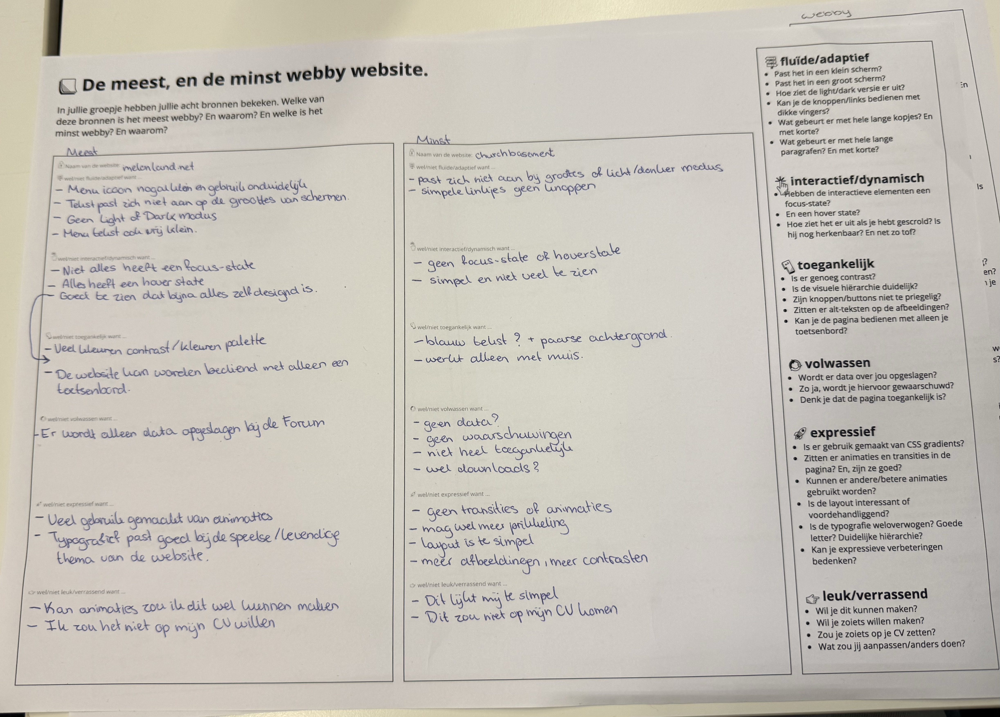
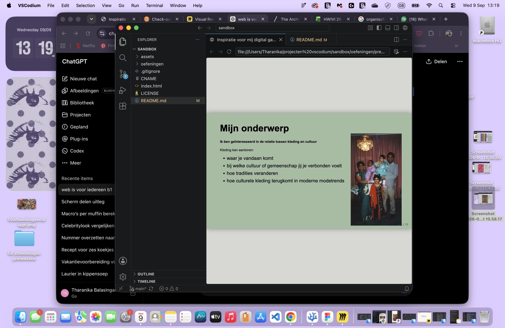
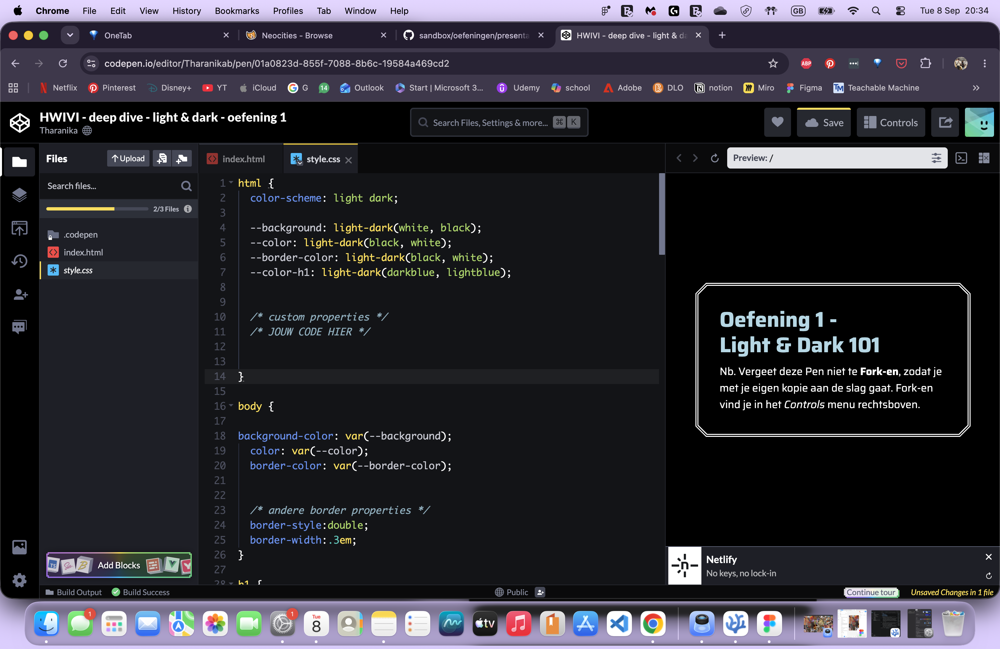
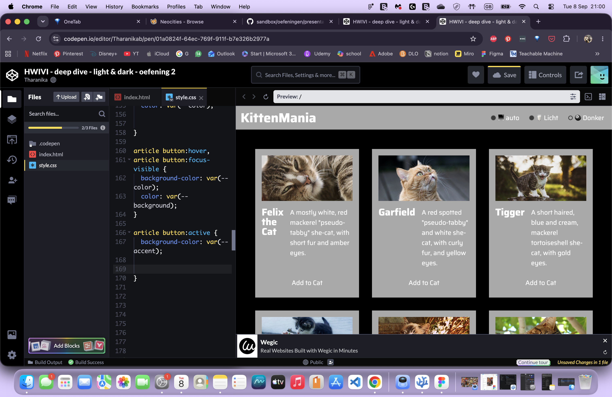
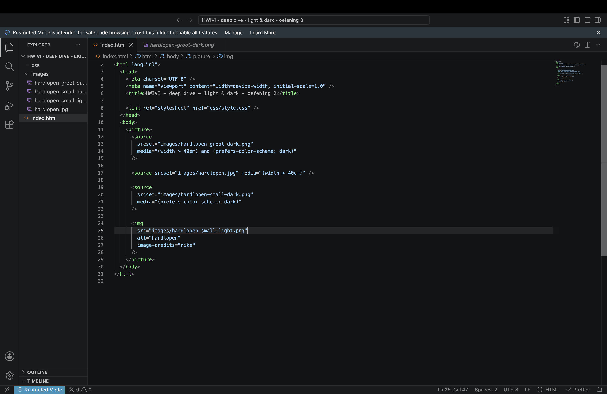
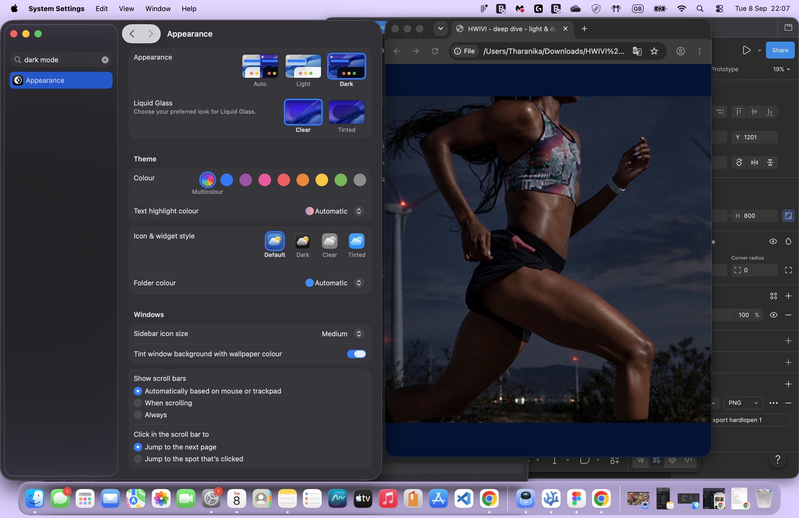
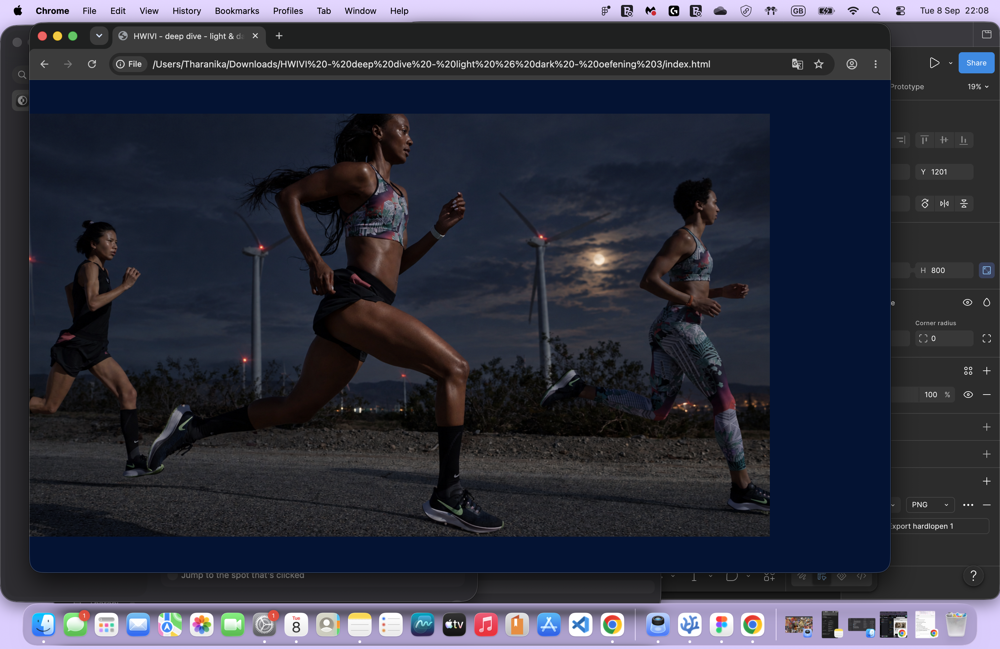

# Model

Het staat model voor digitale tuintjes welke bij 'Het web is voor iedereen' door studenten worden gemaakt.

## Learning Log

### 31 aug - Kickoff

Een fork van de model repository gemaakt en gepubliceerd via mijn eigen Github omgeving.

#### 1. Leg uit wat een source hosting platform is en voor welke jij gekozen hebt.

Een source hosting platform is een online plek waar je de bestanden en code van een website kunt opslaan en beheren. Ik heb gekozen voor GitHub. Hier heb ik mijn eigen repository gemaakt door de model repository te forken.

#### 2. Vertel welke domeinnaam jij gekozen hebt en hoe je die hebt gekoppeld aan jouw pagina.

Ik heb gekozen voor het domein tharanika.nl. Ik heb mijn domein gekoppeld aan mijn GitHub Pages door de DNS-instellingen van mijn domein aan te passen en een CNAME-bestand in mijn repository te gebruiken.

#### 3. Beschrijf hoe je aanpassingen aan jouw pagina kunt maken en hoe je er voor zorgt dat die op het web gepubliceerd worden.

Ik kan mijn website aanpassen door de bestanden, bijvoorbeeld index.html, in VSCodium te veranderen. Daarna sla ik mijn wijzigingen op en maak ik een commit. GitHub Pages zorgt er daarna voor dat de aangepaste versie van mijn website online wordt gepubliceerd.

### 2 september 2026

Vandaag hebben we gewerkt aan micro-interacties en multimodal design.
We hebben een Wok to Walk-menu formulier aangepast naar een digitaal ontwerp voor een laptop of tablet. Dit heb ik Figma gemaakt.

#### Dit is het originele formulier:

#### schetsencursus

We hebben tijdens schetsen cursus gehad over lijnen trekken en vierkanten maken zonder liniaal, na dit oefenen hebben we verschillen bekeken tussen hi-fi en low fi wireframes en die getekend van een app met microanimaties.
Ik had apple music gekozen

#### De wireframe die ik heb gemaakt

### 3 september 2026

voorbereiding voor de cursus HTML & CSS Basics (Justus) en Praktische CSS (Vasilis)

Voor deze les heb ik de onderdelen Introduction, Basic Web Pages en Hello CSS van HTML & CSS is hard gelezen. Ook heb ik de CSS Diner gedaan om meer te oefenen met CSS-selectors. Dit vond ik eerlijk gezegd best lastig, maar ik kwam uiteindelijk tot level 15. Ik wil hier nog verder mee oefenen totdat ik de selectors beter begrijp.

Daarnaast heb ik het artikel Structuring content with HTML op MDN doorgenomen. Tijdens het doorklikken viel mij op dat SEO niet alleen bij bijvoorbeeld YouTube een rol speelt, maar ook bij websites. Ik wist niet dat de structuur en betekenis van HTML hierbij kunnen meespelen.

De vragen die ik voor de les had waren:

- Wanneer gebruik je in CSS px en wanneer em?
- Hoe bepaalt de cascade welke CSS-regel voorrang krijgt wanneer meerdere regels op hetzelfde HTML-element van toepassing zijn?

#### deel van de aantekeningen die ik had gemaakt en CSS diner

### CSS diner game

#### lelijke website verbeteren

#### 4 september 2026

Vandaag hebben de in de cursus van Justus het gehad over de basis van HTML en CSS, aangezien de laatste keer dat we het hier over hadden al een jaar geleden was waar we weinig uitleg kregen.
We hebben besproken waar HTML en CSS voor staan, wat de belangrijkste onderdelen zijn en waar je op moet letten wanneer je ermee werkt.
Iets echt nieuws wat ik nog niet wist was dat je tegenwoordig Java niet perse meer nodig hebt om een website echt interactief te maken omdat je met CSS heel veel kan doen, dus ik ben benieuwd hoe mijn website er over een paar weken uit zal zien.

Bij Vasilis hebben we mijn eerder gemaakte “lelijke” HTML-pagina gebruikt om opnieuw naar de basis van HTML en CSS te kijken. We hebben de code stap voor stap opgebouwd en steeds zelf overgetypt, zodat duidelijker werd wat ieder onderdeel doet.

Ik vind HTML en vooral CSS nog steeds best ingewikkeld. Daarom wil ik de komende tijd blijven oefenen door de code zoveel mogelijk zelf uit te schrijven in plaats van alles te kopiëren en plakken. Op die manier wil ik niet alleen de code beter leren begrijpen, maar ook de volgorde, haakjes, aanhalingstekens en andere tekens steeds beter leren herkennen en onthouden.

#### 7 september 2026

##### Les van Maandag

we hebben in de les artikels gelezen en geanalyseerd over wat een digital garden inhoudt, wat het betekent, maar ook wat jij zelf denkt dat erin hoort.

We hebben ook websites vergeleken met elkaar, en gerangschikt hoe "webby" het is.
of het alle vakjes aanvinkt.

- **Vanuit de inventarisatie: Wat zou je zelf willen maken? Heb je dingen gezien die je nog niet kan, maar wel interessant vindt in de websites die je bekeken hebt?**
  Ik wil eigenlijk een website die best wel diep in een bepaald onderwerp gaat, maar die ook naar meerdere kanten kijkt. Ik wil hem ook best prikkelend hebben, veel afbeeldingen, plaatjes maar ook micro animaties en ook dat hij interactief is.

- **Welke webby dingen heb je gezien die je ook wil gebruiken?**
  ik wil ook veel afbeeldingen hebben die animaties geven of dat als je er op drukt dat er een reactie komt, mooie kleurcombinaties maar vooral iets wat persoonlijk is en echt bij mij past.

- **Welke eigen content zou je over het onderwerp kunnen schrijven? Wat is de toon, ​de context, het doel, wat zijn onderwerpen, wat is ‘het’ wat jou raakt!​**
  Ik weet nog niet precies wat ik wil, maar ik wil een richting van kleding die uit culturen komt, en hoe dat mensen met elkaar verbind. Verdieping over hoe bijvoorbeeld bepaalde stijlen van over de hele wereld in een trend komen in bijvoorbeeld westerse landen, maar ook hoe je een bepaalde connectie kan voelen met jouw afkomst door de kleding die jij bij jou draagt.

- **Maak je gebruik van content van een ander? Hoe denk je dat te doen? En mag dat eigenlijk wel? Hoe kan je die content zo aanpassen dat het echt een eigen verhaal wordt? Dat het echt jouw content wordt, op jouw eigen garden?**
  Ik wil de content van anderen gebruiken om mijn eigen content te verbreden en te versterken, dus het wel mijn eigen te maken. Ik denk als ik bronvermeldingen gebruik en niet zeg dat het van mij is dan vind ik dat het wel zou kunnen maar wil veel zelf vinden en uitzoeken.

- **Op welke manier is de content te ervaren, denk verder dan alleen in tekst en beeld (beleeft, voelt, ziet, hoort enz.)**
  Ik denk dat bij mijn onderwerp heb je veel dingen die je kan ervaren, bijvoorbeeld je gevoel van nostalgie of herkenning maar ook dingen voor het eerst zien wat je nog niet kende.
  Ik denk dat muziek kan ook goed een gevoel creëren wat bij dat beeld past.

#### checkout

Check-out

Vandaag heb ik geleerd wat een Digital Garden is en hoe deze verschilt van een reguliere website. Een Digital Garden is persoonlijker en kan blijven groeien en veranderen, in plaats van dat alles meteen af en perfect hoeft te zijn.

Ook heb ik gekeken naar wat een website webby maakt. Voor mij zijn duidelijke navigatie en buttons, passende typografie, een goed kleurthema en voldoende contrast belangrijk. Ik wil deze principes meenemen in mijn eigen Digital Garden en vooral veel aandacht besteden aan de visuele uitstraling en interactie.

#### 8 september 2026

Voor het huiswerk heb ik mijn presentatie gemaakt en voorbereid,
Het koste best veel werk, en heb er ook heel lang over gedaan Terwijl het resultaat best simpel is, maar ik snap nu wel beter hoe afbeeldingen werken met positions and width left and right.

Ik heb daarna de deepdive gedaan van light&dark theme
Ingewikkeld maar ik snap het wel, dus ik denk als ik het vaker doe dat het dan steeds logischer wordt.

#### 9 september 2026

**Visual Research & visuele identiteit**

Tijdens de online les van vandaag hebben we gekeken hoe je een visuele identiteit aan je Digital Garden kunt geven. Door onder andere kleur, typografie, logo, visuals en achtergrond krijgt je Garden een eigen karakter en uitstraling.

Daarna zijn we gestart met Visual Research. Vanuit de zin “Ik voel mij verbonden” heb ik gezocht naar beelden die passen bij mijn onderwerp. Woorden als warm, trots, thuis, herkenning, eigen en divers passen hierbij. Ik heb gekeken naar verschillende culturen, mijn familie, kledingtrends, patronen en sieraden en hieruit visuele kenmerken gehaald zoals herhaling, overlapping en organische vormen.

Met de Crazy 8 heb ik vervolgens verschillende ideeën geschetst. Ik wil vooral het idee van inzoomen op details verder onderzoeken, bijvoorbeeld om patronen en sieraden uit kleding uit te lichten. Ook het samenbrengen van verschillende beelden tot één geheel past goed bij het idee van verbondenheid.

Daarnaast heb ik vandaag mijn presentatie met Tamar gegeven en hebben we elkaar vragen en feedback gegeven over onze onderwerpen.

de opdracht in miro [miro-opdrachten](https://miro.com/app/board/uXjVHpsKqYY=/?share_link_id=626870178987)

#### checkout vragen

**Leg uit waar het Visual Research in 3 stappen naartoe werkt**
Het Visual Research gaat van mijn onderwerp en sfeerwoord naar visuele kenmerken en uiteindelijk naar concrete ontwerpideeën. Door eerst beelden te verzamelen, daarna te kijken naar patronen en vormen en vervolgens te schetsen, kom ik tot een visuele richting voor mijn Digital Garden.

**Vertel in 2 zinnen waar jouw Garden over gaat, en met welke content je dat gaat doen (beeld, tekst, sound, animatie enz).**
Mijn Garden gaat over de relatie tussen kleding en cultuur en hoe kleding kan zorgen voor een gevoel van verbondenheid met een cultuur, familie en geschiedenis. Ik wil dit vertellen met eigen foto’s, afbeeldingen, tekst en interactieve/visuele elementen zoals animaties en micro-interacties.

**Vertel kort welk idee van de Crazy 8 je het liefst zou willen uitvoeren/ verder zou willen onderzoeken.**
Ik wil het idee van inzoomen op beelden verder onderzoeken. Ik vind het interessant om details van kleding, zoals patronen en sieraden, interactief uit te lichten.

**Vragen tijdens mijn presentatie;**

**Wat is voor jou de essentie van wat je hebt gepresenteerd qua onderwerp en geschreven/beeldende content?**

- Kleding is meer dan mode, het is een manier om creativiteit en verbondenheid uit te drukken.

 
**Welke woorden uit de kwaliteitenlijst kunnen passen bij je onderwerp?**

- Persoonlijk, traditioneel, modern en visueel.

 
**Heeft 'de ander' een aanvulling op je onderwerp?**

- Hoe sociale media trends impact hebben op hoe culturele kleding nu wordt gedragen en verkocht.

 
**Wat is het karakter/ de uitstraling/ het gevoel dat bij het onderwerp past? (bijv. stoer, hip, vrolijk, dynamisch, eenvoudig, enz.)**

- Kleurrijk, expressief en persoonlijk.

 
**Welke inspiratie kun je uit je 25 afbeeldingen halen. Stijl, een gevoel, vorm, enz.**

- Het is heel kleurrijk, verschillende culturen hebben vaak een eigen stijl in de kleding (patronen, kleuren,vormen). De culturele kleding kan ook trots gevoel opwekken.

#### 10 september 2026

**randvoorwaarden schermschetsen**

- Singel column is standaard voor moviel
- Schets realistische verhoudingen van tekst en beeld en schets met je gehele content, en de gehele flow met interacties
- +-35 tekens per regel en 16px/1em font-size

##### Mobile-first schermschetsen

Voor mijn vijf mobile-first schermschetsen heb ik ideeën uit mijn Crazy 8 en Visual Research verder uitgewerkt. Ik heb over verschillende manieren nagedacht waarop de gebruiker door mijn Digital Garden over kleding en cultuur kan navigeren.

Bij de schetsen heb ik onder andere gekeken naar:

- kleding als centraal uitgangspunt;
- verschillende culturen en kledingstijlen;
- inzoomen op details zoals patronen en sieraden;
- interactieve cirkels/hotspots;
- informatie die verschijnt wanneer je op een onderdeel klikt.

Ik heb bewust vijf verschillende richtingen geschetst om uiteindelijk te kunnen vergelijken en kijken welke toch het beste is.

#### Digital garden en HTML structuur

Vandaag ben ik begonnen met het aanpassen van de HTML-structuur van mijn Digital Garden. Ik heb de bestaande template aangepast en ben alvast begonnen met het toevoegen van mijn eigen onderwerp, teksten en structuur. Ook wil ik de kleuren, achtergrond en typografie steeds meer laten aansluiten bij mijn eigen stijl.

Tijdens het uitwerken merkte ik dat ik eerst beter moet bepalen wat ik precies in mijn Digital Garden wil vertellen. Ik wil niet alleen onderzoek doen naar traditionele kleding en verschillende culturen, maar ook een persoonlijk onderdeel toevoegen.

Kleding heeft voor mij namelijk een sterke verbinding met cultuur, familie en identiteit. Doordat ik niet bij mijn gezin woon en een ouder ben verloren, heb ik soms het gevoel gehad dat er een stukje verbinding ontbrak. Het zoeken naar mijn culturele achtergrond en het dragen van kleding uit mijn cultuur is voor mij daardoor ook een manier geworden om die verbinding te voelen en te behouden.

Ik wil deze persoonlijke ervaring uiteindelijk naast mijn onderzoek plaatsen. Zo wordt mijn Digital Garden niet alleen een verzameling informatie over culturen en kleding, maar ook een plek waarin ik onderzoek hoe kleding voor iemand persoonlijk betekenis en een gevoel van verbondenheid kan krijgen.
