# Model

Het staat model voor digitale tuintjes welke bij 'Het web is voor iedereen' door studenten worden gemaakt.

#### bronnen voor mijn website, die ik heb gebruikt.

- W3Schools - Gebruikt voor uitleg en voorbeelden bij HTML en CSS.
- MDN Web Docs - gebruikt voor uitleg en documentie over HTML en CSS.
- HTML5 Doctor - vinden van codes voor mijn HTML en CSS
- CSS-Tricks - gebruikt voor uitleg en voorbeelden rondom CSS.
- ChatGPT - gebruikt als hulpmiddel om mijn code te controleren, fouten te begrijpen en het bedenken van oplossingen.

#### Voor inspiratie

- Pinterest - visuele inspiratie voor de vormgeving, kleding en beelden op mijn website

#### Gebruikte afbeeldingen

- Pinterest - afbeelding gebruikt op de website; oorspronkelijke maker/auteur was bij het vinden van de afbeelding niet duidelijk vermeld.
- andere afbeeldingen - fotos van mijzelf of die ik zelf heb gemaakt.

## Learning Log

#### 7 & 8 oktober 2026

Link van tijdgeest website;
file:///Users/Tharanika/Downloads/TIJDSGEEST/tijdsgeest.html

In de les hebben we het gehad over grids en hiërarchie om je ontwerp te verbeteren en duidelijker te maken.

checkout

- Waarom is het goed om een grid in je ontwerp toe te passen? Noem een reden voor de ontwerper en een voor de bezoeker.
  voor een ontwerper geeft grid een structuur en helpt daarmee dus ook elementen logischer en duidelijker te plaatsen.
  voor de bezoeker zorg dus een grid dat het overzichtelijk is en de info beter te volgen is door de bepaalde rangorde.

- Noem drie manieren om chaos in je ontwerp te voorkomen.

1. hiërarchie in je ontwerp
2. gebruiken van grids
3. voldoende witruimte zodat het niet te druk wordt.

- Hoeveel gekkigheid moet er in je werk zitten?
  Ik denk eigenlijk zoveel jij zelf wilt, en jij denkt dat het dan nogsteeds een mooi ontwerp is, maar zorg dat het wel nog rust geeft en duidelijkheid heeft.

deepdive Sanne variabele fonts:
In deze Deep Dive heb ik geleerd wat variabele fonts zijn en hoe je deze kunt gebruiken. Een variabel font kan verschillende instellingen/assen hebben, waardoor je eigenschappen van een lettertype kunt aanpassen, zoals het font-weight en andere font-variaties.

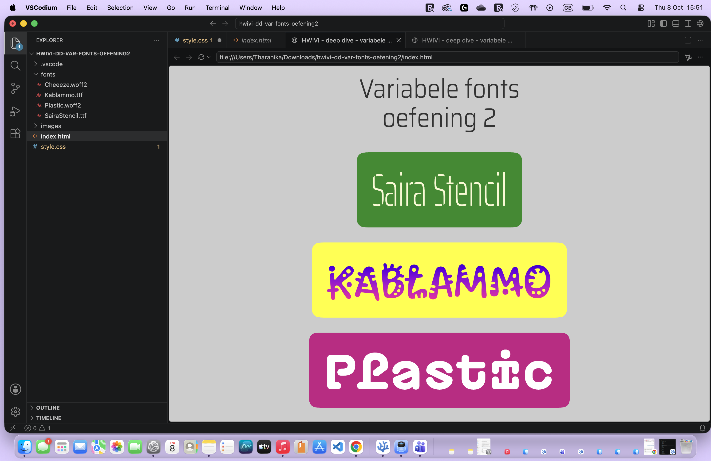

Ik heb verschillende variation settings uitgeprobeerd en gebruik :hover en transition om de grote titel en losse woorden te laten veranderen wanneer je eroverheen gaat.

huiswerk:

artikel: Using Grids in Interface Designs
Grids geven structuur aan een interface. Ze zorgen voor uitlijning, consistentie, betere scanbaarheid en een responsive layout. Een grid bestaat uit columns, gutters en margins. De meest gebruikte types zijn column, modular en hierarchical grids.

Een grid is een onzichtbare structuur waarmee je bepaalt waar elementen op een pagina komen te staan. Het bestaat uit:

- columns -> waar je content in uitlijnt.
- gutters -> de ruimte tussen de kolommen.
- Margins -> de ruimte aan de linker- en rechterkant van het scherm.

3 belangrijkste grids:

- column grid;
  De pagina wordt verdeeld in verticale kolommen. Elementen worden hieraan uitgelijnd.
  -> Goed voor algemene websites en layouts waarbij je flexibiliteit nodig hebt.
- modular grid;
  Dit is een column grid met óók horizontale rijen. Hierdoor ontstaan kleine blokken/modules.
  -> Handig voor bijvoorbeeld webshops, portfolio's en overzichtspagina's, omdat je veel herhalende elementen hebt.
- hierarchical grid
  Hierbij bepaalt de belangrijkheid van content hoeveel ruimte iets krijgt.
  -> Belangrijkste content = grootste gedeelte van de layout.
  Bijvoorbeeld een nieuwswebsite waarbij één hoofdartikel veel groter is dan de andere artikelen.

Grids zijn belangrijk omdat het de gebruiker zowel designer helpt.

Voor de designer:

- Je kunt elementen makkelijk uitlijnen.
- Je krijgt sneller een consistente layout.
- Je hebt een duidelijke structuur om mee te werken.
  Voor de gebruiker:
- Een pagina is makkelijker te scannen.
- Elementen staan waar je ze verwacht.
- De informatie voelt overzichtelijker en voorspelbaarder.

Een grid moet meebewegen met verschillende schermformaten.

belangrijk: gutters moeten leeg blijven, mag geen info in.

Grid mag je doorbreken hoeft niet perse dus recht, maar wel met een reden

artikel | Rhythm in Graphic Design: Types, Uses, and Examples:

rhytym = herhaling van visuele elementen waardoor je oog door een ontwerp wordt geleid.

Je kunt bijvoorbeeld herhalen:

- vormen
- kleuren
- lijnen
- tekststijlen
- iconen
- afstanden/spacing
- kaarten of andere componenten

Rhythm zorgt ervoor dat een ontwerp:

- makkelijker te volgen is -> je oog weet waar het naartoe moet.
- samenhangend voelt -> verschillende onderdelen lijken bij hetzelfde systeem te horen.
- overzichtelijker wordt -> herhaling geeft structuur.
- een bepaalde emotie kan oproepen.
  Bijvoorbeeld:
- Regelmatig ritme -> rustig en georganiseerd
- Afwisselend ritme -> actief en speels
- Gecontroleerd willekeurig -> energiek en experimenteel

3 soorten rhythm:

- regular, Hetzelfde element wordt met dezelfde afstand herhaald
- alternating, Twee of meer elementen wisselen elkaar af
- Random, Elementen hebben verschillende afstanden/posities, maar wel binnen bepaalde regels

Kies wat je gaat herhalen
bijvoorbeeld cards, headings, iconen of spacing. 2. Begin met gelijke afstanden
bouw eerst een duidelijk basisritme. 3. Voeg daarna variatie toe
bijvoorbeeld om en om een andere kleur of grootte. 4. Gebruik rhythm om het oog te sturen
herhaling kan bepalen welke route iemand door je pagina volgt. 5. Controleer spacing en alignment
als afstanden per ongeluk verschillen, wordt je rhythm rommelig. Code Chefs

Rhythm is herhaling van visuele elementen om beweging en flow in een ontwerp te creëren. Het helpt de gebruiker door een pagina te leiden en zorgt voor samenhang. De drie belangrijkste vormen zijn regular, alternating en random rhythm. Gebruik consistente spacing en herhaling, maar voeg variatie alleen bewust toe.

filmpje:

Als designer gebruik je verschillende designprincipes en tools om betere en meer consistente ontwerpen te maken.

Design tools & principles: Als designer gebruik je tools en designprincipes om betere, consistente en esthetische interfaces te maken. Belangrijke principes zijn grid, hierarchy, typography, spacing en composition.

Grid → structuur
Hierarchy → belangrijkheid
Typography → tekst
Rhythm → herhaling/flow
Spacing → ruimte
Composition → alles samen

#### 6 oktober 2026

S3 Deep Dive — Interessantere layouts

- vw → schaal gebaseerd op viewport
- clamp() → minimum / ideale waarde / maximum
- cqi → schaal gebaseerd op container
- container-type: inline-size → maakt container geschikt voor container queries
- writing-mode → tekst anders oriënteren
- @media → layout aanpassen aan schermgrootte
- CSS Grid → elementen bewust plaatsen
- position: sticky → element blijft tijdens scrollen staan

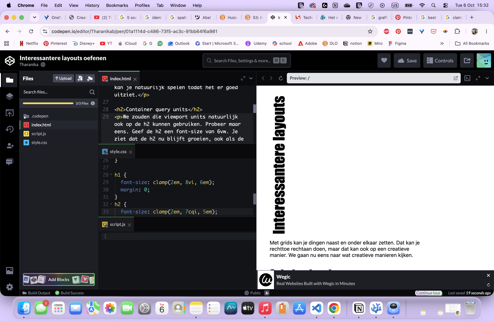

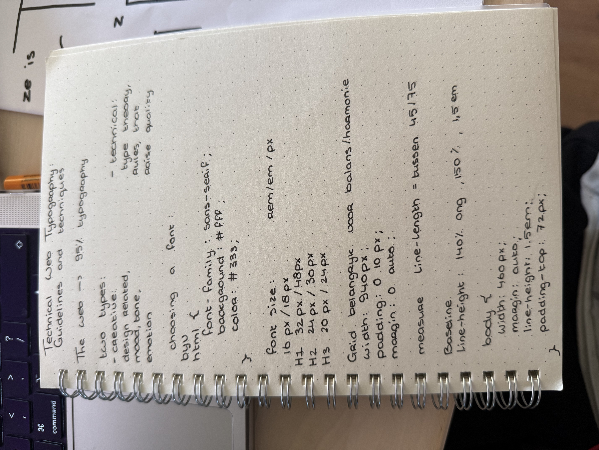

Ik heb ook mijn tijdgeest html gemaakt en wilde eigenlijk een soort trappetje maken maar omdat het niet werd zoals ik wilde heb ik er een soort omgekeerde piramide vorm van gemaakt.

#### 5 oktober

Deze week ben ik begonnen met Sprint 3: De regels en het spel. In deze sprint gaat het specifiek over typografie en waarom typografie zo belangrijk is binnen een website. We kijken niet alleen naar hoe een lettertype eruitziet, maar ook naar hoe je typografie kunt gebruiken om hiërarchie, ritme, contrast en dynamiek te creëren.
We zijn begonnen met verschillende teksten over typografie, waaronder typografische theorie, ritme, hiërarchie en het werken met een modular type scale.

Eerst wilde ik Let It Happen van Tame Impala kiezen, maar omdat veel studenten dit nummer kozen en ik mezelf wilde uitdagen, heb ik uiteindelijk gekozen voor Tijdgeest van Ijsland.
Ik kende het nummer vooraf nog niet. Ik heb het gekozen omdat het ritme mij opviel. De snelle bas en het ritmische karakter doen mij een beetje denken aan techno. Hierdoor zag ik mogelijkheden om het ritme en de dynamiek van het nummer visueel te vertalen.

Door de herhaling denk ik dat ik het ritme en de hiërarchie beter visueel kan laten terugkomen.
Vervolgens heb ik tien verschillende expressieve vormgevingen gemaakt.

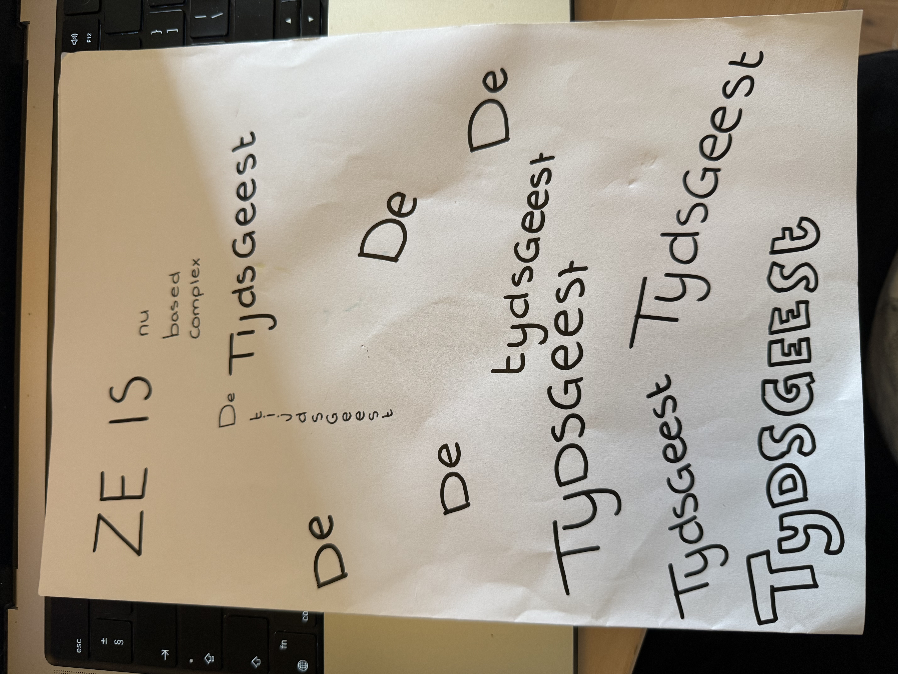

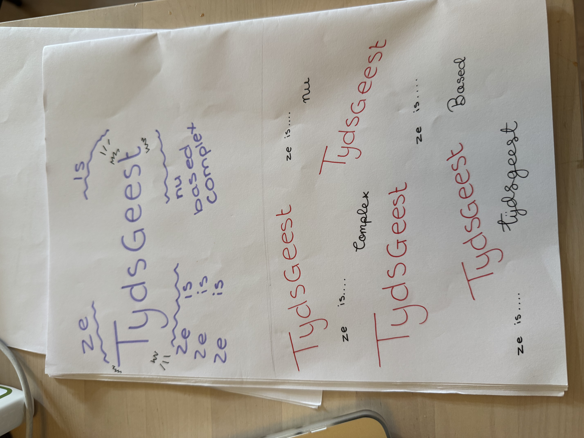

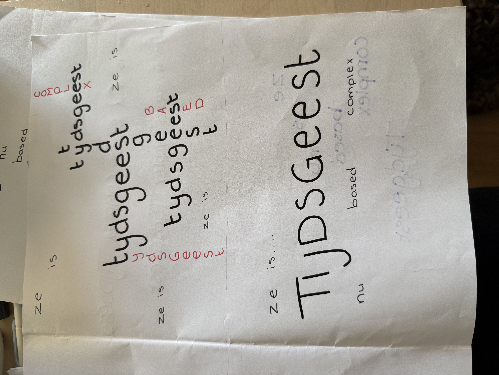

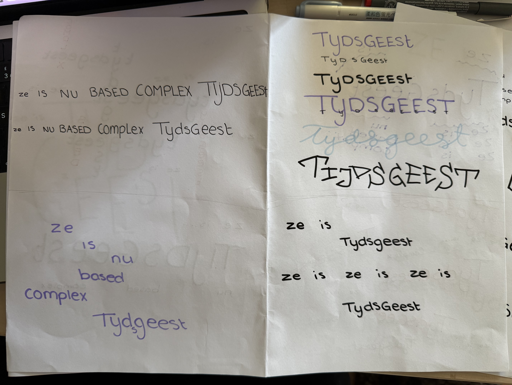

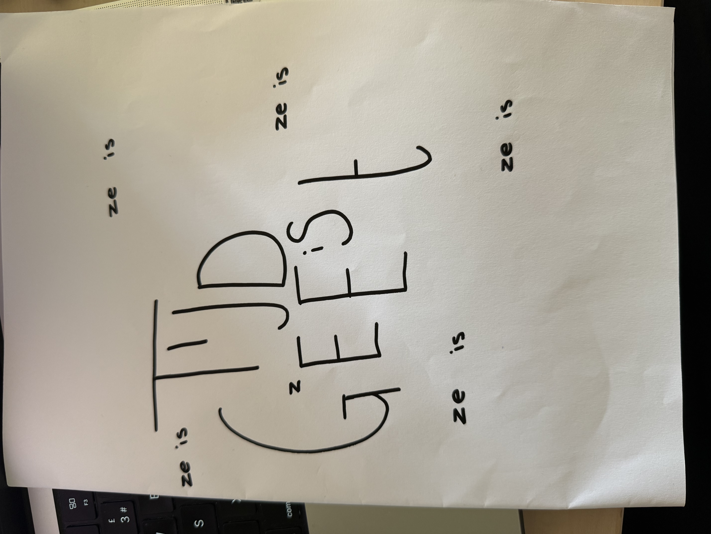

Ritme
→ herhaling van woorden
Hiërarchie
→ één enorm woord tegenover kleine tekst
Dynamiek
→ verspreiding over het scherm / verschillende richtingen
Contrast
→ groot-klein, dik-dun, verschillende fonts
Grid
→ woorden bewust op verschillende plekken in een grid

checkout:

- Leg uit wat er met de volgende termen bedoeld wordt: kerning, tracking, leading, flush-left, flush-right, centered, justified, indent, outdent, modular scale, movable type, focus punt, vijf soorten contrast, spatial tension. (Hint, alle termen staan in de artikelen die we samen gelezen hebben)

kerning: Is het aanpassen van de afstand tussen bepaalde letters zodat het er natuurlijk uitziet.

tracking: is het aanpassing van ruimte bij bepaalde paragrafen

leading: is de verticale ruimte tussen twee regels van tekst

flush left: is dat je je tekst aangelijnd is aan de linkerkant.

centered: is dat je tekst in het midden komt te staan, gecentreerd

indent:

tussen 40/65 pixels

5 soorten contrasten:
-licht en donker contrast
-warmte en koud contrast
-Complementair contrast

- Wat is jouw ideale regellengte (measure)? Leg uit waarom.

- Als je in een ontwerp maar één variabele tot je beschikking had om hiërarchie aan te brengen (grootte, plaatsing, spacing, lettersoorten), welke zou je dan gebruiken en waarom?

#### 2 oktober 2026

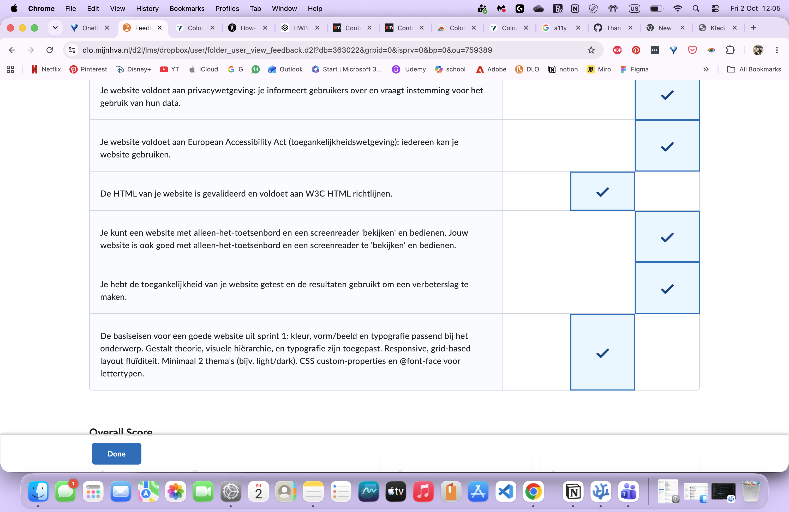
evaluatie feedback:

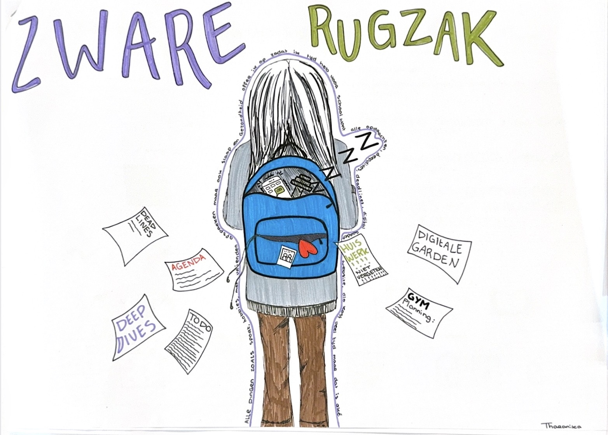
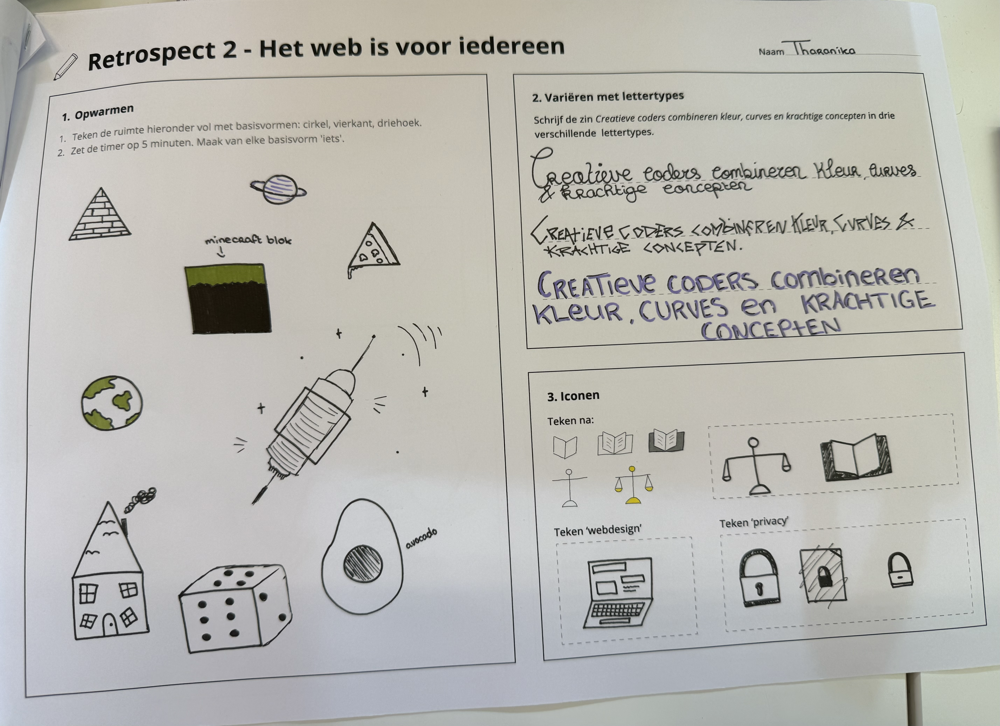
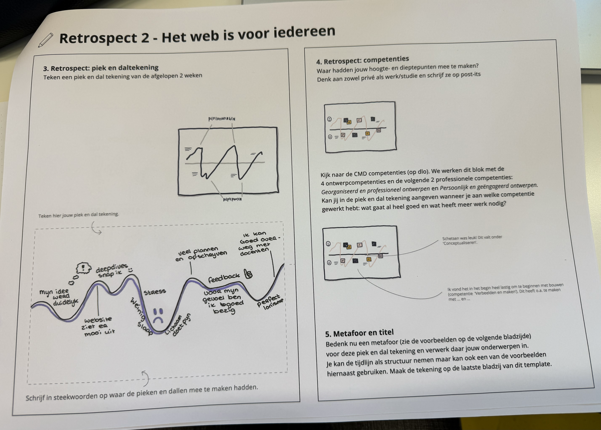

#### 1 oktober 2026

Ik heb gewerkt aan mijn to do's die ik bijvoorbeeld moest aanpassen,
bijvoorbeeld mijn privacy en cookie button.
Ik had eerst een fout gemaakt waardoor de buttons het niet meer deden, maar dat is nu opgelost.

Ik heb nu ook twee nieuwe pagina's toegevoegd aan mijn Digital Garden. Ik had de tekst voor deze pagina's had ik al eerder in mijn notities opgeschreven, maar nu eindelijk de tijd voor gehad om op de website te zetten. De inhoud staat er maar ik ben nog niet blij met de layout dus daar wil ik nog mee aan de slag

Mijn website begint hierdoor steeds meer vorm te krijgen. De belangrijkste onderdelen staan er nu in en ik kan steeds beter zien hoe de verschillende pagina's en onderdelen samen één geheel vormen.

#### 30 september 2026

Ik ben vandaag niet naar school geweest omdat ik ziek was dus heb ik thuis de opdrachten gedaan en getest met mijn vriend.

**Screenreader-test**

Ik heb mijn website samen met mijn vriend getest met een screenreader. Hiervoor heb ik mijn spiekbrief gebruikt om door de website te navigeren.

Headings
De headings worden goed herkend door de screenreader. Ze staan in de juiste volgorde en de structuur van de pagina is hierdoor duidelijk. De H1 en H2-kopjes worden goed aangegeven.

Navigatie en links
De navigatie werkt goed met de screenreader. De links worden herkend en de namen van de links worden duidelijk voorgelezen. Hierdoor is het duidelijk waar de verschillende links naartoe leiden.

Buttons
Ook de buttons worden goed herkend. De screenreader geeft onder andere de buttons Privacy en Cookie-instellingen duidelijk aan.

Interactief kledingstuk
Het interactieve kledingstuk werkt nog niet goed met de screenreader. De interactieve punten op het kledingstuk worden niet als interactieve elementen herkend en zijn daardoor niet via de screenreader te gebruiken. Dit is een verbeterpunt waar ik nog naar moet kijken.

Conclusie
De belangrijkste structuur en navigatie van mijn website zijn goed te gebruiken met een screenreader. Vooral de headings, links en buttons worden goed herkend. Het interactieve kledingstuk is op dit moment het belangrijkste toegankelijkheidsprobleem.

**Toetsenbordtest**

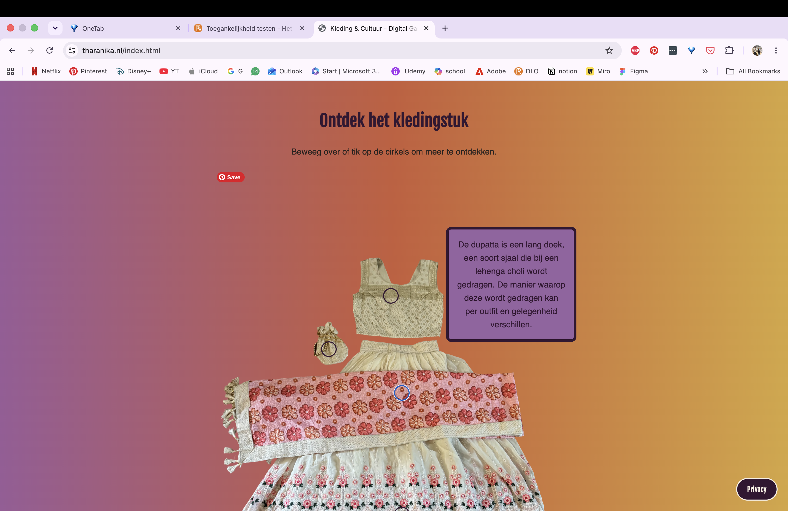

Daarna heb ik mijn website alleen met het toetsenbord getest. Met de Tab-toets kan ik alle interactieve elementen bereiken. De buttons, navigatie en ook het interactieve kledingstuk zijn bereikbaar. De volgorde waarin ik door de website ga is logisch.

Ook kan ik de Privacy-dialog en Cookie-instellingen openen en de opties hierin aanpassen. Ik kom tijdens het navigeren nergens vast te zitten.

Een klein verbeterpunt dat ik tijdens de test ontdekte is de focus state. Bij het navigeren met Tab wordt nu nog de standaard blauwe focuskleur van de browser weergegeven. Ik wil deze focus state aanpassen zodat deze beter aansluit bij de rest van mijn website en duidelijk zichtbaar blijft.

Conclusie: de website is met alleen het toetsenbord goed te navigeren. De focus styling kan nog verbeterd worden.

- Kleurcontrast test: De gebruikte kleurcombinaties zijn getest met een contrast ratio tool. De geteste combinaties voldoen aan WCAG AA en AAA. Ook bij verschillende vormen van kleurenblindheid blijft de tekst leesbaar.

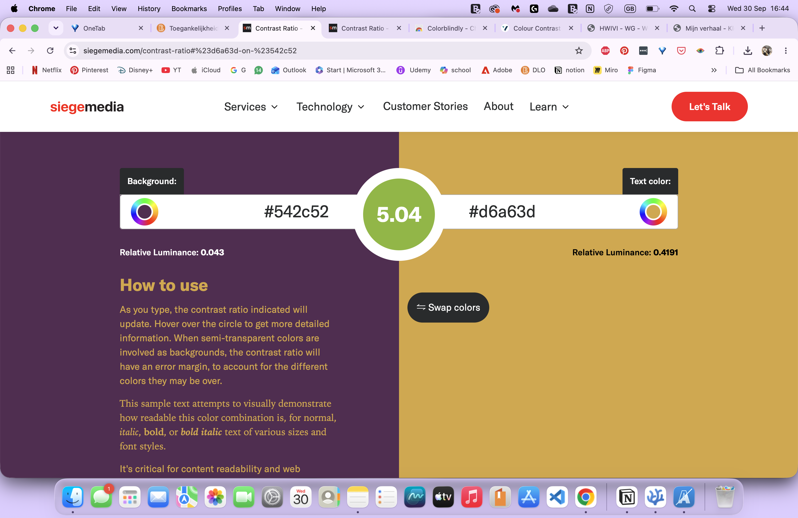

- Colorblind test: Ik heb de website getest met verschillende vormen van kleurenblindheid. De kleuren veranderen zichtbaar, maar de tekst blijft leesbaar en de afbeeldingen blijven herkenbaar. De website gebruikt kleur niet als enige manier om informatie over te brengen.

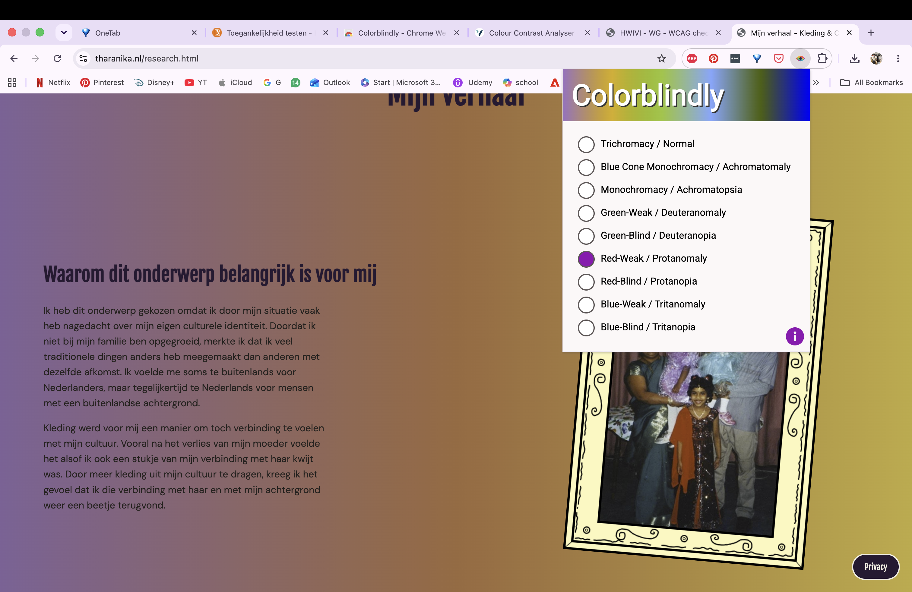

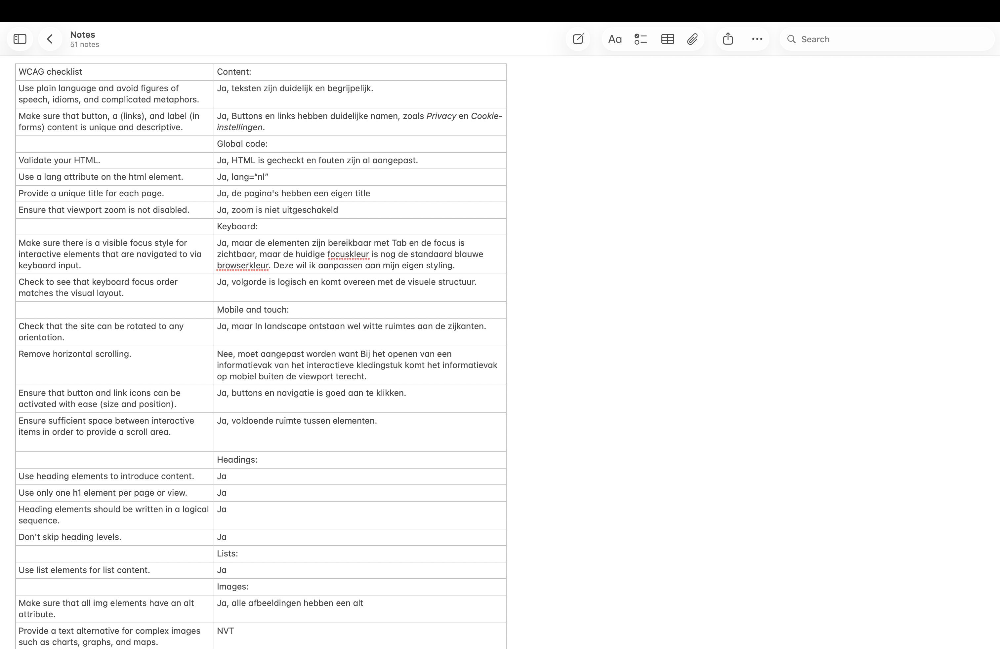

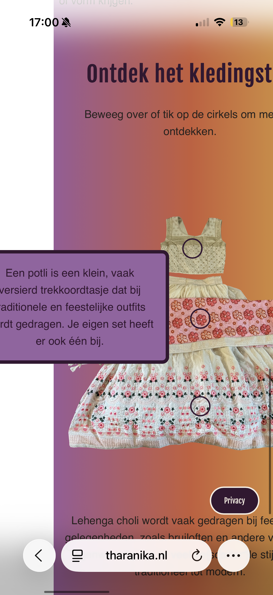

**Verbeterpunten die uit de test kwamen**

1. Focus state → eigen kleur/styling geven in plaats van de standaard blauwe browserstijl.
2. Interactief kledingstuk op mobiel → infoboxen komen buiten de viewport terecht.
3. Skip link → ontbreekt momenteel.
4. Links die in een nieuw tabblad openen → niet aangegeven.
5. High-contrast mode → nog testen.
6. Afbeeldingen met tekst → nog controleren of de tekst in de afbeelding ook inhoudelijk belangrijk is.
7. Landscape → werkt, maar heeft witte ruimtes aan de zijkanten.

checkout:

1. Waar staat WCAG en A11y voor?
   WCAG staat voor Web Content Accessibility Guidelines. Dit zijn richtlijnen voor het toegankelijk maken van websites en digitale content.

A11y is een afkorting voor accessibility. Het A11y Project maakt toegankelijkheidsrichtlijnen onder andere overzichtelijker en praktischer door ze in een checklist te zetten.

2. Wat vind je lastiger, je laptop/websites alleen met een toetsenbord bedienen of met een screenreader? Waarom? Waar moet je nog mee oefenen?
   k vind het werken met een screenreader lastiger dan een website alleen met een toetsenbord bedienen. Met mijn toetsenbord gebruik ik automatisch de Tab-toets en pijltjestoetsen om door een website te navigeren. Bij een screenreader zijn de bediening en sneltoetsen anders en moet ik vaak meerdere toetsen tegelijk indrukken. Daardoor ga ik soms per ongeluk naar het verkeerde onderdeel.

Ik moet daarom vooral nog oefenen met de bediening en sneltoetsen van de screenreader en het navigeren door verschillende soorten content.

3. Met welke beperking rekening houden vind je het meest lastig?
   Ik vind het lastig om één beperking aan te wijzen, omdat iedere beperking weer andere aandachtspunten heeft. Vooral het bedenken hoe iemand mijn interactieve ontwerp kan gebruiken wanneer diegene een andere manier van navigeren nodig heeft, vind ik soms lastig.

Door de tests ben ik er wel achter gekomen dat toegankelijkheid niet alleen gaat over hoe iets eruitziet, maar ook over hoe iemand door een website kan navigeren en informatie kan begrijpen. 4. Vind je dat je beperkt wordt in wat je kunt ontwerpen?
Of heb je al manieren gevonden om vanuit een solide basis - die voor iedereen toegankelijk is - allemaal leuke en mooie extra's toe te voegen als je bezoekers dat goed vinden?

Ik denk wel dat je moet accepteren dat je niet voor iedereen een website perfect toegankelijk kunt maken. Het gaat er voor mij vooral om dat je vanuit een goede, toegankelijke basis ontwerpt en vervolgens bewuste keuzes maakt over de extra's die je toevoegt.

to do's
Focus state aanpassen / done
infobox mag niet buiten viewport vallen / geprobeerd, werkt nog niet
geen horizontale overflow wanneer je erop tikt
Kijken of het interactieve kledingstuk ook met screenreader goed werkt
Eventueel skip link overwegen
Controleren of afbeeldingen met tekst een goede alt hebben / done

Website opruimen
Bronnen op je website
Verbondenheid uitbreiden
onderzoek/bronnen

afbeeldingen in mapjes zetten?

#### 29 september 2026

Vandaag heb ik eerst de Deep Dive over meer interactie met HTML en CSS afgerond. Dit ging eigenlijk beter dan ik had verwacht. Ik dacht van tevoren dat het lastiger zou zijn, omdat ik veel dingen nog niet uit mijn hoofd weet. Tijdens de Deep Dive merkte ik wel dat het nadenken over wat er moet gebeuren en hoe ik iets kan oplossen steeds makkelijker begint te worden. Ik hoef de code dus niet altijd direct uit mijn hoofd te kennen om te kunnen bedenken welke richting ik op moet. Dat vond ik dus wel een goed teken.
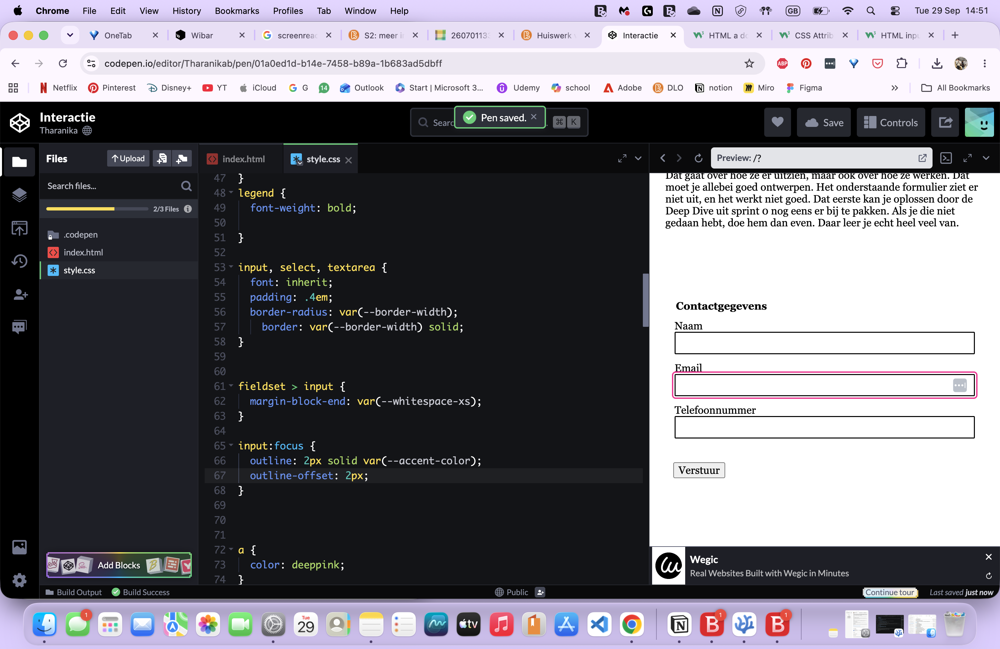
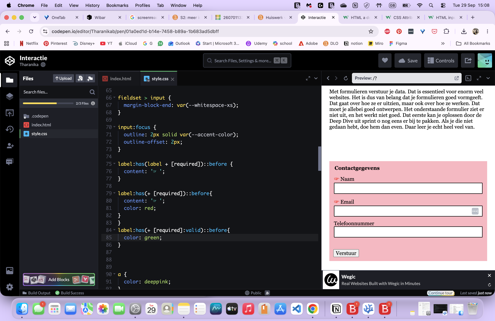
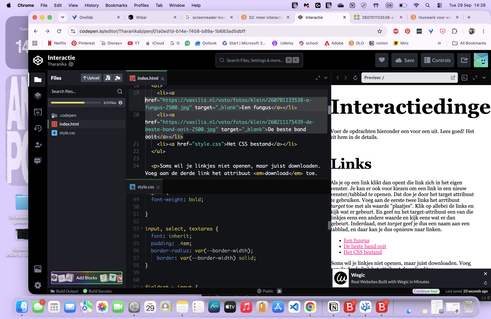

Daarna ben ik verdergegaan met mijn website. Ik heb vooral gewerkt aan de Grid Areas op de pagina van mijn verhaal. Hier ben ik best lang mee bezig geweest, omdat ik mijn eerdere opzet een beetje had verknald en daardoor een deel opnieuw moest opbouwen. Uiteindelijk zijn de Grid Areas nu wel goed gelukt. Op desktop ziet de indeling er goed uit. Op mobiel heb ik de layout aangepast naar één kolom, maar dit ziet er nog niet helemaal netjes uit. Hier moet ik dus nog verder aan werken.

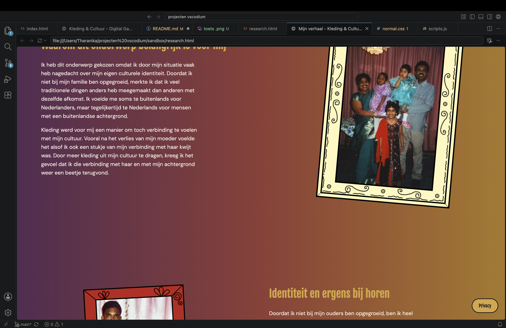

Daarna ben ik begonnen met de toegankelijkheid van mijn website. Dit vind ik best lastig, omdat ik zelf nog steeds aan het leren ben hoe ik überhaupt een website goed moet bouwen. Nu moet ik daarnaast ook rekening houden met verschillende toegankelijkheidsregels en manieren waarop mensen een website kunnen gebruiken. Bij sommige problemen wist ik daarom niet meteen hoe ik ze moest oplossen.

Ik heb onder andere mijn website getest met het toetsenbord en met een screenreader. Ik merkte dat een groot deel van mijn website eigenlijk al goed met het toetsenbord te bedienen is. Omdat mijn website nog relatief klein is, was het ook makkelijk om door de verschillende onderdelen te navigeren.

Een probleem waar ik nog tegenaan loop is de interactieve kledingafbeelding met de hover-elementen. Met de Tab-toets kan ik de ronde knoppen niet goed bereiken. Ik denk dat dit te maken heeft met het feit dat ik oorspronkelijk div-elementen had gebruikt in plaats van echte interactieve elementen zoals buttons. Ik heb geprobeerd dit aan te passen, maar het werkt nog steeds niet helemaal zoals ik wil. Ik weet daarom nog niet precies hoe ik dit probleem moet oplossen. Voor nu laat ik dit even liggen en kom ik hier later op terug.

**Ik merk dat ik steeds beter begin te begrijpen hoe ik problemen in mijn code kan aanpakken. Ik hoef niet alles uit mijn hoofd te kennen om zelf tot een oplossing te kunnen komen. Tegelijkertijd merk ik dat toegankelijkheid nog een lastig onderdeel voor mij is en dat ik daar nog meer mee moet oefenen.**

#### 28 september 2026

biweekly vragen

We hebben het in de les gehad over toegankelijkheid, wat belangrijk is bij een website en de wettelijke verplichtingen die er zijn voor mensen met een beperking.
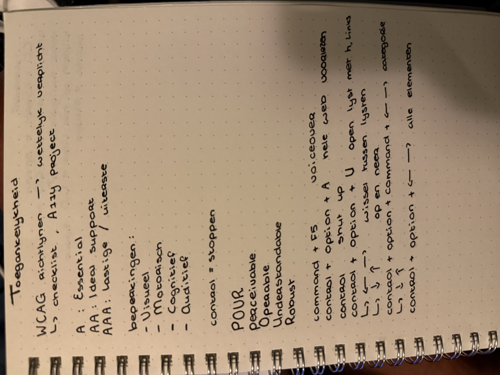

We gingen ook kijken hoe het is om zulke beperkingen te hebben en hoe je dan bijvoorbeeld op een website kan navigeren, wat eigenlijk heel moeilijk is. Hier denk je zelf niet zo snel aan maar voor iemand met een beperking kan het heel vervelend zijn.

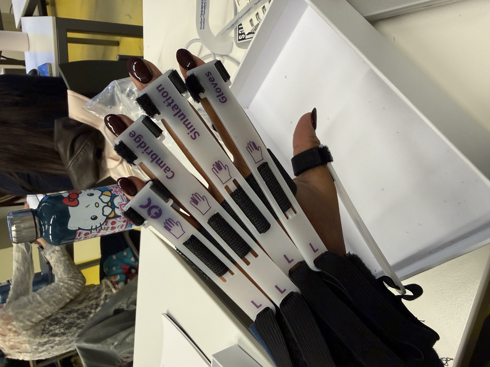
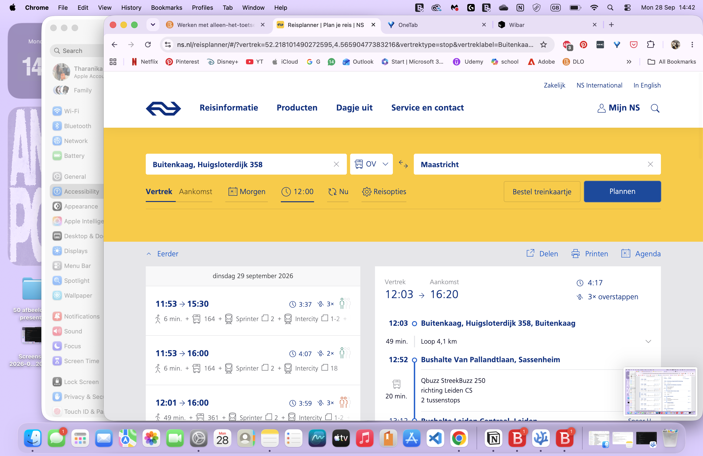

checkout vragen:

- Wat bedoelt Vasilis met de uitspraak: Semantiek doet mij niet zo veel, ik ben liever bezig met de UX van HTML?
  Hij houdt zich niet bezig met wat het is, de letterlijke definitie maar meer in de zin van wat je er allemaal mee kan doen.
- Wat voor type beperkingen hebben invloed op het gebruiken van websites?
  visueel, motorisch, cognitief, en auditief.
- Noem drie manieren om door een website te navigeren met jouw screenreader.
  Via headers
  regel per regel met de pijltjes
  met de linkjes of sneltoetsen

#### 26&27 september 2026

Ik heb nu eindelijk de summary aangepast naar een echte button dus nu past het goed op mijn website.

ik heb de artikelen over AI en de DSA gelezen en aantekeningen gemaakt.

Ik ben nu ook bezig met de pagina van "mijn verhaal" om de afbeeldingen goed te zetten, maar ik werkte eerst met position maar omdat ik met meerdere afbeeldingen werk en met tekst bedacht ik dat het beter is om gridareas te gebruiken dus daar ben ik nu mee bezig.
Ik heb een schets gemaakt van hoe ik het ongeveer zou willen.

#### 25 september

validator html structuur

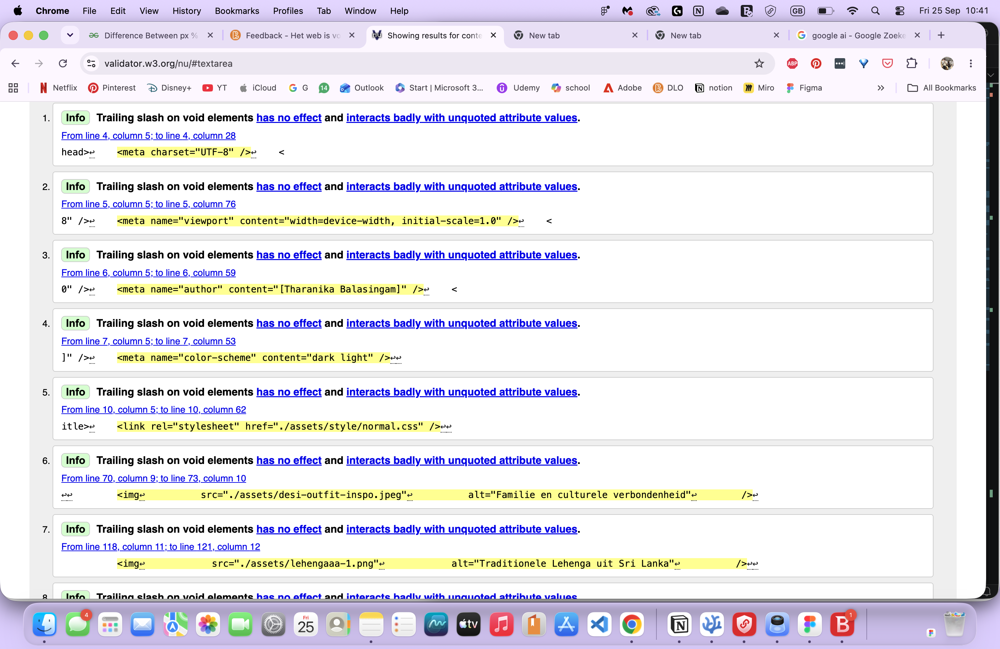

checkout: wat heb je afgelopen week allemaal geleerd?

- dark patterns
- privacy wet
- cookies popup/ human consent component
- html structuur en compliance html
- buttons & javascript
  Afgelopen week heb ik geleerd over dark patterns, privacy en privacywetgeving, cookies, de Human Consent Component, HTML-structuur en hoe ik deze kan controleren. Ook heb ik voor het eerst gewerkt met buttons en JavaScript. Ik begin hierdoor steeds beter te begrijpen hoe de structuur en techniek achter een website samenwerken en hoe belangrijk privacy en bewuste interacties daarbij zijn.

**deepdive Buttons&dialogs**

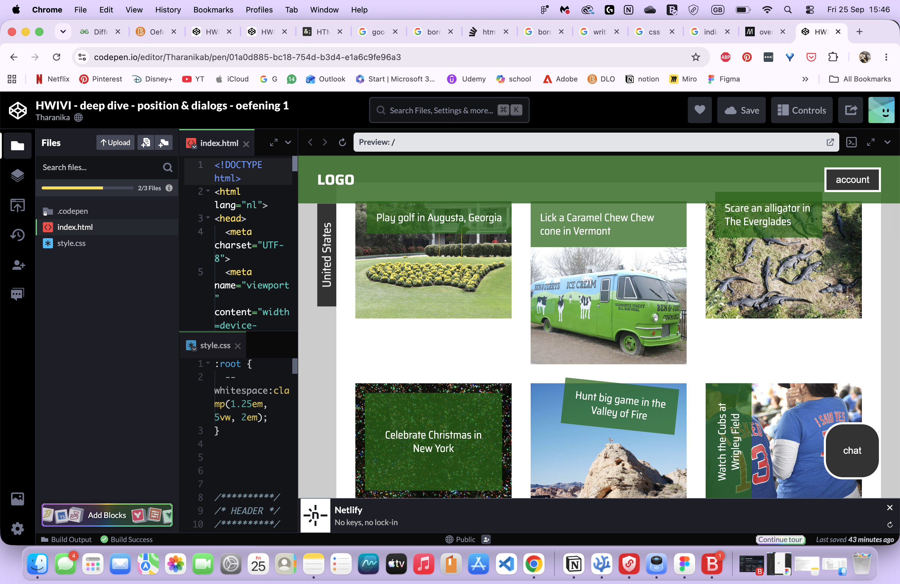
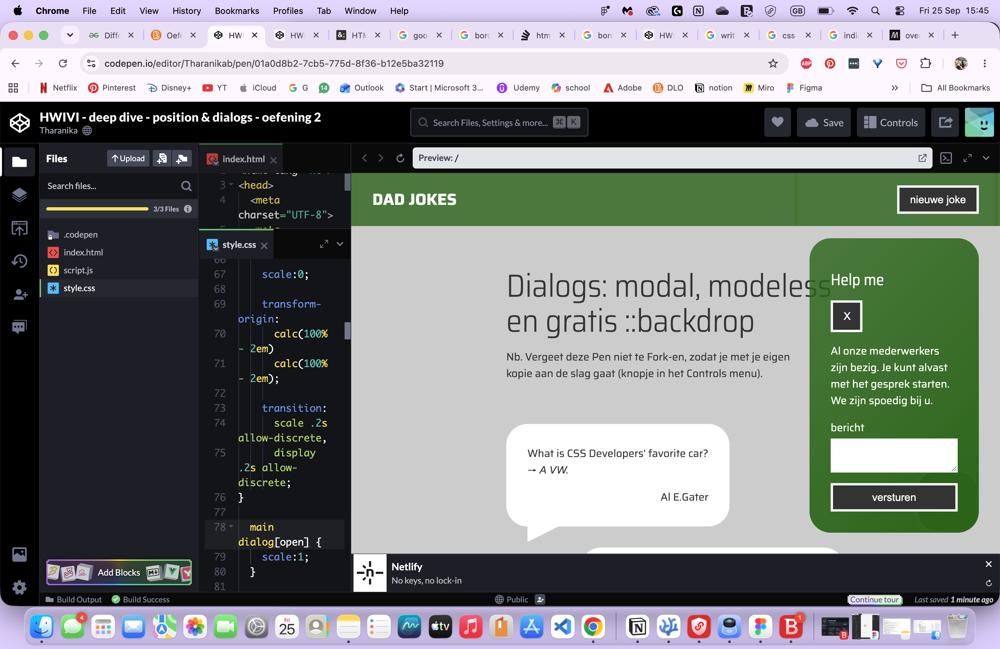
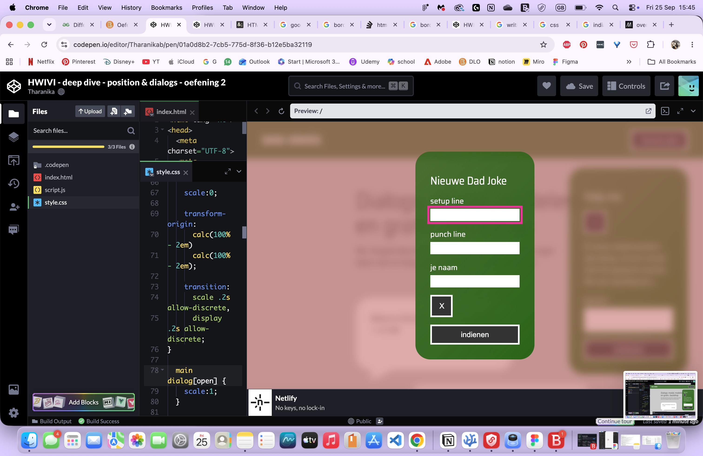

ik heb nu ook door de deepdive mijn privacy button position fixed gemaakt zodat hij op het scherm blijft staan ook als je naar beneden scrollt.

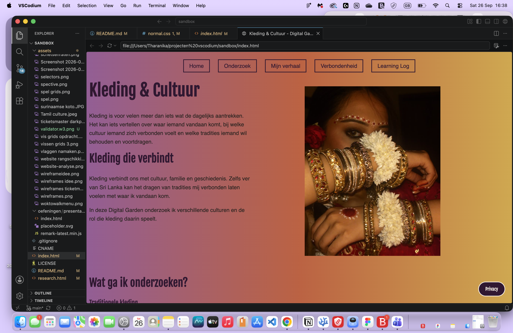

#### 24 september 2026

Ik heb door de feedback van gisteren mijn hovers aangepast zodat ze nu goed kloppen en het een class gemaakt en gecentreerd.
ik heb de gradient aangepast zodat de kleuren mooier zijn met de letters.
en fontface nu ook gedownload en erin gezet.
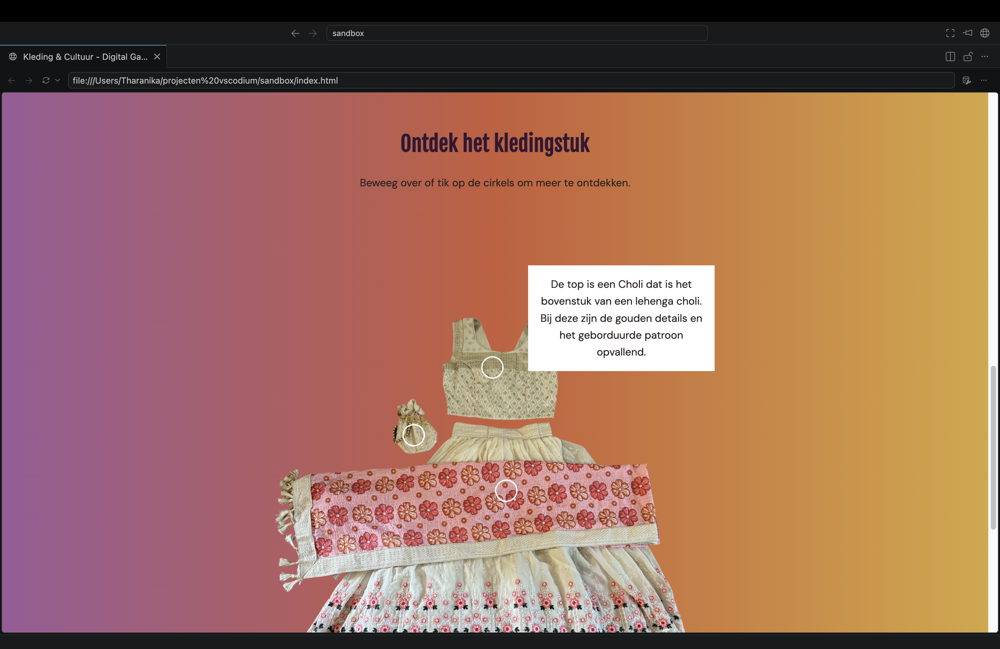

Ik ben nu verder aan het gaan met de layout van mijn andere pagina die dieper ingaat op mijn persoonlijke verhaal, ik heb fotolijstjes in figma gemaakt.

#### 23 september 2026

We begonnen vandaag met een college van Hans over privacy.
Hij heeft uitlegd over wat privacy eigenlijk is, maar ook hoe je daar rekening mee houdt en hoe sommige bedrijven daar misbruik van kunnen maken.
Door deze college besefte ik mij meer hoeveel informatie ik eigenlijk deel wat best persoonlijk is op het web, maar ook met anderen.

!notities van college! 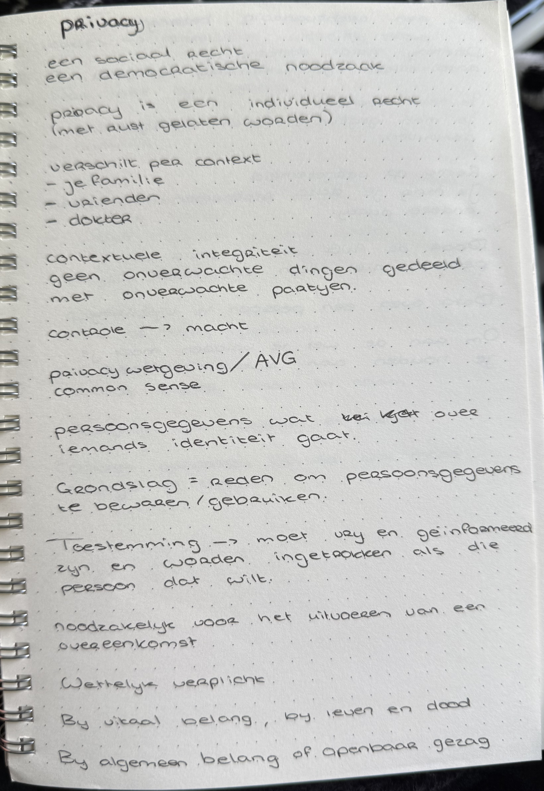
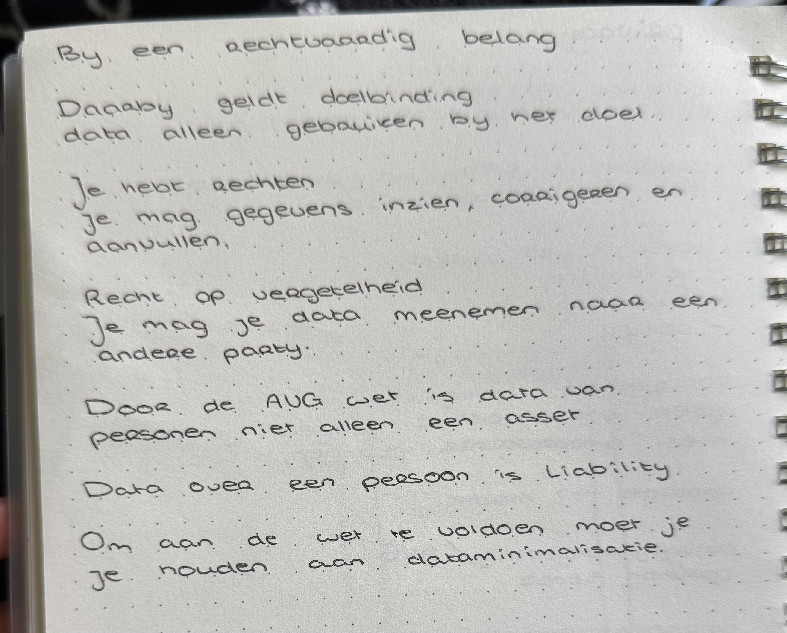

Bij de opdracht van Dark Pattern Herontwerp heb ik samen met Nisha en Floortje gekeken naar de website Ticketmaster en gekeken naar welke data er wordt opgeslagen en specifiek welke dark patterns er voorkomen, hiervan hebben we wireframes getekend met een nieuw ontwerp om te zorgen dat er geen dark patterns meer zijn maar juist met duidelijkheid.

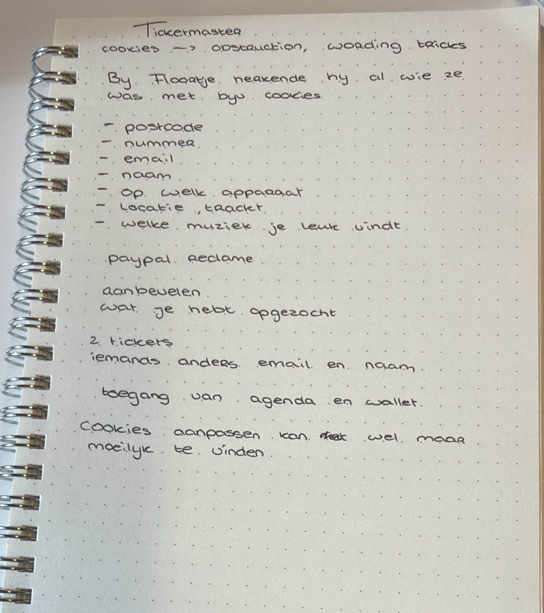
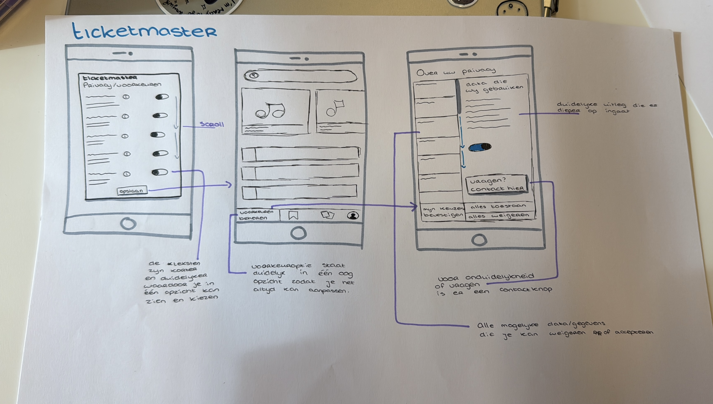

Ik heb vandaag mijn evaluatie gesprek gehad met Barbara om mijn voorlopige beoordeling te bespreken.

Ik ben goed opweg en mijn idee begint steeds meer door te komen op mijn website, ik moet nog een paa technische dingetjes aanpassen zoals buttons bij mijn menu ipv wat ik nu heb gedaan met details open en summary.
Verder ga ik verder met uittekenen en werken aan mijn website.

Barbara feedback:
**Je bent lekker op weg en ik zie een compleet learning log. Je mag op het gebied van vormgeving best nog verder doorwerken a.d.h.v. je ideeen in schets, maar de basis is daar. Het kledingstuk met de pop-overs vind ik heel cool!**

**checkout vragen**

1. Wat is een wireflow en wat heb je er aan?
   Een wireflow zijn meerdere wireframes (schetsen van de frames van je website) waarin je de stappen kan laten zien die je ondergaat
   tijdens het gebruiken van je website.
2. Wat zijn dark UX patterns? Geef drie voorbeelden...
   - Visual or wording tricks: misleidende woorden gebruiken of keuzes waarvan de websites niet willen dat je die kiest moeilijk te vinden
     maken.
   - Nagging: het blijven herhalen van bepaalde dingen (meestal betaalde opties van dezelfde site) totdat je er uiteindelijk voor kiest.
   - Sneaking of preselection: wanneer je bijvoorbeeld iets online wilt bestellen en er automatisch iets extra's wordt toegevoegd aan je
     winkelmand zonder jouw toestemming.
3. Waar moet je als ontwerper rekening mee houden bij het maken van een human consent component?
   Het moet niet te lang zijn en er moet duidelijk in worden weergegeven welke gegevens worden gebruikt (waarvoor en door wie), de
   gebruiker van mijn website moet ook altijd zijn/ haar keuzes kunnen wijzigen.

**deepdive Sanne Buttons & dialogs**

Ik heb de deepdive gevolgd in de les van Sanne en ik snapte het best goed,
het zijn best simpele codes en de javascript was goed te doen.
Ik kan nu dit ook gaan toepassen op mijn website met mijn Human Conset component en mijn navigatiebalk.

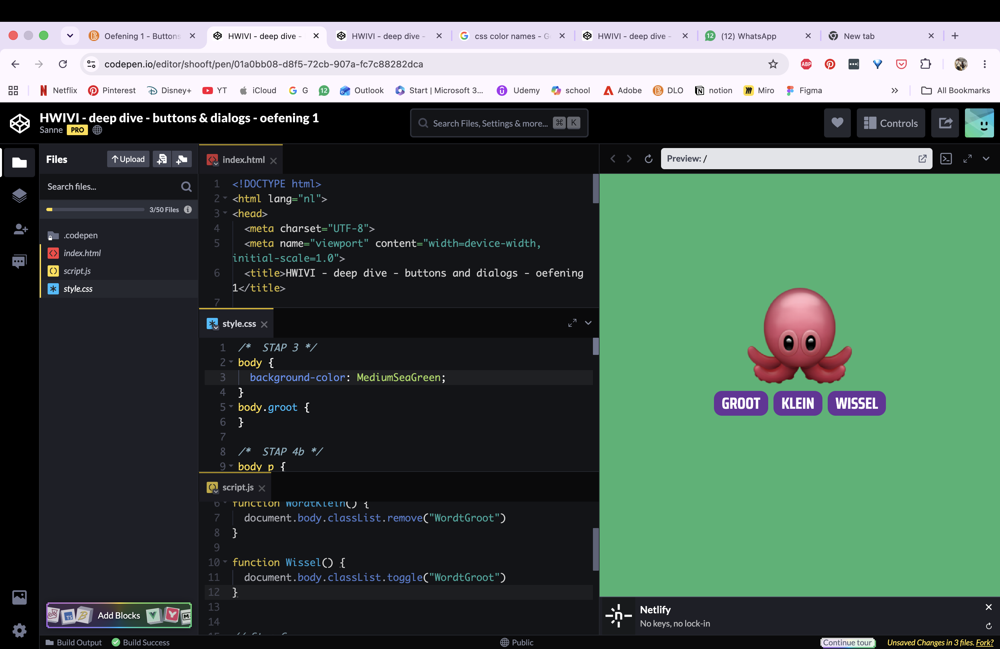
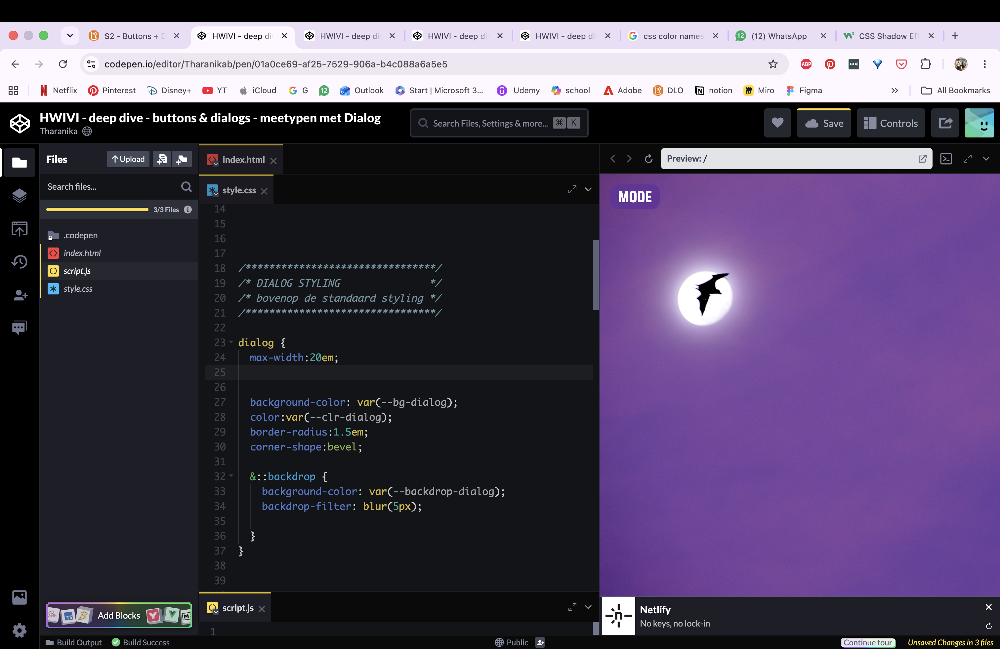
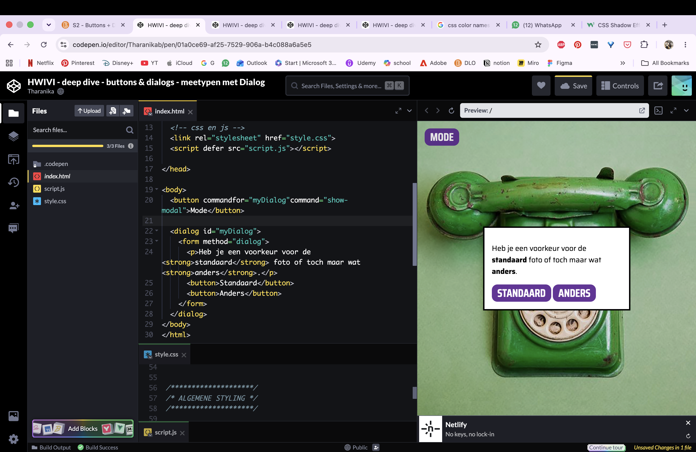
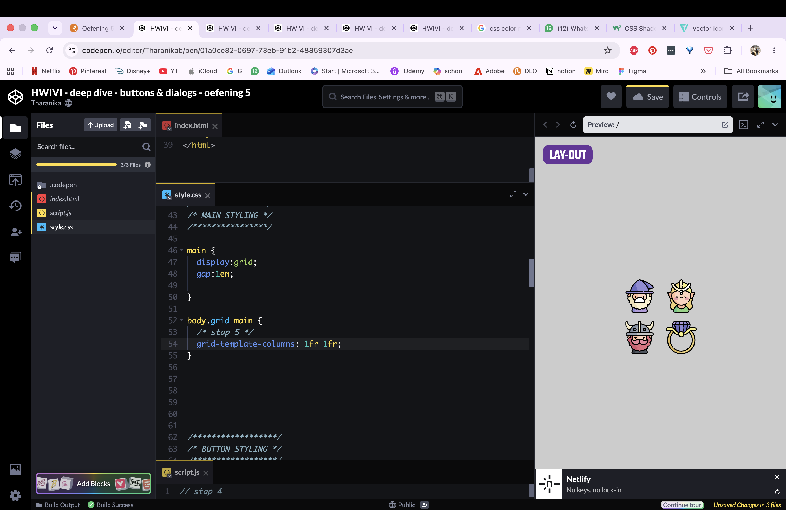
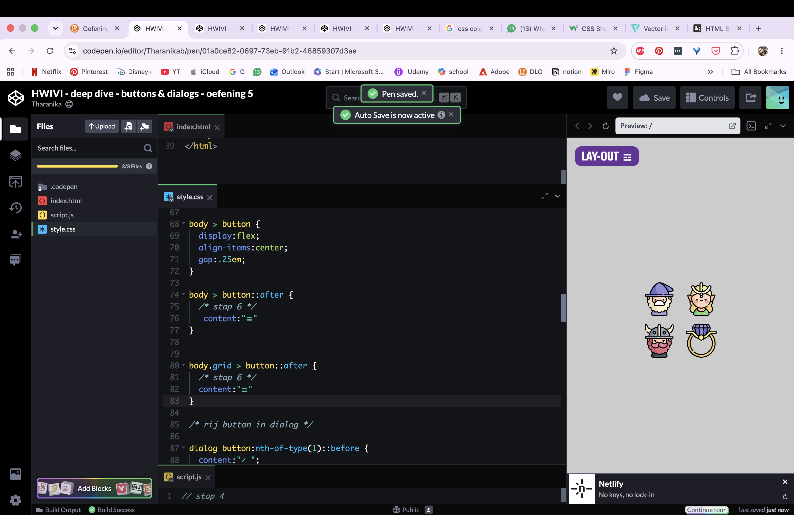

hw to do:

- Schets je human consent component.
  Welke vorm krijgt deze? En waarom kies je hier specifiek voor? Gebruik je opgedane kennis en de bad/best practices die je hebt onderzocht als leidraad.

- Maak een begin aan je HTML structuur.
  Welke informatie moet er sowieso aan de gebruiker getoond worden?
- Human consent component opdracht van de les

#### 22 september 2026

Omdat ik nog geen feedback heb gehad die ik eigenlijk vrijdag had moeten krijgen ben ik gewoon verder gaan met mijn website op eigen gevoel.

**deepdive Button, states en selectors**
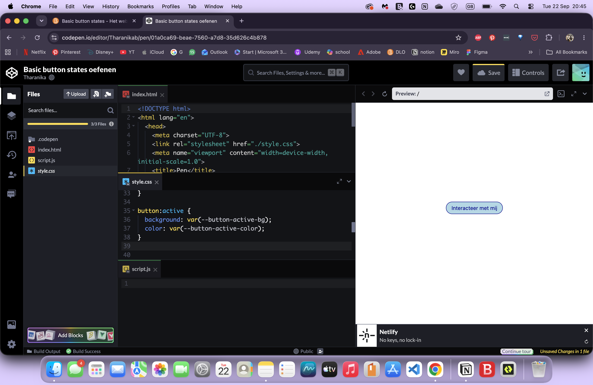

**artikelen en filmpjes die we moesten kijken/lezen**

- Microinteractions: Design with Details
  Micro-interactions zijn kleine interacties tussen gebruiker en systeem die samen de ervaring van een product bepalen. Ze bestaan uit triggers, rules, feedback en loops/modes. Door bekende interactiepatronen te gebruiken en duidelijke feedback te geven, kan een kleine interactie een grote invloed hebben op de gebruikservaring.

- What are dark patterns in UX?
  Een dark pattern is een ontwerpkeuze die de gebruiker subtiel richting een bepaalde actie stuurt, waarbij die keuze vooral voor het bedrijf goed is en hiervoor misleiding wordt gebruikt.
  Je probeert een gebruiker een bepaalde actie te laten doen, maar je maakt daarbij misbruik van hoe mensen websites gebruiken.

meer laten betalen → bijvoorbeeld hidden costs;
iemand laten abonneren → forced continuity;
data laten delen;
vage of misleidende informatie gebruiken;
iemand iets laten accepteren wat die niet goed doorheeft.

Dark patterns maken gebruik van menselijke psychologie en gewoontes om gebruikers richting een bepaalde actie te sturen die vooral het bedrijf voordeel oplevert. Daarom worden ze gezien als onethisch. Ze kunnen dus ook het vertrouwen en de reputatie van een bedrijf verpesten.

- Deceptive Patterns in UX: How to Recognize and Avoid Them

- 2 ways to avoid deceptive design patterns

Summary: Deceptive patterns/Dark patterns promote business outcomes at the user's expense. Designers should avoid deceptive patterns by carefully assessing their designs.

Definition: A sludge is the opposite of a nudge, a term used by behavioral economists to denote a tactic encouraging a positive behavior, such as saving for retirement.

Obstruction — een keuze die het bedrijf niet wil, wordt onnodig moeilijk gemaakt.
Visual or wording tricks — gebruikmaken van verwachtingen, cognitieve beperkingen of misleidende formuleringen.
Nagging — steeds opnieuw dezelfde keuze of toestemming vragen.
Emotionally manipulative designs — gebruikers schuld, schaamte of druk laten voelen.
Sneaking / pre-selection — bijvoorbeeld extra opties automatisch aanvinken of toevoegen.

A/B-testing → ontwerpen worden geoptimaliseerd voor conversie.
Copycat designs → bedrijven nemen patronen van andere websites over.
Daardoor kunnen manipulatieve patronen steeds normaler gaan lijken.

belangrijke vragen die je jezelf moet stellen als designer:

Wie profiteert het meest van dit ontwerp?
Hoe goed sluit het ontwerp aan bij de verwachtingen van de gebruiker?

Omdat ik nog geen feedback heb gehad heb ik meer verder gebrainstormed over wat ik nog wil doen in mijn website zodat ik niet straks heb dat ik ben verder gegaan zonder een echte beoordeling of het wel of niet goed is.
Dus ik heb voor de tweede page, waar ik dieper op mijn verhaal in ga een wireframe getekend hoe ik het misschien zou willen kwa design.

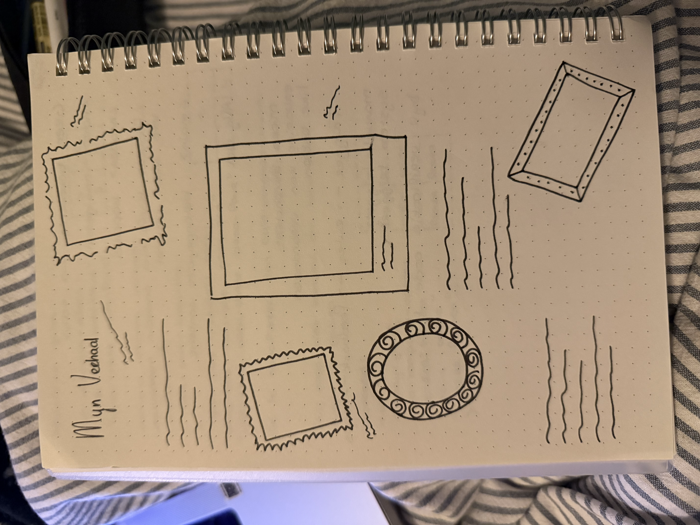

#### 21 september 2026

We gingen in de les, live coderen en hiervan dus de basis stappen die je in een simple website hebt zoals light/dark maar ook colors ingesteld etc doen.
Het ging best wel snel hierdoor was het moeilijk te begrijpen wat we nou uiteindelijk allemaal deze maar ik had het wel af.

We hebben ook naar Cookies gekeken die je op websites te zien krijgt, en onderzocht wat het nou eigenlijk is, en over wat voor data het gaat en welke bedrijven die cookies willen en verkopen.

**checkout questions**

**Wat zijn HTML landmark role elements?**

- Het zijn elementen die de grootte en het inhoud bepalen, zoals
  body, footer, main, header.

**Wat zijn heading elementen en hoe horen deze 'genest' te worden?**

- H1 tot H2 gaan op hierarchische volgorde.
  Het "nesten" of ordenen van koppen hoor je te doen op basis van een logische, numerieke volgorde

**Hoe ga jij met cookies om? Beschrijf jouw beweegredenen en of die zijn veranderd na het volgen van dit college.**

- Voortaan niet meer zomaar op akkoord drukken, want ze gebruiken gewoon je data en die verkopen ze.

#### 18 september 2026

**checkout reflectie**

Ik wilde vooral leren hoe ik HTML en CSS kan gebruiken om een Digital Garden te maken, door de Deep Dives en maken van mijn eigen website begrijp ik veel beter wat code inhoudt en hoe de structuur van een website werkt, bijvoorbeeld de opbouw met body, main en footer.
De Deep Dive over Grid 101 en Grid areas vond ik vooral het beste omdat ik hiervoor nooit goed snapte wat grids deden. Nu heb ik het ook kunnen verwerken in mijn eigen website. Ik heb ook bijvoorbeeld over gradients geleerd en snap nu hoe dat in CSS moet. Vergeleken met vorig jaar in het eerste blok vind ik HTML en CSS nu een stuk duidelijker. Het is nogsteeds moeilijk maar ik begin de logica te snappen.
Ik merk wel dat ik vaak veel ideeën heb die nu technisch nog te moeilijk zijn en daardoor nog niet haalbaar maar het geeft mij wel veel ruimte om nieuwe dingen te

In het begin wist ik nog niet goed wat een Digital Garden was. Door de voorbeelden die ik had gezien dacht ik eerst dat het vooral een soort portfolio of digitaal dagboek was. Ik vond dat minder bij mij passen omdat ik niet veel eerder gemaakt werk had gemaakt werk dat ik als portfolio wilde laten zien.
Één van de docenten had uitgelegd dat het een onderwerp kan zijn waar je je veel over in kan verdiepen of iets persoonlijks of juist iets wat je heel leuk vind, dus ik kwam uit bij mijn interesse in cultuur en kleding, waardoor het idee voor mijn Digital Garden over kleding en cultuur ontstond. Om dit idee verder te onderzoeken heb ik afbeeldingen uit mijn eigen galerij bekeken, Pinterest gebruikt en vrienden met verschillende culturele achtergronden gevraagd naar hun ervaringen. Daarnaast heb ik veel geschetst, wireframes gemaakt en Crazy Eights gebruikt om verschillende richtingen te onderzoeken. Mijn oorspronkelijke interactieve idee was een kledingstuk waarop je kon inzoomen. Tijdens feedback met Barbara en een van de studentassistenten bleek dat dit technisch waarschijnlijk te ingewikkeld zou zijn. Hij stelde voor om met pop-overs te werken, waardoor uiteindelijk het idee voor de interactieve hotspots ontstond. Mijn concept is uiteindelijk iets persoonlijker geworden en richt zich nu sterker op mijn eigen culturele achtergrond, terwijl ik oorspronkelijk verschillende culturen en hun overeenkomsten en verschillen wilde vergelijken.
Tijdens het uitwerken heb ik veel onderdelen van mijn website zelf gebouwd. Ik heb de kennis uit de Deep Dives en bronnen zoals MDN en HTML5 Doctor toegepast. Zo heb ik een light- en dark mode gemaakt, een navigatie met een hamburgermenu, Grid en Grid Areas gebruikt en interactieve hotspots met pop-overs toegevoegd. Vooral de navigatie was technisch lastig. Ik wilde eerst met buttons werken, maar daarvoor zou ik JavaScript nodig hebben, wat ik nog niet beheers en waar de focus dit blok ook niet op ligt, Daarom heb ik naar een andere oplossing gezocht en uiteindelijk met summary gewerkt.
Ook de hotspots waren lastig om goed te krijgen. De interactie werkt, maar de cirkels staan nog niet op iedere schermgrootte precies op de juiste plek. Tijdens het bouwen merkte ik hierdoor dat een idee technisch anders kan uitpakken dan ik vooraf verwacht. Het onderdeel waar ik het meest tevreden over ben, is de visuele stijl. Vooral de gradients zijn geworden zoals ik ze voor ogen had en sluiten goed aan bij mijn eerdere collage en moodboard.
Tijdens het proces heb ik verschillende keren feedback gebruikt om mijn ontwerp te verbeteren. Van Barbara kreeg ik bijvoorbeeld de feedback om mijn moodboard, collage, foto's, typografie en het abstracte karakter van mijn onderzoek meer terug te laten komen in mijn website. Vooral de kleuren en vloeiende, organische bewegingen konden sterker terugkomen. Daarom heb ik mijn eerste simpele kleurgebruik aangepast en gradients toegevoegd, waardoor de website beter aansluit bij mijn eerdere visuele onderzoek. Ook heb ik samen met klasgenoten gekeken naar mijn light- en dark mode. Zij gaven feedback op de kleuren, waarna ik deze verder heb aangepast. Door het maken van de website heb ik geleerd dat ik eerst mijn ideeën visueel wil uitwerken en daarna pas wil kijken welke code ik daarvoor nodig heb. Als ik opnieuw zou beginnen, zou ik deze werkwijze grotendeels hetzelfde gebruiken. Wel zou ik sommige technische ideeën eerder testen, zodat ik sneller weet wat haalbaar is.

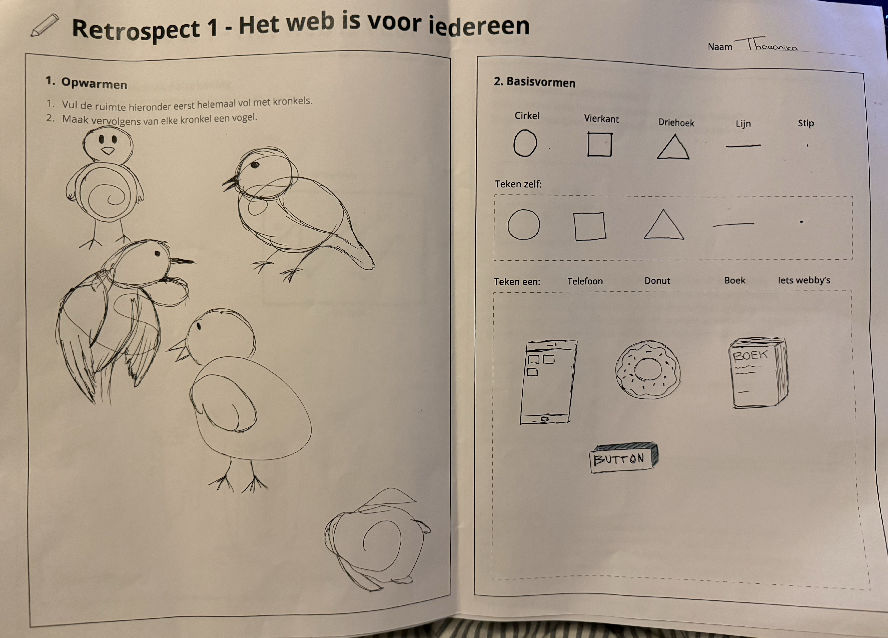
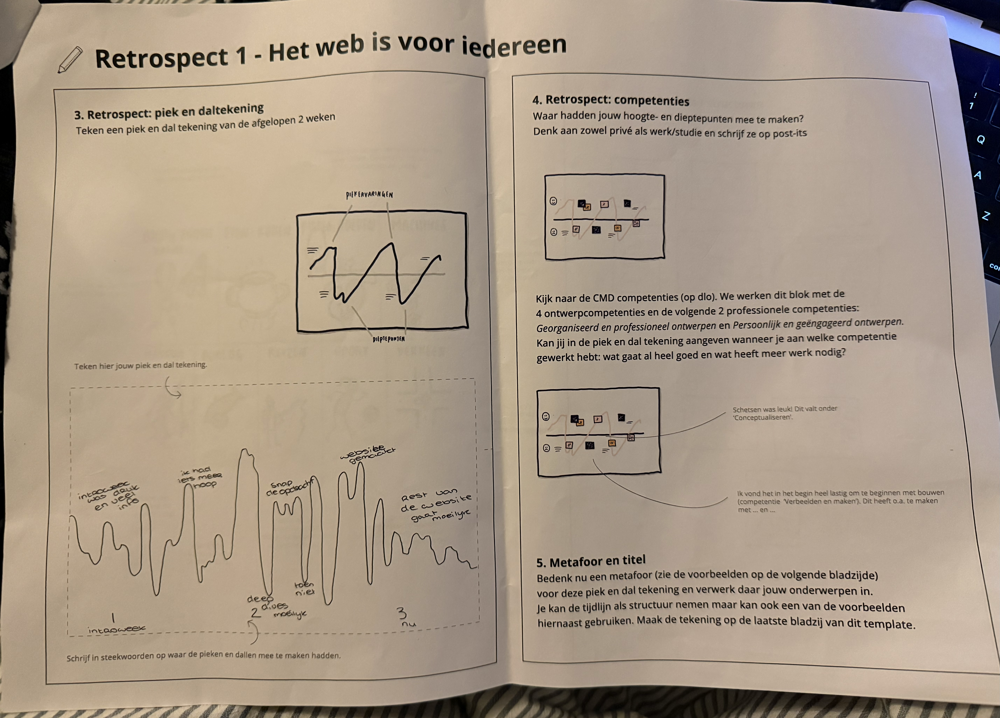

!image nog van mn rollercoaster erin zetten!

#### 17 september 2026

Ik heb na de schetsen die ik gisteren in de les heb gemaakt en die ik vandaag verder heb uitgedacht mijn navigatie responsive gemaakt.
Dus op de desktop zijn mijn navigatielinks nu buttons die werken met een hover. en heb hierbij dus gedaan dat als je op mobiel opent er een hamburger menu icoon verschijnt. Dit ik heb ik wel anders gedaan dan dat bij HTML5 Doctor werd aangegeven want dat was button code maar dat moest met JavaScript en aangezien dat voor mij nog te ingewikkeld is en ik mij wil focussen op CSS heb ik aan ChatGPT gevraagd of er andere mogelijkheden zijn en dat was werken met summary en details. En dit heb ik vorig jaar ook gedaan dus hiervan had ik zelf de code.

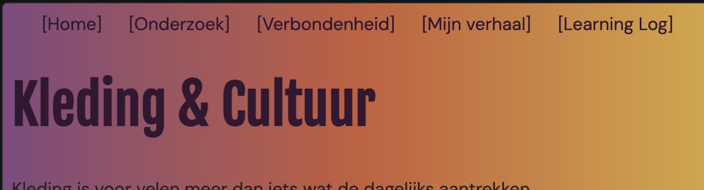

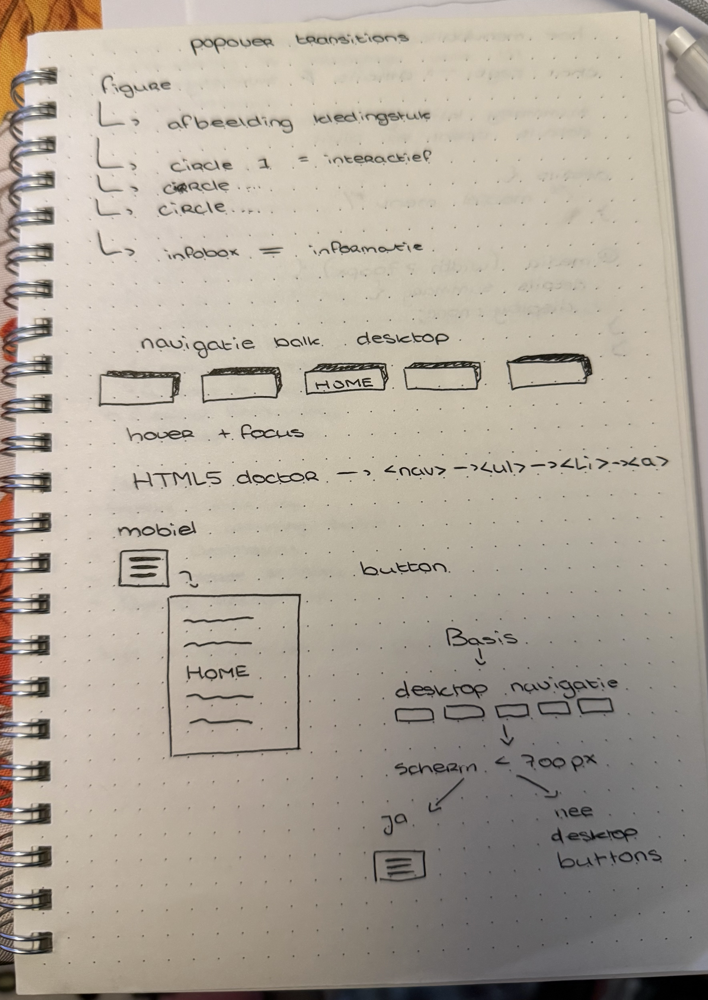
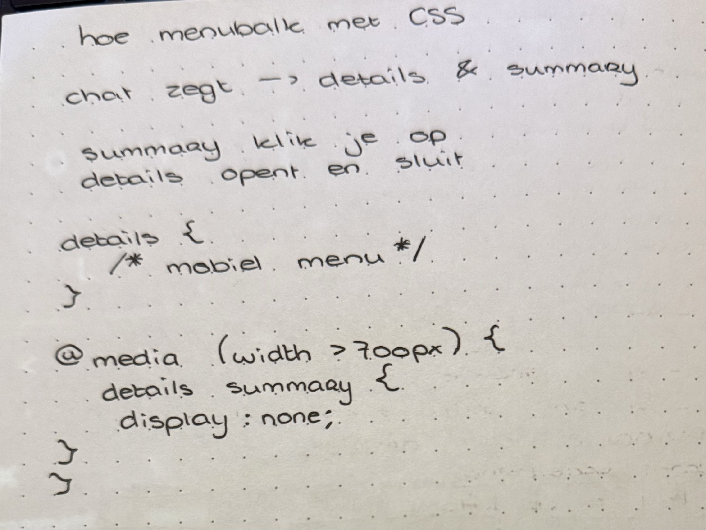

dus bijvoorbeeld
@media (width >700px)
details: summary
display: none;

#### 16 september 2026

- Noem 3 Gestaltprincipes op en laat de ander uitleggen wat ze betekenen en doen.

Nabijheid - dus de afstand kan zorgen voor groepen zodat je weet wat bij elkaar hoort

closure - je hersenen maken het beeld af, door het zelf in te vullen dit kan of goed werken of juist het verkeerde beeld geven

Asymmetrie - tegenovergestelde van symmetrie waardoor je ongelijkheden krijgt in je design.

- Een grid biedt ruimte om te spelen (vrijheid), maar tegelijkertijd ook eenheid en structuur (vastigheid). Wat wordt hiermee bedoeld?

Je hebt veel mogelijkheden met hoe je de grids gebruikt met rows of columns of areas maar het geeft structuur omdat het alles uitlijnt dus het ziet er netter uit.

- Welk principe neem je mee in een laatste iteratie van je ontwerp?

Nabijheid want zo kan je goed zien welke groepen bij elkaar horen en dat mis ik nu nog een beetje in mijn website.

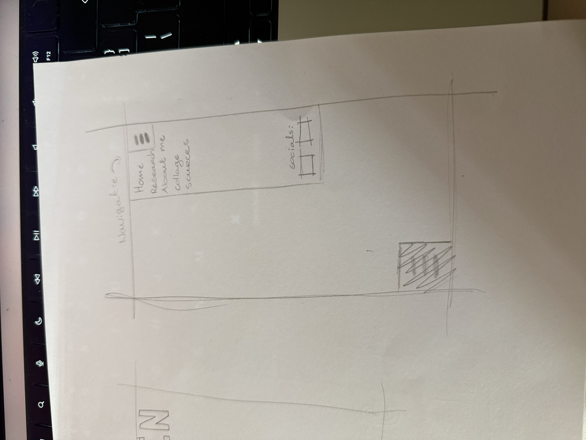
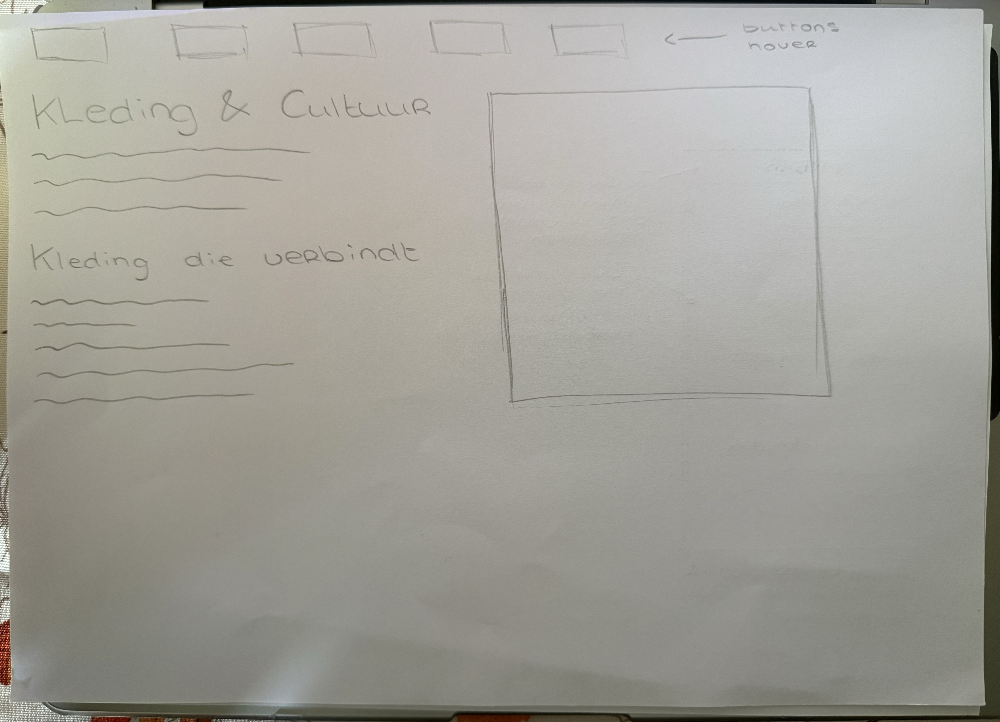
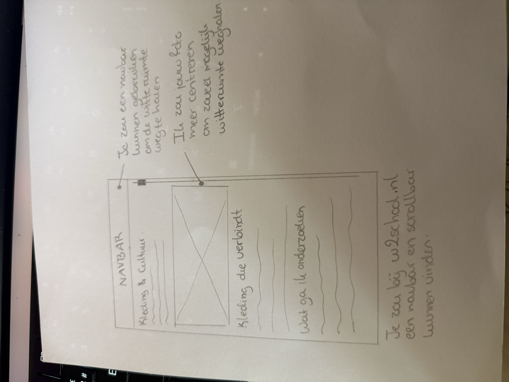

#### 15 september 2026

Visual design & design consistency
Ik heb de vijf principes van visual design van NN/g gelezen: scale, visual hierarchy, balance, contrast en Gestalt. Deze principes helpen om een ontwerp duidelijker en gebruiksvriendelijker te maken en kunnen ook invloed hebben op emotie en merkperceptie.

Daarnaast heb ik gelezen over design consistency. Consistentie zorgt ervoor dat een interface voorspelbaarder wordt, waardoor usability verbetert, de learning curve korter wordt en gebruikers minder fouten maken. Ik heb geleerd over visual, functional, internal en external consistency. Bij mijn eigen Digital Garden zie ik dit bijvoorbeeld terug in mijn vaste typografie, kleuren, layout en manier waarop links en onderdelen worden vormgegeven.

Ik heb de deepdive over grids gedaan, en doordat ik die grids 101 al had gedaan was het best makkelijk om te begrijpen en kon het ook toepassen in de oefeningen dus ik wil dat nu in mijn eigen website proberen.

"area-one area-two"
"area-three area-four"

┌───────────┬───────────┐
│area-one │ area-two │
├───────────┼───────────┤
│ area-three│ area-four │
└───────────┴───────────┘

Ik ben ook verder gegaan aan het verder maken van mijn website, ik heb extra tekst toegevoegd en de navigatie menu aangepast door hem nu boven mijn header neer te zetten en inplaatsvan verticaal onder elkaar dat ze horizontaal naast elkaar staan dat vond ik mooier.

Ik heb ook gekeken of ik mijn grids kon aanpassen dus naar areas maar ik denk dat dat niet handig is omdat hoe ik het nu heb is dat hij automatisch het in twee kolommen zet en ik nog geen specifieke positionering heb wat je bij areas juist gebruikt.

#### 14 september 2026

**checkout vragen**

- Leg uit wanneer een website 'lelijk' wordt en geef voorbeelden wat je kan doen om deze 'lelijke' onderdelen te fixen?
  wanneer je html structuur niet werkt en je geen css hebt die bijvoorbeeld grid geeft of dat je afbeelding zich aanpast aan je desktop.
  door dus wel grids te hebben en max width toe te voegen maakt het een mindere lelijke website.

- Vertel welke volgende stap je neemt om je website responsive te maken.
  Ik denk dat mijn volgende stap is zorgen dat mijn headers en tekst mooi onder elkaar staan en ik ga verder aan mijn afbeeldingen

- Kun je het ontwerp en de bouw van je eigen Garden (zo uit je hoofd) onderbouwen in Webby vocabulair?
  Op dit moment kan ik nog niet zeggen dat hij volledig webby is maar hij heeft dus wel al dat hij redelijk fluïde is dus hij past zich aan aan het scherm zoals desktop of mobiel en light en dark mode.

Ik ben nu bezig met het dynamisch en interactief te maken dus hover states erin zetten.
Toegankelijk heb ik het al door dus contrast en hierarchie.

En ik wil het meer expressief maken want het idee wat ik heb is best uitdagend maar ik denk dat het gaat werken.

#### 11 september 2026

**feedback van Barbara**

- idee is goed uitgewerkt en ik heb een duidelijk idee van wat ik wil vertellen.
- ik heb veel frames getekend dus dat is goed zodat ik mijn ideeën kan vergelijken met elkaar
- probeer te kijken hoe je de kleuren kan laten terug komen van de fotos die je hebt verzameld dus bijvoorbeeld warme tinten
- de abstracte vormen van de typografie poster erin terug laten komen in je design bijvoorbeeld transitions met organische vormen.

Van mijn uitgetekende ideeën spreekt het idee waarbij een kledingstuk centraal staat en je meer informatie over verschillende details kunt ontdekken mij het meest aan. Mijn oorspronkelijke idee was om op een detail in te zoomen en vervolgens extra informatie te tonen.

Ik had samen met een leerling van tweedejaar gekeken naar een simpelere oplossing voor het idee dat ik had omdat mijn idee van het inzoomen op een kledingstuk en daar info bij zetten eigenlijk te moeilijk en misschien nu nog te complex is met de html en css wat ik nu kan, maar hij had wel laten zien hoe ik het op een andere manier kan doen dus dat wil ik uitproberen en misschien kan mijn idee dan toch werken.

Ik heb ook de deepdive gevolgd over grids, en hier heb ik alle opdrachten tijdens de deepdive kunnen doen.
Het was wel ingewikkeld de oefeningen maar ik snap het wel.
Ik heb wel nog moeite met code typen uit mijn hoofd, want ik snap de code vaak wel maar als ik dus zelf moet typen wat het moet zijn en de volgorde dan lukt het vaak niet. Ik hoop dat met oefenen dit probleem weggaat.

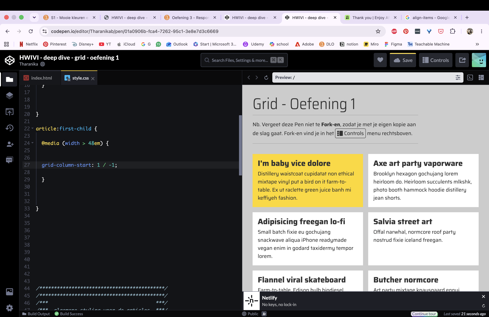

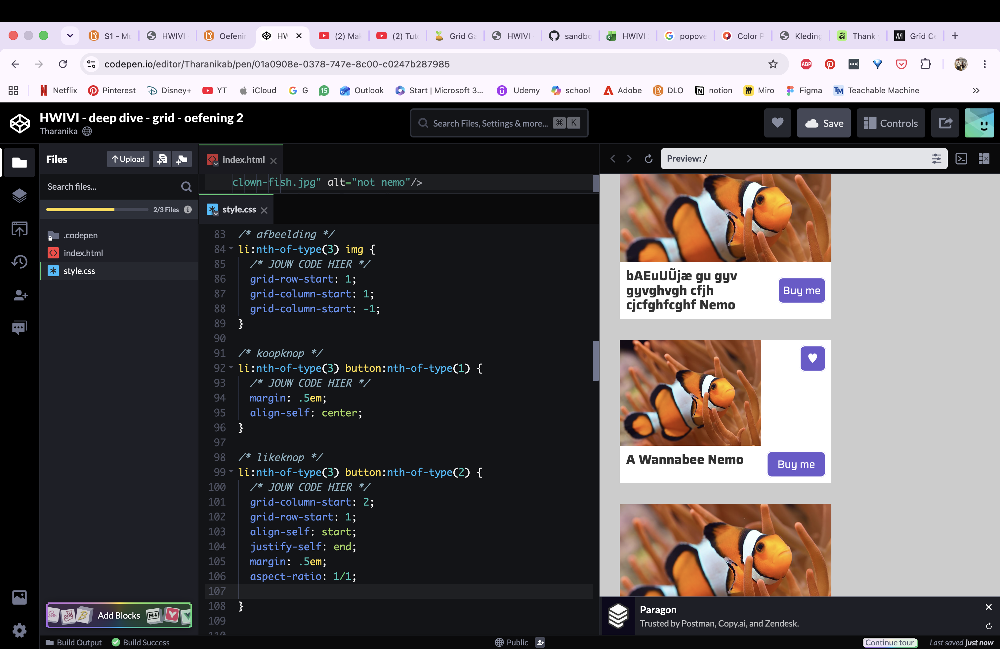

#### 10 september 2026

**randvoorwaarden schermschetsen**

- Singel column is standaard voor moviel
- Schets realistische verhoudingen van tekst en beeld en schets met je gehele content, en de gehele flow met interacties
- +-35 tekens per regel en 16px/1em font-size

##### Mobile-first schermschetsen

Voor mijn vijf mobile-first schermschetsen heb ik ideeën uit mijn Crazy 8 en Visual Research verder uitgewerkt. Ik heb over verschillende manieren nagedacht waarop de gebruiker door mijn Digital Garden over kleding en cultuur kan navigeren.

Bij de schetsen heb ik onder andere gekeken naar:

- kleding als centraal uitgangspunt;
- verschillende culturen en kledingstijlen;
- inzoomen op details zoals patronen en sieraden;
- interactieve cirkels/hotspots;
- informatie die verschijnt wanneer je op een onderdeel klikt.

Ik heb bewust vijf verschillende richtingen geschetst om uiteindelijk te kunnen vergelijken en kijken welke toch het beste is.

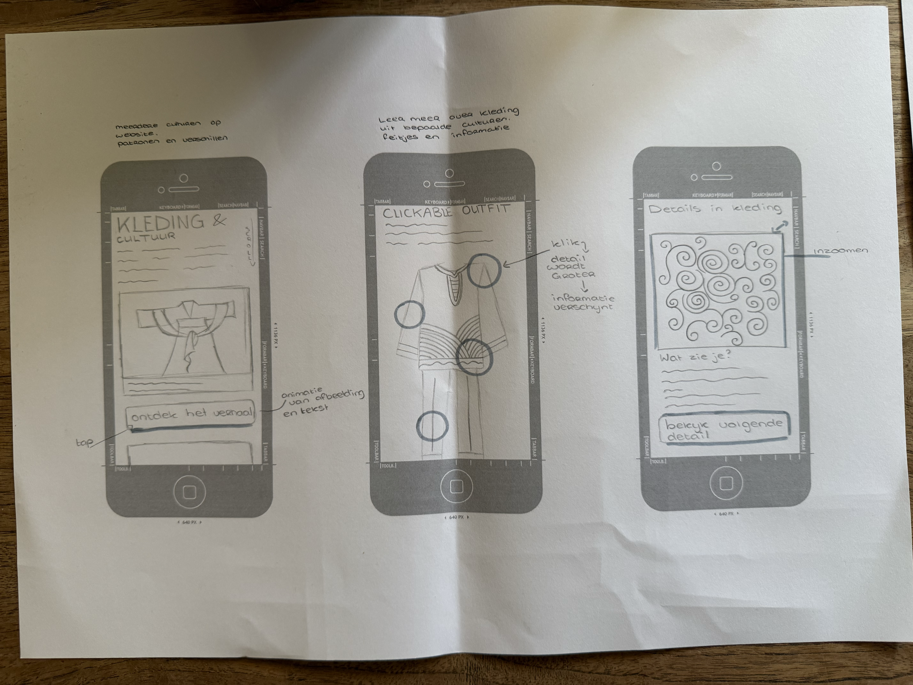
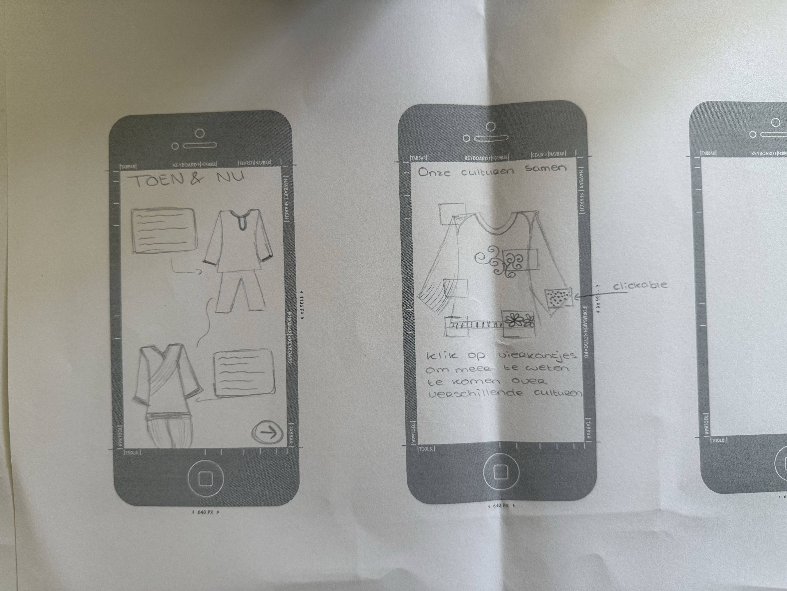

#### Digital garden en HTML structuur

Vandaag ben ik begonnen met het aanpassen van de HTML-structuur van mijn Digital Garden. Ik heb de bestaande template aangepast en ben alvast begonnen met het toevoegen van mijn eigen onderwerp, teksten en structuur. Ook wil ik de kleuren, achtergrond en typografie steeds meer laten aansluiten bij mijn eigen stijl.

Tijdens het uitwerken merkte ik dat ik eerst beter moet bepalen wat ik precies in mijn Digital Garden wil vertellen. Ik wil niet alleen onderzoek doen naar traditionele kleding en verschillende culturen, maar ook een persoonlijk onderdeel toevoegen.

Kleding heeft voor mij namelijk een sterke verbinding met cultuur, familie en identiteit. Doordat ik niet bij mijn gezin woon en een ouder ben verloren, heb ik soms het gevoel gehad dat er een stukje verbinding ontbrak. Het zoeken naar mijn culturele achtergrond en het dragen van kleding uit mijn cultuur is voor mij daardoor ook een manier geworden om die verbinding te voelen en te behouden.

Ik wil deze persoonlijke ervaring uiteindelijk naast mijn onderzoek plaatsen. Zo wordt mijn Digital Garden niet alleen een verzameling informatie over culturen en kleding, maar ook een plek waarin ik onderzoek hoe kleding voor iemand persoonlijk betekenis en een gevoel van verbondenheid kan krijgen.

**deepdive over kleuren en gradients**

ik heb de hele deepdive gedaan en vond het best interessant, ik wist al ongeveer van vorig jaar hoe hex codes werkte maar nu was het meer info en ook duidelijker dus ik kon de opdrachten ook doen, alleen bij de vlaggen kon ik de moeilijkste niet daarvoor moest ik wel AI gebruiken omdat mijn code steeds niet werkte.
gradients en animations snap ik nu ook, wel nog ingewikkeld maar als ik oefen komt het wel goed, laatste animation werkte niet helaas.

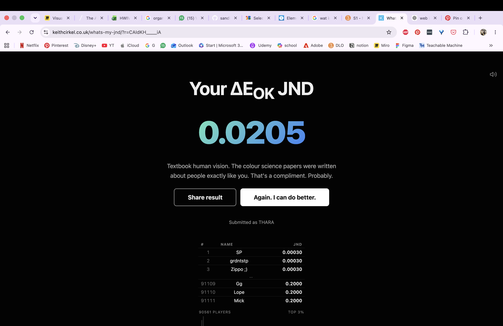
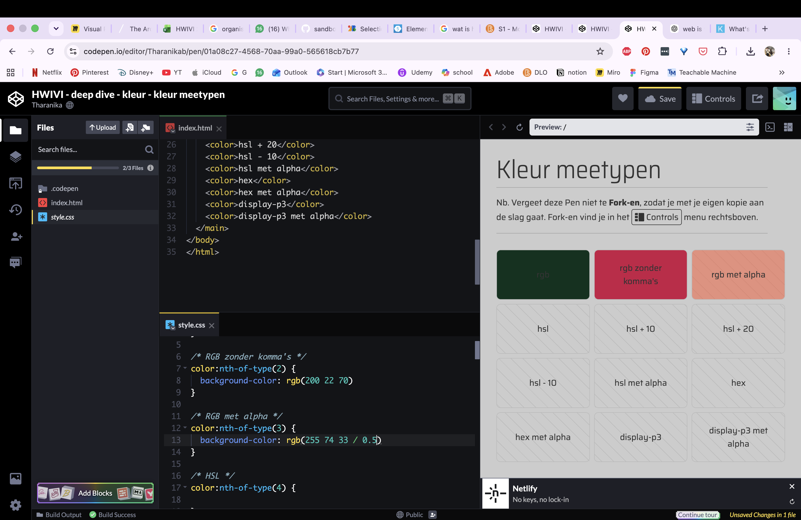

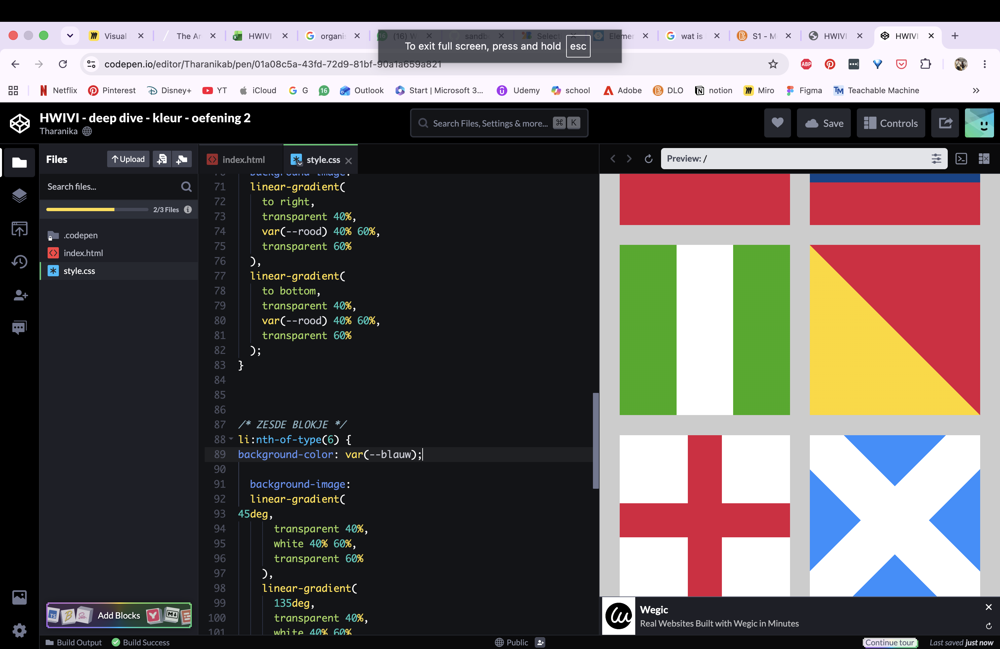

#### 9 september 2026

**Visual Research & visuele identiteit**

Tijdens de online les van vandaag hebben we gekeken hoe je een visuele identiteit aan je Digital Garden kunt geven. Door onder andere kleur, typografie, logo, visuals en achtergrond krijgt je Garden een eigen karakter en uitstraling.

Daarna zijn we gestart met Visual Research. Vanuit de zin “Ik voel mij verbonden” heb ik gezocht naar beelden die passen bij mijn onderwerp. Woorden als warm, trots, thuis, herkenning, eigen en divers passen hierbij. Ik heb gekeken naar verschillende culturen, mijn familie, kledingtrends, patronen en sieraden en hieruit visuele kenmerken gehaald zoals herhaling, overlapping en organische vormen.

Met de Crazy 8 heb ik vervolgens verschillende ideeën geschetst. Ik wil vooral het idee van inzoomen op details verder onderzoeken, bijvoorbeeld om patronen en sieraden uit kleding uit te lichten. Ook het samenbrengen van verschillende beelden tot één geheel past goed bij het idee van verbondenheid.

Daarnaast heb ik vandaag mijn presentatie met Tamar gegeven en hebben we elkaar vragen en feedback gegeven over onze onderwerpen.

de opdracht in miro [miro-opdrachten](https://miro.com/app/board/uXjVHpsKqYY=/?share_link_id=626870178987)

#### checkout vragen

**Leg uit waar het Visual Research in 3 stappen naartoe werkt**
Het Visual Research gaat van mijn onderwerp en sfeerwoord naar visuele kenmerken en uiteindelijk naar concrete ontwerpideeën. Door eerst beelden te verzamelen, daarna te kijken naar patronen en vormen en vervolgens te schetsen, kom ik tot een visuele richting voor mijn Digital Garden.

**Vertel in 2 zinnen waar jouw Garden over gaat, en met welke content je dat gaat doen (beeld, tekst, sound, animatie enz).**
Mijn Garden gaat over de relatie tussen kleding en cultuur en hoe kleding kan zorgen voor een gevoel van verbondenheid met een cultuur, familie en geschiedenis. Ik wil dit vertellen met eigen foto’s, afbeeldingen, tekst en interactieve/visuele elementen zoals animaties en micro-interacties.

**Vertel kort welk idee van de Crazy 8 je het liefst zou willen uitvoeren/ verder zou willen onderzoeken.**
Ik wil het idee van inzoomen op beelden verder onderzoeken. Ik vind het interessant om details van kleding, zoals patronen en sieraden, interactief uit te lichten.

**Vragen tijdens mijn presentatie;**

**Wat is voor jou de essentie van wat je hebt gepresenteerd qua onderwerp en geschreven/beeldende content?**

- Kleding is meer dan mode, het is een manier om creativiteit en verbondenheid uit te drukken.

 
**Welke woorden uit de kwaliteitenlijst kunnen passen bij je onderwerp?**

- Persoonlijk, traditioneel, modern en visueel.

 
**Heeft 'de ander' een aanvulling op je onderwerp?**

- Hoe sociale media trends impact hebben op hoe culturele kleding nu wordt gedragen en verkocht.

 
**Wat is het karakter/ de uitstraling/ het gevoel dat bij het onderwerp past? (bijv. stoer, hip, vrolijk, dynamisch, eenvoudig, enz.)**

- Kleurrijk, expressief en persoonlijk.

 
**Welke inspiratie kun je uit je 25 afbeeldingen halen. Stijl, een gevoel, vorm, enz.**

- Het is heel kleurrijk, verschillende culturen hebben vaak een eigen stijl in de kleding (patronen, kleuren,vormen). De culturele kleding kan ook trots gevoel opwekken.

#### 8 september 2026

Voor het huiswerk heb ik mijn presentatie gemaakt en voorbereid,
Het koste best veel werk, en heb er ook heel lang over gedaan Terwijl het resultaat best simpel is, maar ik snap nu wel beter hoe afbeeldingen werken met positions and width left and right.

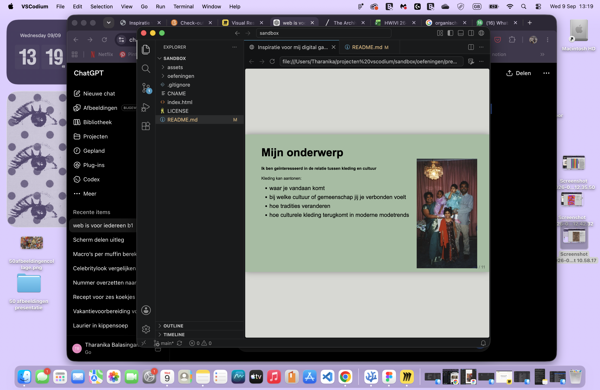

Ik heb daarna de deepdive gedaan van light&dark theme
Ingewikkeld maar ik snap het wel, dus ik denk als ik het vaker doe dat het dan steeds logischer wordt.

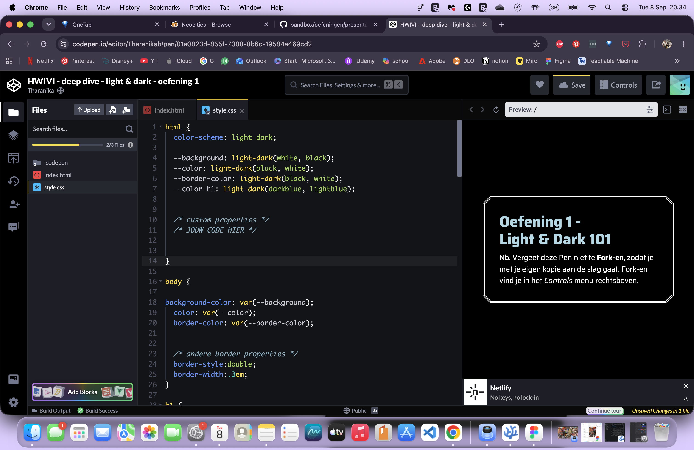

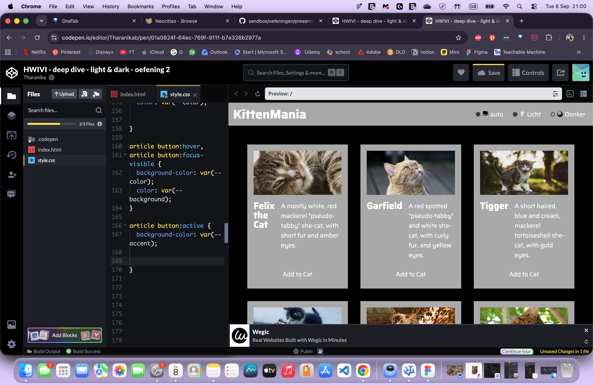
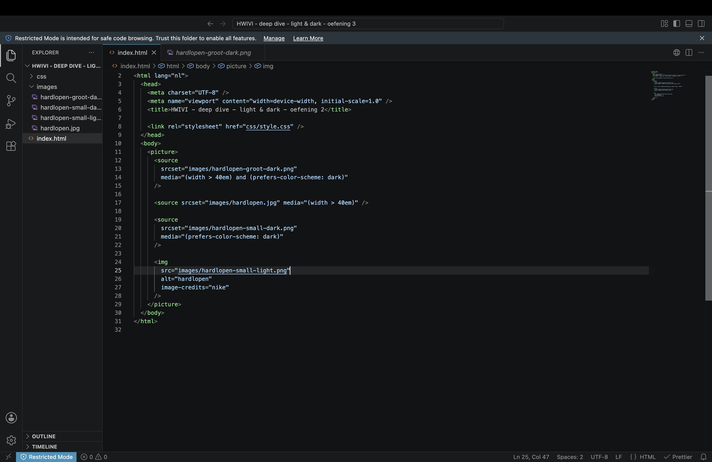
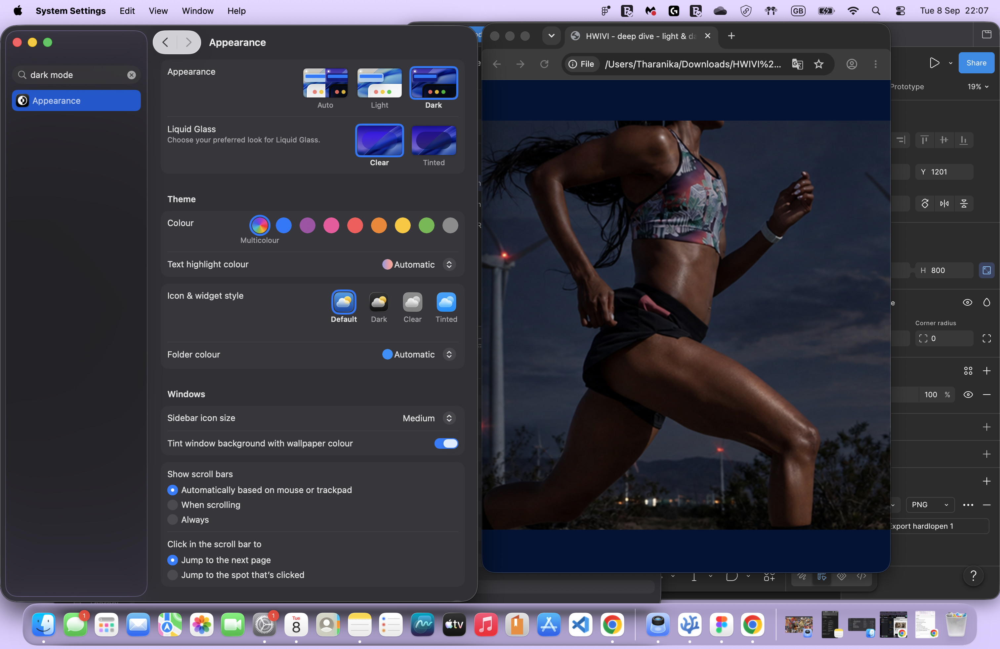
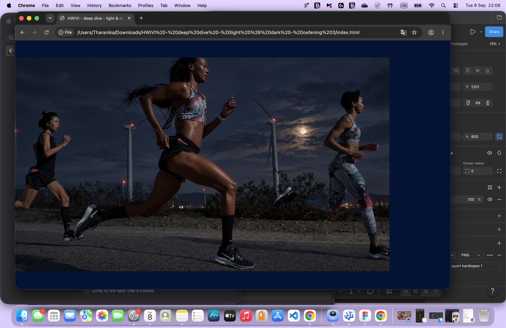

#### 7 september 2026

##### Les van Maandag

we hebben in de les artikels gelezen en geanalyseerd over wat een digital garden inhoudt, wat het betekent, maar ook wat jij zelf denkt dat erin hoort.

We hebben ook websites vergeleken met elkaar, en gerangschikt hoe "webby" het is.
of het alle vakjes aanvinkt.

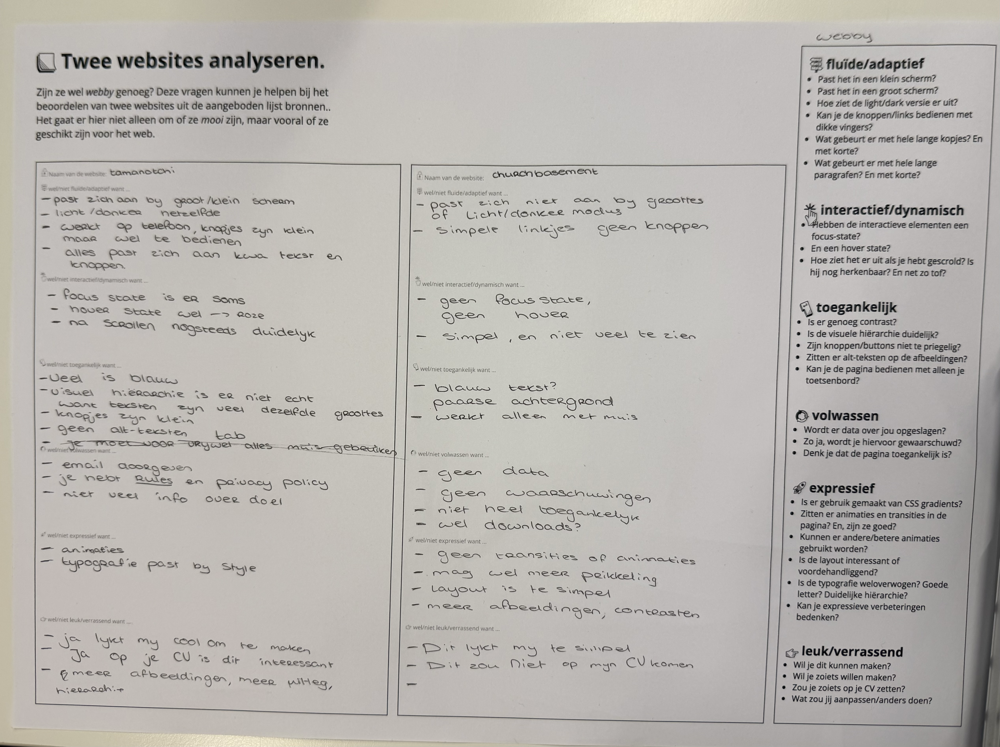
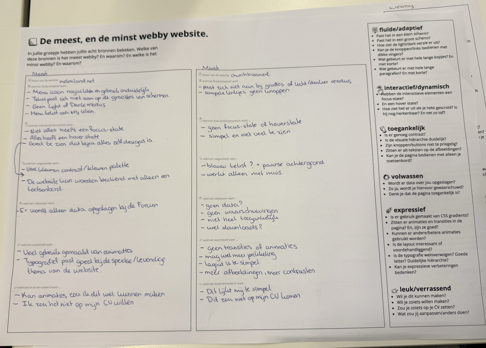

- **Vanuit de inventarisatie: Wat zou je zelf willen maken? Heb je dingen gezien die je nog niet kan, maar wel interessant vindt in de websites die je bekeken hebt?**
  Ik wil eigenlijk een website die best wel diep in een bepaald onderwerp gaat, maar die ook naar meerdere kanten kijkt. Ik wil hem ook best prikkelend hebben, veel afbeeldingen, plaatjes maar ook micro animaties en ook dat hij interactief is.

- **Welke webby dingen heb je gezien die je ook wil gebruiken?**
  ik wil ook veel afbeeldingen hebben die animaties geven of dat als je er op drukt dat er een reactie komt, mooie kleurcombinaties maar vooral iets wat persoonlijk is en echt bij mij past.

- **Welke eigen content zou je over het onderwerp kunnen schrijven? Wat is de toon, ​de context, het doel, wat zijn onderwerpen, wat is ‘het’ wat jou raakt!​**
  Ik weet nog niet precies wat ik wil, maar ik wil een richting van kleding die uit culturen komt, en hoe dat mensen met elkaar verbind. Verdieping over hoe bijvoorbeeld bepaalde stijlen van over de hele wereld in een trend komen in bijvoorbeeld westerse landen, maar ook hoe je een bepaalde connectie kan voelen met jouw afkomst door de kleding die jij bij jou draagt.

- **Maak je gebruik van content van een ander? Hoe denk je dat te doen? En mag dat eigenlijk wel? Hoe kan je die content zo aanpassen dat het echt een eigen verhaal wordt? Dat het echt jouw content wordt, op jouw eigen garden?**
  Ik wil de content van anderen gebruiken om mijn eigen content te verbreden en te versterken, dus het wel mijn eigen te maken. Ik denk als ik bronvermeldingen gebruik en niet zeg dat het van mij is dan vind ik dat het wel zou kunnen maar wil veel zelf vinden en uitzoeken.

- **Op welke manier is de content te ervaren, denk verder dan alleen in tekst en beeld (beleeft, voelt, ziet, hoort enz.)**
  Ik denk dat bij mijn onderwerp heb je veel dingen die je kan ervaren, bijvoorbeeld je gevoel van nostalgie of herkenning maar ook dingen voor het eerst zien wat je nog niet kende.
  Ik denk dat muziek kan ook goed een gevoel creëren wat bij dat beeld past.

#### checkout

Check-out

Vandaag heb ik geleerd wat een Digital Garden is en hoe deze verschilt van een reguliere website. Een Digital Garden is persoonlijker en kan blijven groeien en veranderen, in plaats van dat alles meteen af en perfect hoeft te zijn.

Ook heb ik gekeken naar wat een website webby maakt. Voor mij zijn duidelijke navigatie en buttons, passende typografie, een goed kleurthema en voldoende contrast belangrijk. Ik wil deze principes meenemen in mijn eigen Digital Garden en vooral veel aandacht besteden aan de visuele uitstraling en interactie.

#### 4 september 2026

Vandaag hebben de in de cursus van Justus het gehad over de basis van HTML en CSS, aangezien de laatste keer dat we het hier over hadden al een jaar geleden was waar we weinig uitleg kregen.
We hebben besproken waar HTML en CSS voor staan, wat de belangrijkste onderdelen zijn en waar je op moet letten wanneer je ermee werkt.
Iets echt nieuws wat ik nog niet wist was dat je tegenwoordig Java niet perse meer nodig hebt om een website echt interactief te maken omdat je met CSS heel veel kan doen, dus ik ben benieuwd hoe mijn website er over een paar weken uit zal zien.

Bij Vasilis hebben we mijn eerder gemaakte “lelijke” HTML-pagina gebruikt om opnieuw naar de basis van HTML en CSS te kijken. We hebben de code stap voor stap opgebouwd en steeds zelf overgetypt, zodat duidelijker werd wat ieder onderdeel doet.

Ik vind HTML en vooral CSS nog steeds best ingewikkeld. Daarom wil ik de komende tijd blijven oefenen door de code zoveel mogelijk zelf uit te schrijven in plaats van alles te kopiëren en plakken. Op die manier wil ik niet alleen de code beter leren begrijpen, maar ook de volgorde, haakjes, aanhalingstekens en andere tekens steeds beter leren herkennen en onthouden.

### 3 september 2026

voorbereiding voor de cursus HTML & CSS Basics (Justus) en Praktische CSS (Vasilis)

Voor deze les heb ik de onderdelen Introduction, Basic Web Pages en Hello CSS van HTML & CSS is hard gelezen. Ook heb ik de CSS Diner gedaan om meer te oefenen met CSS-selectors. Dit vond ik eerlijk gezegd best lastig, maar ik kwam uiteindelijk tot level 15. Ik wil hier nog verder mee oefenen totdat ik de selectors beter begrijp.

Daarnaast heb ik het artikel Structuring content with HTML op MDN doorgenomen. Tijdens het doorklikken viel mij op dat SEO niet alleen bij bijvoorbeeld YouTube een rol speelt, maar ook bij websites. Ik wist niet dat de structuur en betekenis van HTML hierbij kunnen meespelen.

De vragen die ik voor de les had waren:

- Wanneer gebruik je in CSS px en wanneer em?
- Hoe bepaalt de cascade welke CSS-regel voorrang krijgt wanneer meerdere regels op hetzelfde HTML-element van toepassing zijn?

#### deel van de aantekeningen die ik had gemaakt en CSS diner

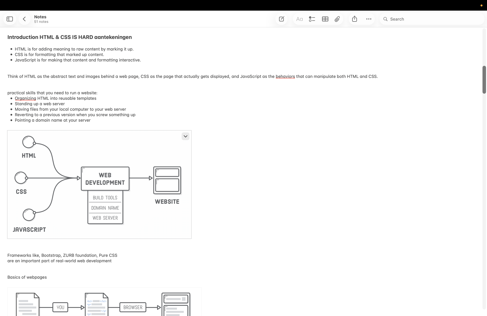
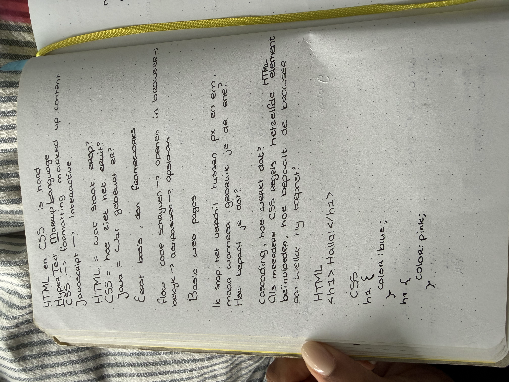
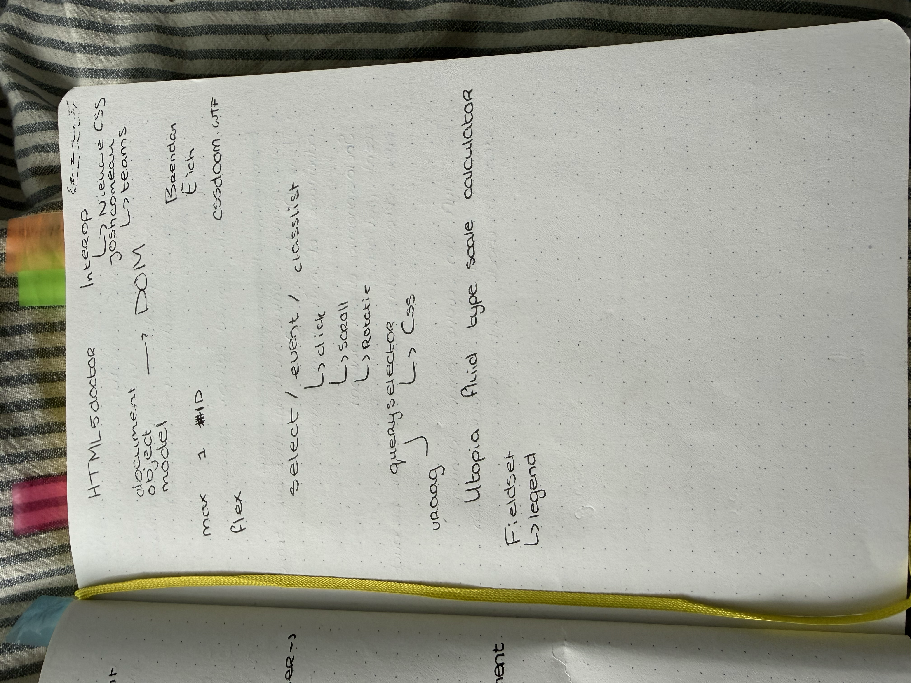
### CSS diner game

#### lelijke website verbeteren

### 2 september 2026

Vandaag hebben we gewerkt aan micro-interacties en multimodal design.
We hebben een Wok to Walk-menu formulier aangepast naar een digitaal ontwerp voor een laptop of tablet. Dit heb ik Figma gemaakt.

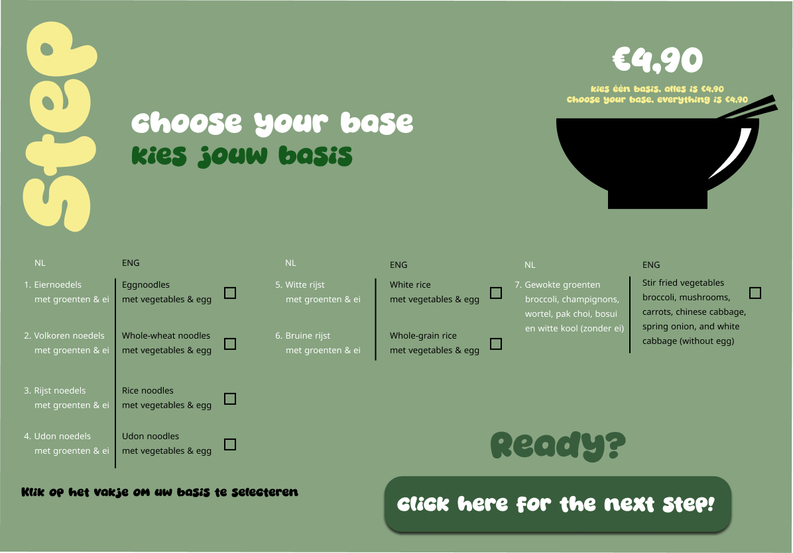

#### Dit is het originele formulier:

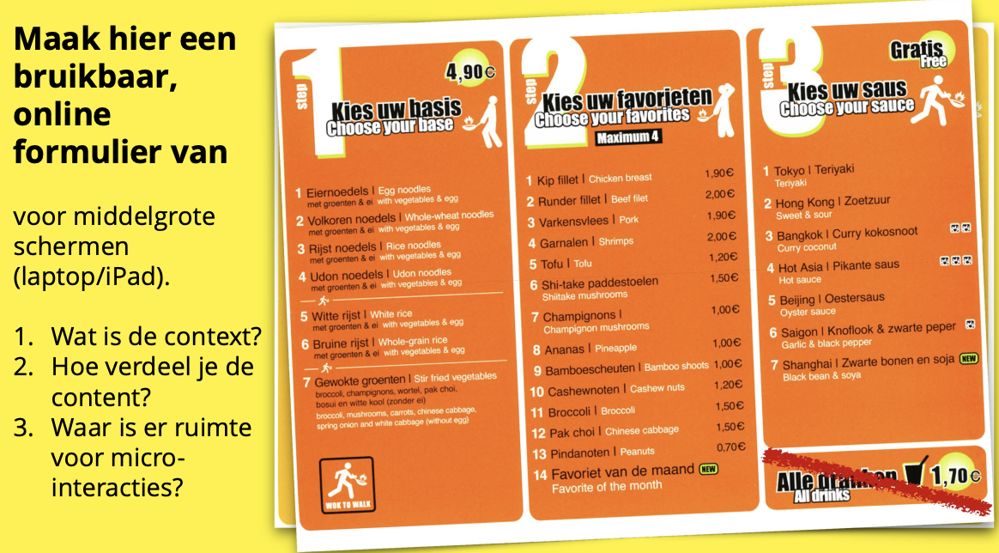
#### schetsencursus

We hebben tijdens schetsen cursus gehad over lijnen trekken en vierkanten maken zonder liniaal, na dit oefenen hebben we verschillen bekeken tussen hi-fi en low fi wireframes en die getekend van een app met microanimaties.
Ik had apple music gekozen

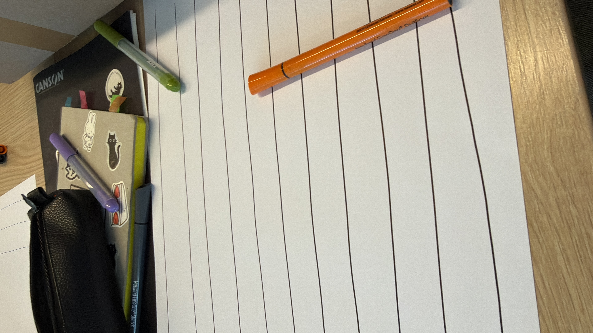

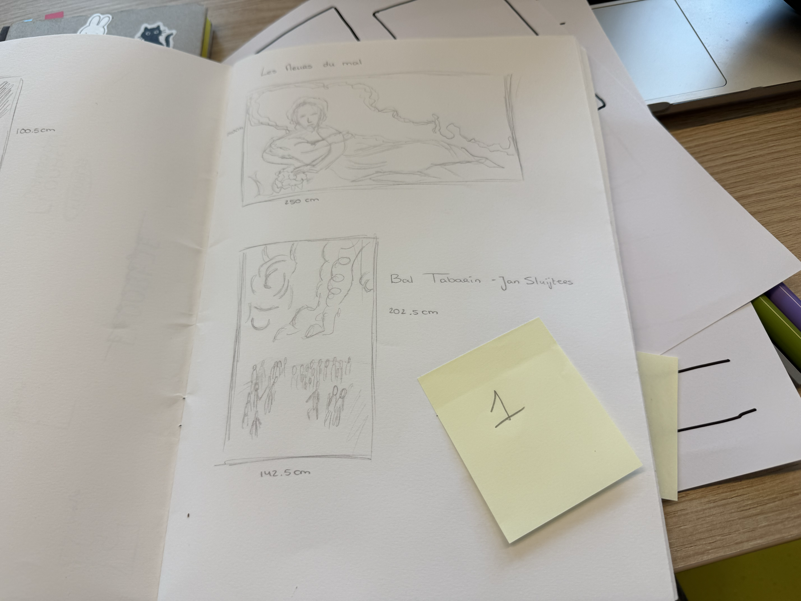

#### De wireframe die ik heb gemaakt

